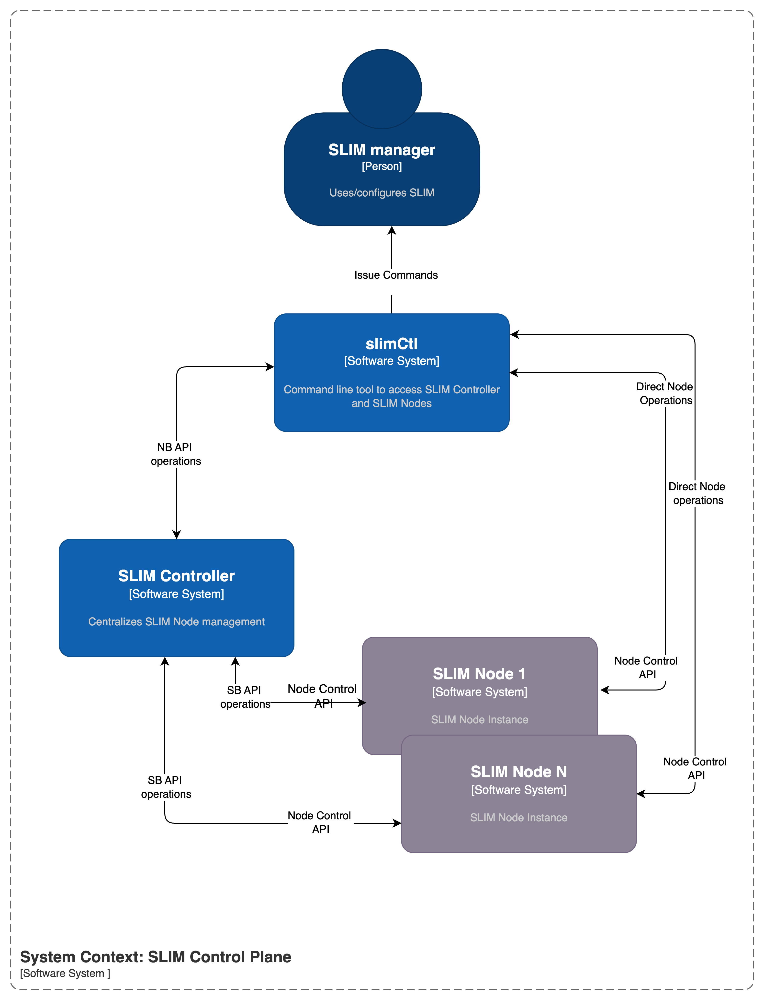
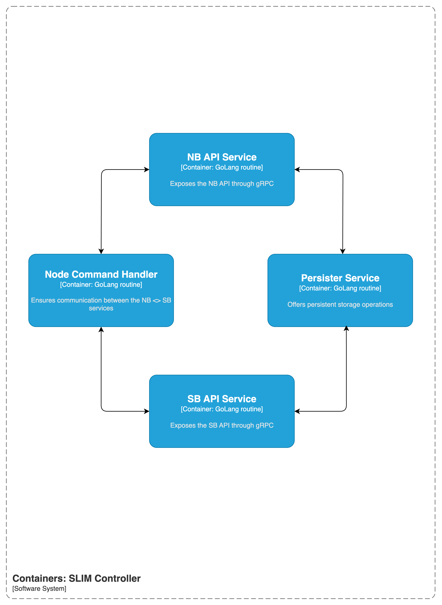

# SLIM Control Plane

The SLIM Control Plane is a centralized management service that orchestrates node registration, connection management, and routing configuration for the SLIM nodes. It provides Northbound and Southbound gRPC APIs to manage nodes, connections, and subscriptions in a distributed messaging environment.

## Overview

The SLIM Controller component is in charge of managing SLIM nodes and their connections. It provides a centralized point for:

- **Node Management**: Registration, status tracking, and lifecycle management
- **Connection Management**: Creation and configuration of node connections
- **Subscription Management**: Routing and subscription configuration

Exposes two API's over gRPC:

- **Northbound API**: Management interface for external clients and control tools, like `slimctl`.
- **Southbound API**: Node registration and control channel for SLIM nodes

## Architecture

#### System Context Diagram



#### Container Diagram




## Quick Start

### Prerequisites

- Go 1.23.6 or later
- Task runner (optional, for using Taskfile commands)

### Building the Control Plane

```bash
# Build all control plane components
task control-plane:build

# Or build just the control plane binary
task control-plane:control-plane:build
```

### Running the Control Plane

```bash
# Start the control plane service
task control-plane:control-plane:run
```

By default, the service listens on ports defined in `config/config.yaml`. You can override configuration using environment variables.

### Configuration

The Control Plane is configured via a YAML file, where you can configure API ports and log levels.
Example configuration can be found in `config/config.yaml` or below:

```yaml
northbound:
  httpHost: localhost
  httpPort: 50051
  logging:
    level: DEBUG

southbound:
  httpHost: localhost
  httpPort: 50052
  logging:
    level: DEBUG
```

## Examples

## Configure routes 

In this example we will setup a route between two SLIM nodes via Control Plane using `slimctl`

### Prerequisites

- `slim` executable - see [dataplane](https://github.com/agntcy/slim/tree/main/data-plane))
- `slimctl` command-line tool - see [slimctl](https://github.com/agntcy/slim/tree/main/control-plane/slimctl)

1. Checkout the SLIM repository and go to repo root directory:

2. Start up the Control Plane

```bash 
task control-plane:control-plane:run
```

3. Start up two SLIM nodes `slim/a` and `slim/b`, with the Control Plane configured as their controller client endpoint.

```bash
slim --config tests/integration/testdata/server-a-config-cp.yaml
slim --config tests/integration/testdata/server-b-config-cp.yaml
```

> Checkout example SLIM configs: [server-a-config-cp](https://github.com/agntcy/slim/blob/main/tests/integration/testdata/server-a-config-cp.yaml)
> [server-b-config-cp](https://github.com/agntcy/slim/blob/main/tests/integration/testdata/server-b-config-cp.yaml) to see how to configre SLIM nodes to connect to the Control Plane.

4. Now you should see the nodes being registered in the Control Plane logs.

```bash
Northbound API Service is listening on 127.0.0.1:50051
Southbound API Service is Listening on 127.0.0.1:50052
2025-07-22T19:59:46+03:00 INF Register node with ID: slim/a
2025-07-22T19:59:50+03:00 INF Register node with ID: slim/b
````

5. Create a route on node `slim/b` to forward messages received on `org/ns/example/0` node `slim/b` using `slimctl`:

```bash
slimctl cp route add org/ns/example/0 via tests/integration/testdata/client-a-config-data.json \ 
  --node-id slim/b  --server 127.0.0.1:50051
```

> Checkout [client-a-config-data.json](https://github.com/agntcy/slim/blob/main/tests/integration/testdata/client-a-config-data.json) to see how to configure connection details to a SLIM node.

6. List Routes on node `slim/b` to verify the route was created:

```bash
slimctl cp route list --node-id slim/b  --server 127.0.0.1:50051
```

7. You can also list the routes directly from the SLIM node:

```bash
slimctl route  list  --server 127.0.0.1:46368
```
