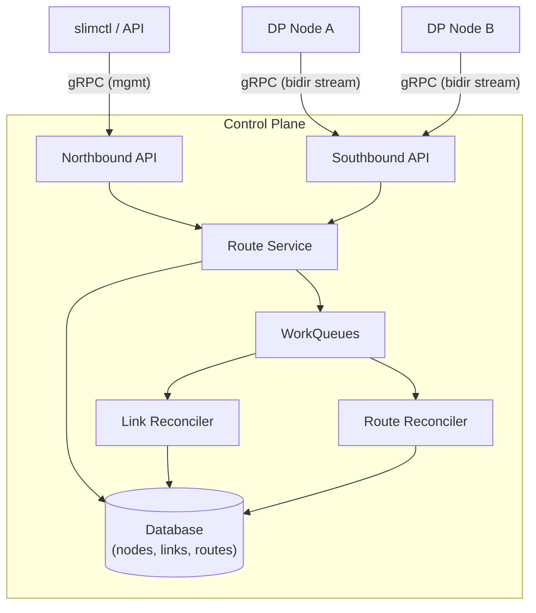
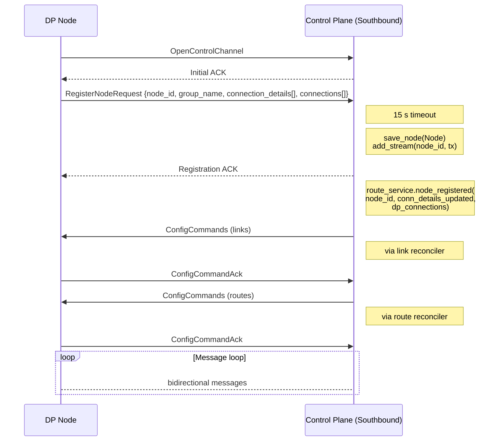
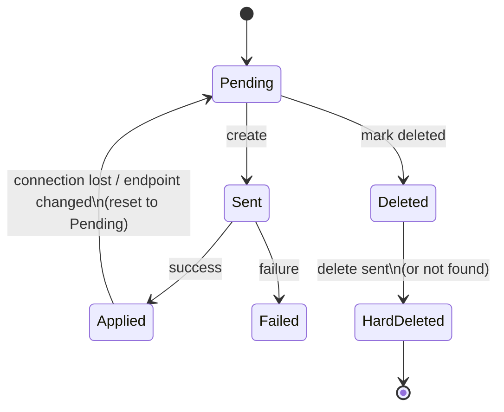
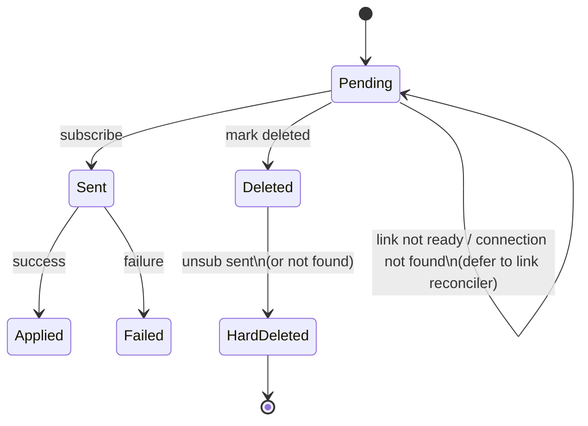

# Control-Plane Architecture

This document describes the SLIM control-plane: how nodes connect, how routing
information is propagated to data-plane instances, and how failures are handled.

---

## Table of Contents

1. [System Overview](#system-overview)
2. [Components](#components)
3. [Node Lifecycle](#node-lifecycle)
   - [Registration](#registration)
   - [Deregistration](#deregistration)
   - [Crash Disconnect](#crash-disconnect)
4. [Link Management](#link-management)
   - [Link Creation](#link-creation)
   - [Link Reconciliation](#link-reconciliation)
   - [Link State Machine](#link-state-machine)
5. [Route Management](#route-management)
   - [Wildcard Routes](#wildcard-routes)
   - [Route Reconciliation](#route-reconciliation)
   - [Route State Machine](#route-state-machine)
6. [Data-Plane Controller](#data-plane-controller)
   - [Connection to CP](#connection-to-cp)
   - [ConfigCommand Processing](#configcommand-processing)
   - [Reconnection](#reconnection)
7. [Failure Handling](#failure-handling)
   - [Retry and Backoff](#retry-and-backoff)
   - [Idempotency](#idempotency)
   - [Race Conditions](#race-conditions)
8. [Periodic Reconciliation](#periodic-reconciliation)
9. [Configuration Reference](#configuration-reference)

---

## System Overview

The control plane (CP) is the central coordinator for a fleet of SLIM
data-plane (DP) nodes. It maintains the desired state of inter-node connections
(links) and message subscriptions (routes), and uses a declarative
reconciliation loop to converge the actual state of each DP node toward the
desired state.



Communication between the CP and DP nodes uses a bidirectional gRPC stream
(`OpenControlChannel`). The CP sends `ConfigCommand` messages to instruct
nodes to create/delete connections and subscriptions. Nodes send registration
requests, config command acknowledgements, and DP-initiated subscription
mutations back on the same stream.

## Components

| Component | File | Role |
|---|---|---|
| **Southbound API** | `services/southbound.rs` | Accepts DP node connections, handles registration handshake, dispatches messages |
| **Northbound API** | `services/northbound.rs` | Management gRPC API for operators (`slimctl`): create routes/links, list state |
| **Route Service** | `services/routes.rs` | Orchestrates link/route lifecycle on node register/deregister events |
| **Link Reconciler** | `services/routes/link_reconciler.rs` | Converges link state: creates/deletes connections on DP nodes |
| **Route Reconciler** | `services/routes/route_reconciler.rs` | Converges route state: creates/deletes subscriptions on DP nodes |
| **Node Command Handler** | `node_control.rs` | Manages per-node gRPC streams, request-response correlation, connection status |
| **Work Queue** | `workqueue.rs` | Fair, deduplicating, k8s-style work queue with shutdown/drain support |
| **Database** | `db/` | Persistent storage (InMemory or SQLite) for nodes, links, and routes |
| **DP Controller** | `core/controller/src/service.rs` | Data-plane side: connects to CP, processes ConfigCommands, manages datapath connections |

## Node Lifecycle

### Registration

When a data-plane node starts, it opens a bidirectional gRPC stream to the
CP's southbound API (`OpenControlChannel`). The following sequence occurs:



**Node ID construction.** If the node provides a `group_name`, the effective
node ID becomes `{group_name}/{node_id}`. Otherwise, the bare `node_id` is
used.

**Connection details parsing.** The CP extracts `local_endpoint`,
`external_endpoint`, `trust_domain`, and `client_config` from the proto
metadata. The effective endpoint prefers `local_endpoint`; if absent, the
peer's IP address is used combined with the port from the proto `endpoint`
field.

**`node_registered` orchestration.** After saving the node and registering
the stream, the route service performs several operations under a per-node
lock (to serialize with concurrent deregistration):

1. **Link state sync against DP-reported connections.** The DP sends its
   currently active connection IDs in the registration message. For each
   existing inbound link in the DB:
   - **DP says alive** (link ID in the active set): mark the link `Applied`
     and enqueue route reconciliation only.
   - **DP did not report, but endpoint unchanged and link is Applied**:
     optimistically trust the link (avoids unnecessary connection recreation
     when only the CP stream reconnected).
   - **DP says dead, or endpoint changed**: reset the link to `Pending` and
     enqueue link reconciliation. If the endpoint changed, update the
     destination endpoint and connection config in the link record.

2. **Ensure links exist** (`ensure_links_for_node`). For every other
   registered node that does not yet have a link to/from this node:
   - **Same group**: create a direct link using the first connection detail.
   - **Different group**: create a group link using the `external_endpoint`.
     The node with the external endpoint becomes the destination.
   - If neither node has an external endpoint, log an error (cross-group
     connectivity requires at least one external endpoint).

3. **Ensure routes exist** (`ensure_routes_for_node`). Expand wildcard route
   templates (see [Wildcard Routes](#wildcard-routes)) in two passes:
   - **Pass 1** -- node as source: for each wildcard `(*, dest_X)`, create
     `node -> dest_X` if it doesn't exist.
   - **Pass 2** -- node as destination: for each wildcard `(*, node)`, create
     `peer -> node` for every registered peer.

4. **Enqueue reconciliation.** All affected nodes are enqueued for link and
   route reconciliation.

### Deregistration

A node deregisters gracefully by sending a `DeregisterNodeRequest` on the
stream. The CP sends a `DeregisterNodeResponse` *before* removing the stream
(critical ordering -- once the stream is removed, sends fail). Then:

1. **Source routes**: hard-delete all routes where the node is the source.
   Wildcard template routes (`source=*`) are preserved.
2. **Destination routes**: soft-delete (mark `deleted=true`) all non-wildcard
   routes where the node is the destination. Enqueue source nodes for route
   reconciliation so the subscriptions are cleaned up on the DP.
3. **Outgoing links** (source = departing node): hard-delete immediately.
   The node is gone, so the link reconciler cannot reach it to send a delete
   command.
4. **Incoming links** (dest = departing node): mark `deleted=true` and
   enqueue the source node for link reconciliation so the peer tears down
   the outgoing connection.
5. **Node record**: delete from the database.
6. **Per-node lock**: remove the entry (while the lock guard is still held,
   preventing a racing `node_registered` from losing its lock).

### Crash Disconnect

When a DP node disconnects without sending `DeregisterNodeRequest` (crash,
network failure), the stream read loop exits. The CP:

1. Removes the stream (`remove_stream`), which closes all in-flight
   response waiters immediately (they receive a channel-closed error
   instead of blocking until the 90 s timeout).
2. Removes the per-node lock entry to prevent unbounded growth in the
   `node_locks` map.

No link or route cleanup is performed on crash disconnect. The node's links
and routes remain in the DB. When the node reconnects, `node_registered`
syncs the state (see step 1 of Registration). The periodic reconciliation
sweep also re-enqueues connected nodes to catch any drift.

## Link Management

A **link** represents a desired gRPC connection between two DP nodes. Links
are directional: the `source_node_id` initiates the connection to the
`dest_node_id` at `dest_endpoint`.

### Link Creation

Links are created during node registration (`ensure_links_for_node`) or via
the northbound API. Each link gets a unique `link_id` (UUID) and is stored
with status `Pending`. The link record includes:

| Field | Description |
|---|---|
| `link_id` | Unique identifier (UUID) |
| `source_node_id` | Node that initiates the connection |
| `dest_node_id` | Target node |
| `dest_endpoint` | gRPC endpoint address |
| `conn_config_data` | JSON-serialized `ClientConfig` (TLS settings, backoff, keepalive, headers) |
| `status` | `Pending`, `Applied`, or `Failed` |
| `deleted` | Soft-delete flag |

**Connection detail selection.** For same-group links, the first connection
detail's local endpoint is used with insecure TLS. For cross-group links, the
`external_endpoint` is used with mTLS (SPIRE-based), and additional settings
(backoff, keepalive, SPIRE socket path) are injected into the config.

### Link Reconciliation

The link reconciler runs as configurable parallel workers (default: 4)
consuming from a shared `WorkQueue<String>` keyed by source node ID. When a
node is dequeued:

1. **Pre-flight**: verify the node is `Connected`. If not, skip.
2. **Query node state**: send a `ConnectionListRequest` to get the set of
   connection IDs currently live on the node.
3. **Classify links**:
   - **Desired**: non-deleted outgoing links from this node in the DB.
   - **Live**: connections actually present on the node.
   - **Orphan** (optional): live connections not tracked by the CP. Only
     cleaned up if `enable_orphan_detection` is true.
4. **Idempotency check**: if a link is `Applied` in DB *and* live on the
   node, skip the create -- enqueue route reconciliation only.
5. **Build ConfigCommand**:
   - `connections_to_create`: desired links not yet live.
   - `connections_to_delete`: deleted links + orphans.
6. **Send and wait for ack** (`ConfigCommandAck`).
7. **Process acks**:
   - Created link + success: mark `Applied`, enqueue route reconciliation.
   - Created link + failure: mark `Failed` with error message.
   - Deleted link + success: hard-delete from DB.
   - Deleted link + "connection not found": treat as success (already gone).
8. **On error**: requeue with exponential backoff.

### Link State Machine



## Route Management

A **route** represents a desired message subscription on a DP node. A route
instructs the source node to subscribe to messages matching a name pattern
(`component0/component1/component2`, optionally with a `component_id`) via a
specific link.

### Wildcard Routes

Routes with `source_node_id = "*"` (the `ALL_NODES_ID` sentinel) are
**wildcard templates**. They express operator intent: "every node should
subscribe to this name." The CP automatically expands them:

- **On creation**: a per-node route is created for every currently registered
  node (excluding the destination node itself).
- **On node registration**: all wildcard templates are expanded for the new
  node (both as source and as destination).
- **On deletion**: the template and all its expansions are deleted.

Wildcard template records themselves are stored with status `Applied` (they
don't correspond to a real subscription). The per-node expansions are stored
with status `Pending` and go through normal reconciliation.

### Route Reconciliation

The route reconciler runs as parallel workers consuming from a shared
`WorkQueue<String>` keyed by node ID. When a node is dequeued:

1. **Pre-flight queries** (concurrent): send `ConnectionListRequest` and
   `SubscriptionListRequest` to get the node's live connections and
   subscriptions.
2. **Build applied set**: map of `(c0, c1, c2, component_id, link_id)` tuples
   currently active on the node. The DP's `NULL_COMPONENT` sentinel
   (`u64::MAX`) is normalized to `None` for matching.
3. **Orphan detection**: subscriptions live on the node but absent from the CP
   database are scheduled for deletion.
4. **Process each route**:
   - **Deleted route, already absent from node**: hard-delete from DB (no
     round-trip needed).
   - **Deleted route, still on node**: add to `subscriptions_to_delete`.
   - **Non-deleted route, link not found or Failed**: skip (or mark route
     `Failed` if the link is `Failed`).
   - **Non-deleted route, link not yet Applied**: defer -- poke the link
     reconciler.
   - **Non-deleted route, link Applied but not live on node** (pre-flight
     connection check): defer via `defer_link` -- reset link to `Pending`
     and hand back to the link reconciler.
   - **Non-deleted route, already active on node** (idempotency check): mark
     `Applied`, skip the send.
   - **Otherwise**: add to `subscriptions_to_set`.
5. **Send ConfigCommand** with `subscriptions_to_set` and
   `subscriptions_to_delete`. Wait for `ConfigCommandAck`.
6. **Process acks**:
   - Success + non-deleted route: `mark_route_applied`.
   - Success + deleted route: hard-delete from DB.
   - Failure + deleted route + "subscription not found": treat as success.
   - Failure + "connection not found": `defer_link` (the pre-flight check
     passed but the connection disappeared before the subscribe was sent).
   - Other failure: `mark_route_failed` with error message.

### Route State Machine



## Data-Plane Controller

Each DP node runs a `ControllerService` that manages the connection to the
CP and translates `ConfigCommand` messages into datapath operations.

### Connection to CP

The `connect()` method:

1. **Resets state from any previous session**: drains the `message_id_map`
   (stops timers, sends failure acks to unblock waiters), clears
   `connections`, `route_subscription_ids`, and `link_id_to_conn_id`.
2. **Establishes the gRPC channel** using the configured `ClientConfig`.
3. **Sends queued notifications** that accumulated while disconnected.
4. **Creates a new `TimerFactory`** for ack timeout tracking.
5. **Spawns the stream processing task** (`process_control_message_stream`).

The stream processing task sends a `RegisterNodeRequest` (including the
node's current active connections for idempotency) and then enters the main
message loop.

### ConfigCommand Processing

When the DP controller receives a `ConfigCommand`, it processes four
sections in order:

1. **`connections_to_delete`**: for each `link_id`, resolve the underlying
   datapath connection ID and disconnect.
2. **`connections_to_create`**: for each connection config, parse the JSON
   `ClientConfig`, check for existing connections (by `link_id` or
   endpoint), and either reuse or create a new datapath connection.
3. **`subscriptions_to_set`**: for each subscription, resolve the connection
   (by `link_id` -> `conn_id`), build a `Subscribe` message with the name
   components, and send it through the datapath with a 30 s ack timeout.
   Store the `(Name, conn_id) -> subscription_id` mapping.
4. **`subscriptions_to_delete`**: for each subscription, look up the stored
   `subscription_id` and send an `Unsubscribe` message.

A `ConfigCommandAck` is sent back containing per-connection and
per-subscription success/error status.

**Message ID mapping.** The datapath uses `u32` subscription IDs internally.
The `message_id_map` bridges these to the CP's string-based message IDs. A
`Timer` tracks each pending ack; on timeout, a failure ack is sent.

### Reconnection

When the stream breaks (error or end-of-stream), the DP controller
automatically calls `connect()` again. Because `connect()` resets all
internal state before establishing the new session, the CP treats the
re-registering node as a fresh connection and sends new `ConfigCommand`
messages to rebuild the desired state.

If reconnection fails, the error is logged and no further attempts are made
from within the stream processing task. The DP node remains disconnected
until an external mechanism restarts it or until the CP connection is
re-established through other means.

## Failure Handling

### Retry and Backoff

Both reconcilers use exponential backoff with configurable parameters:

| Parameter | Default | Description |
|---|---|---|
| `base_retry_delay` | 200 ms | Delay for the first retry |
| `max_requeues` | 15 | Maximum retry attempts before dropping |

The backoff schedule (with default 200 ms base):

| Attempt | Delay |
|---------|-------|
| 1 | 200 ms |
| 2 | 400 ms |
| 3 | 800 ms |
| 4 | 1.6 s |
| 5 | 3.2 s |
| 6 | 6.4 s |
| 7 | 12.8 s |
| 8+ | 30 s (cap) |

After `max_requeues` failures, the item is dropped from the work queue. The
periodic sweep re-enqueues all connected nodes, so a dropped item is retried
on the next sweep cycle.

### Idempotency

Every reconciliation step includes idempotency checks to avoid redundant
operations:

- **Link reconciler**: queries the node's live connection table before
  sending creates. If a link is already live, it skips the create and only
  enqueues route reconciliation.
- **Route reconciler**: queries the node's live subscription table before
  sending subscribes. If a subscription is already active, it marks the
  route `Applied` without a round-trip.
- **Delete idempotency**: if a delete command returns "not found"
  (connection or subscription), the reconciler treats it as success -- the
  desired state is already reached.

### Race Conditions

**Register/deregister race.** A rapid disconnect-reconnect sequence can cause
`node_deregistered` and `node_registered` to run concurrently. A per-node
mutex (`node_locks`) serializes these operations for the same node.

**Pre-flight TOCTOU.** The route reconciler checks that a link's connection
is live on the node before sending a subscription. However, the connection
can disappear between the check and the send. If the subscription fails with
"connection not found", the `defer_link` mechanism resets the link to
`Pending` and hands it back to the link reconciler without consuming a retry
slot.

**Concurrent DP-initiated config.** DP nodes can send `ConfigCommand`
messages (for subscriptions without a `link_id`) on the stream. These are
processed in background tasks gated by a semaphore (max 64 concurrent). If
the semaphore is full, the command is processed synchronously in the stream
loop rather than being dropped -- this prevents CP/DP state divergence.

**In-flight waiters on disconnect.** When a node's stream is removed, all
pending request-response waiters (oneshot/mpsc channels) are closed
immediately. Receivers get a channel-closed error instead of blocking until
the 90 s timeout.

## Periodic Reconciliation

Every `reconcile_period` (default: 60 s), the CP enqueues all connected
nodes for both link and route reconciliation. This full-sweep catches:

- Drift caused by missed events.
- Items that were dropped after `max_requeues` failures.
- State changes that occurred outside the normal event-driven flow.

The sweep task respects graceful shutdown via a `watch` channel and exits
when the service shuts down.

## Configuration Reference

```yaml
reconciler:
  # Max retry attempts per item before dropping (re-enqueued on next sweep).
  max_requeues: 15

  # Base delay for first retry. Exponential backoff: base * 2^(attempt-1), cap 30s.
  base_retry_delay: "200ms"

  # Interval for full reconciliation sweep. "0s" disables.
  reconcile_period: "60s"

  # Delete DP connections not tracked by the CP.
  # Only enable in greenfield deployments where CP is sole source of truth.
  enable_orphan_detection: false

  # Parallel reconciler workers per queue (link and route).
  workers: 4
```

The CP exposes two gRPC endpoints:

| Endpoint | Default | Purpose |
|---|---|---|
| Northbound | `0.0.0.0:50051` | Management API (slimctl, operators) |
| Southbound | `0.0.0.0:50052` | DP node registration and control |

Database backend is configurable: `in_memory` (default, all state lost on
restart) or `sqlite` (persistent).
