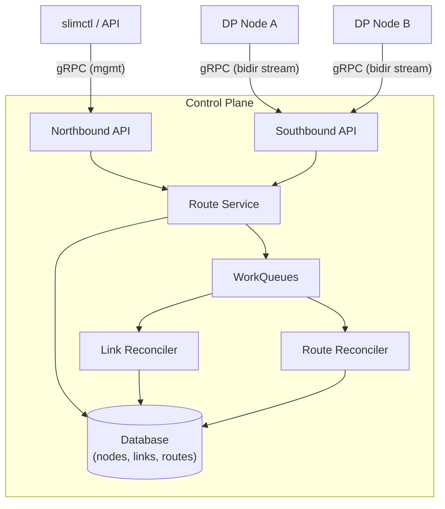
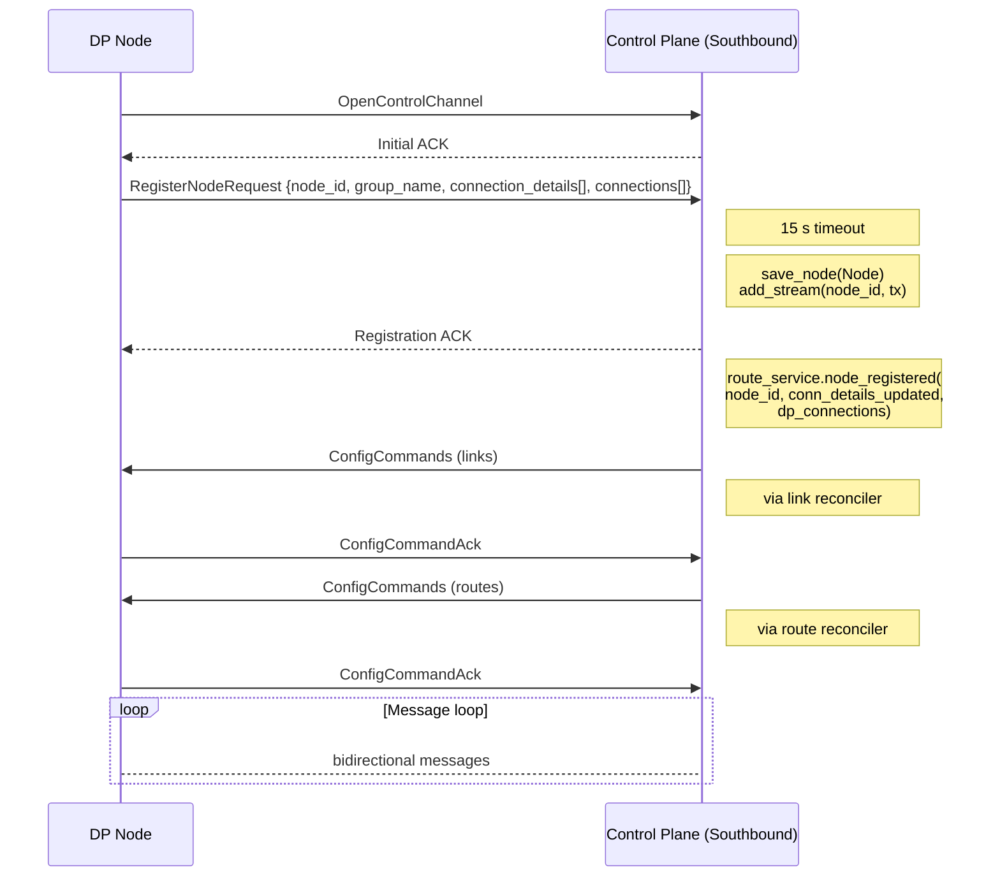
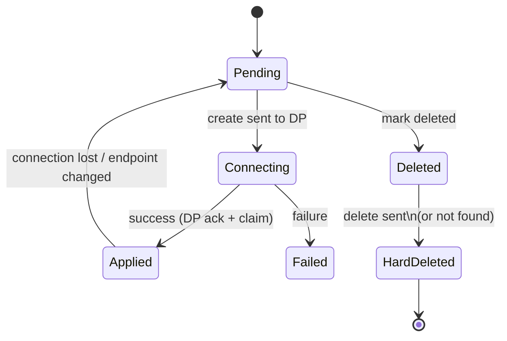
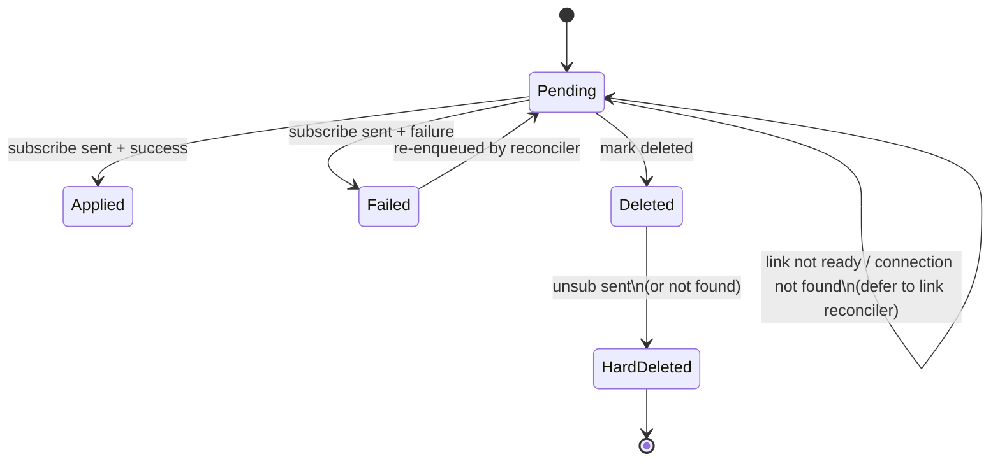

# Control-Plane Architecture

This document describes the SLIM control-plane: how nodes connect, how routing
information is propagated to data-plane instances, and how failures are handled.

---

## Table of Contents

1. [System Overview](#system-overview)
   - [Group-Based Routing](#group-based-routing)
   - [Topology](#topology)
     - [Config mode](#config-mode-topology-section-present)
     - [API mode](#api-mode-topology-section-absent-or-empty)
     - [Examples (config mode)](#examples-config-mode)
     - [Segments](#segments-route-isolation)
   - [Architecture](#architecture)
2. [Components](#components)
3. [Node Lifecycle](#node-lifecycle)
   - [Registration](#registration)
   - [Deregistration](#deregistration)
   - [Crash Disconnect](#crash-disconnect)
   - [Gateway Failover](#gateway-failover)
4. [Link Management](#link-management)
   - [Link Creation](#link-creation)
   - [Link Reconciliation](#link-reconciliation)
   - [Link State Machine](#link-state-machine)
5. [Route Management](#route-management)
   - [Wildcard Routes](#wildcard-routes)
   - [Route Reconciliation](#route-reconciliation)
   - [Route State Machine](#route-state-machine)
6. [Data-Plane Controller](#data-plane-controller)
   - [Connection to CP](#connection-to-cp)
   - [ConfigCommand Processing](#configcommand-processing)
   - [Reconnection](#reconnection)
7. [Failure Handling](#failure-handling)
   - [Retry and Backoff](#retry-and-backoff)
   - [Idempotency](#idempotency)
   - [Race Conditions](#race-conditions)
8. [Periodic Reconciliation](#periodic-reconciliation)
9. [Configuration Reference](#configuration-reference)

---

## System Overview

The control plane (CP) is the central coordinator for a fleet of SLIM
data-plane (DP) nodes. It maintains the desired state of inter-node connections
(links) and message subscriptions (routes), and uses a declarative
reconciliation loop to converge the actual state of each DP node toward the
desired state.

### Group-Based Routing

The CP operates on **groups** (also called deployments), not individual nodes.
Each DP node belongs to exactly one group. Intra-group connectivity is handled
by the data plane directly (nodes within the same group discover each other). 
The CP is responsible only for **inter-group** connectivity:
creating links between groups and expanding routes across group boundaries.

Within a group, one node is randomly selected as the **gateway** — the node
that holds the inter-group link and forwards traffic between its group and
other groups. Gateway selection is randomized to distribute load across group
members. If the gateway crashes, the CP reassigns the link to a randomly
chosen sibling node in the same group (see [Gateway Failover](#gateway-failover)).

### Topology

The CP supports two mutually exclusive topology management modes,
determined by whether the config file contains a `topology` section:

#### Config mode (topology section present)

The config file is the **single source of truth**. The topology is expressed
as an **adjacency list**: each entry declares a group and the neighbors it
connects to. All links are **bidirectional** (if A lists B, then B↔A).

The wildcard `"*"` matches all registered groups and is resolved dynamically
at node registration time.

On restart, all state is wiped and rebuilt from the config file.
Topology mutation APIs are rejected with an error.

#### API mode (topology section absent or empty)

The DB is the **single source of truth**. Topology is managed at runtime
via `slimctl` commands or gRPC APIs:

```
slimctl controller segment add <NAME>
slimctl controller segment remove <NAME>
slimctl controller link add --segment <S> <GROUP_A> <GROUP_B>
slimctl controller link remove --segment <S> <GROUP_A> <GROUP_B>
```

On restart, runtime state (nodes, links, routes) is cleared — nodes
re-register and links/routes are rebuilt automatically. Topology config
(segments, segment links) is preserved in the DB.

Use `topology: {}` in the config file to enable API mode.

#### Examples (config mode)

**Full mesh** (all groups interconnect):

```yaml
topology:
  links:
    - group: "*"
      neighbors: ["*"]
```

**Star** (hub connects to all, spokes only reach each other via hub):

```yaml
topology:
  links:
    - group: cloud
      neighbors: ["*"]
```

**Explicit pairs** (customer groups reach cloud but not each other):

```yaml
topology:
  links:
    - group: cloud
      neighbors: [customer-a, customer-b]
```

**Chain** (linear: a↔b↔c↔d, multi-hop):

```yaml
topology:
  links:
    - group: group-a
      neighbors: [group-b]
    - group: group-b
      neighbors: [group-c]
    - group: group-c
      neighbors: [group-d]
```

The topology is enforced during link creation.
The SPT routing algorithm uses the topology graph to compute
shortest paths for route expansion across non-adjacent groups.

#### Segments (route isolation)

Segments partition the network into independent routing domains.
Agents registered in one segment are **invisible** to agents in other
segments — routes are only expanded within the segment's topology graph.

Each segment has its own `links` adjacency list. The special token
`$group` is a **template variable** that causes the segment definition
to be **instantiated once per registered group**. For each group, `$group`
is replaced with that group's name — it does not expand to a list of
all groups simultaneously.

**Per-group isolation** (each customer reaches cloud but not other customers):

```yaml
topology:
  segments:
    - name: segment-$group
      links:
        - group: cloud
          neighbors: [$group]
```

Because `$group` is a template, this produces one segment per group
(e.g. `segment-customer-a`, `segment-customer-b`). In each generated
segment the `cloud` group links only to that single customer group.
Agents in `customer-a` can communicate with agents in `cloud`
and vice versa, but `customer-a` cannot see `customer-b`.

**Named segments** (explicit multi-tenant isolation):

```yaml
topology:
  segments:
    - name: customer-1
      links:
        - group: cloud
          neighbors: [cluster-a]
    - name: customer-2
      links:
        - group: cloud
          neighbors: [cluster-b, cluster-c]
```

When segments are defined, the top-level `topology.links` section is
ignored — segments fully control both link creation and route expansion.

### Architecture



Communication between the CP and DP nodes uses a bidirectional gRPC stream.
The CP sends `ConfigCommand` messages to instruct
nodes to create/delete connections and subscriptions. Nodes send registration
requests, config command acknowledgements, and DP-initiated subscription
mutations back on the same stream.

## Components

| Component | File | Role |
|---|---|---|
| **Southbound API** | `services/southbound.rs` | Accepts DP node connections, handles registration handshake, dispatches messages |
| **Northbound API** | `services/northbound.rs` | Management gRPC API for operators (`slimctl`): create routes/links, list state |
| **Route Service** | `route_service.rs` | Orchestrates link/route lifecycle on node register/deregister events |
| **SPT Module** | `route_service/spt.rs` | Computes Shortest Path Trees for route expansion |
| **Reconciler** | `route_service/reconciler.rs` | Converges link and route state: creates/deletes connections and subscriptions on DP nodes |
| **Node Command Handler** | `node_transport.rs` | Manages per-node gRPC streams, request-response correlation, connection status |
| **Work Queue** | `workqueue.rs` | Fair, deduplicating, k8s-style work queue with shutdown/drain support |
| **Database** | `db/` | Persistent storage (InMemory or SQLite) for nodes, links, and routes |
| **DP Controller** | `core/controller/src/service.rs` | Data-plane side: connects to CP, processes ConfigCommands, manages datapath connections |

## Node Lifecycle

### Registration

When a data-plane node starts, it opens a bidirectional gRPC stream to the
CP's southbound API (`OpenControlChannel`). The following sequence occurs:



**Node ID construction.** If the node provides a `group_name`, the effective
node ID becomes `{group_name}/{node_id}`. Otherwise, the bare `node_id` is
used.

**`node_registered` orchestration.** After saving the node and registering
the stream, the route service performs several operations:

1. **Link state sync against DP-reported connections.** The DP sends its
   currently active connection IDs in the registration message. For each
   existing inbound link in the DB:
   - **DP says alive** (link ID in the active set): mark the link `Applied`
     and enqueue route reconciliation only.
   - **DP did not report, but endpoint unchanged and link is Applied**:
     optimistically trust the link (avoids unnecessary connection recreation
     when only the CP stream reconnected).
   - **DP says dead, or endpoint changed**: reset the link to `Pending` and
     enqueue link reconciliation. If the endpoint changed, update the
     destination endpoint and connection config in the link record.

2. **Ensure links exist** (`ensure_links_for_node`). For every other
   registered node in a **different group** that does not yet have a link
   to/from this node's group:
   - Create a group link using the `external_endpoint`. The node with the
     external endpoint becomes the destination.
   - The target node within the remote group is chosen randomly to distribute
     gateway load.
   - If neither node has an external endpoint, log an error (cross-group
     connectivity requires at least one external endpoint).
   - Same-group connectivity is handled by the data plane (not the CP).

3. **Expand routes via SPT** (`expand_all_wildcard_routes`). For each unique
   name with wildcard route templates, compute the SPT rooted at the first
   announcer's group. Install upward routes (child→parent) for the root's
   tree and downward routes (parent→child) for subsequent announcers. See
   [Wildcard Routes](#wildcard-routes) for details.

4. **Enqueue reconciliation.** All affected nodes are enqueued for link and
   route reconciliation.

### Deregistration

A node deregisters gracefully by sending a `DeregisterNodeRequest` on the
stream. The CP sends a `DeregisterNodeResponse` *before* removing the stream
(critical ordering -- once the stream is removed, sends fail). Then:

1. **Gateway failover** (`handle_links_for_departing_node`): if the node held
   inter-group links and siblings exist, reassigns them to a random sibling.
   If this was the last node in the group, all links are soft-deleted.
2. **Route cleanup** (`cleanup_routes_for_node`):
   - Source routes: hard-delete.
   - Destination routes: mark-delete and enqueue source nodes for route
     reconciliation so subscriptions are cleaned up on the DP.
   - Wildcard templates targeting this node: hard-delete.
3. **Node record**: delete from the database.

### Crash Disconnect

When a DP node disconnects without sending `DeregisterNodeRequest` (crash,
network failure), the stream read loop exits. The CP:

1. Removes the stream (`remove_stream`), which closes all in-flight
   response waiters immediately (they receive a channel-closed error
   instead of blocking until the 90 s timeout).
2. Calls `node_disconnected` which:
   - **Gateway failover**: if the node held inter-group links, reassigns
     them to a randomly chosen sibling (see [Gateway Failover](#gateway-failover)).
   - **Route cleanup**: deletes source routes, mark-deletes destination
     routes, and deletes wildcard templates targeting this node.
3. Keeps the node record (the node is expected to
   reconnect). When it does, `node_registered` re-syncs links and
   re-expands routes.

### Gateway Failover

When a node that serves as a group's gateway (the node holding inter-group
links) departs, the CP performs gateway failover to maintain connectivity.
The new gateway is chosen **randomly** from connected siblings to distribute load.

**Outgoing links** (gateway is the source side of the link):
1. The link's `source_node_id` is changed to a randomly chosen sibling node.
2. The link keeps its `link_id` and is reset to `Pending`.
3. Routes on the departing gateway are moved to the sibling (same `link_id`).
4. The reconciler pushes the connection to the new gateway, which establishes it.

**Incoming links** (gateway is the dest side of the link):
1. The old link is deleted entirely (the endpoint pointed to the dead node).
2. `ensure_links_for_node` is called on the source to recreate the link
   targeting the sibling's endpoint.
3. Routes referencing the old link are deleted.
4. After the new link is claimed, `expand_all_wildcard_routes` re-creates
   the routes with the correct new `link_id`.

**Single-node groups**: If the departing node is the last in its group, no
failover is possible. All links are soft-deleted and routes are cleaned up.
When a new node joins the group later, links and routes are recreated from
scratch.

## Link Management

A **link** represents a desired gRPC connection between two DP nodes. Links
are directional: the `source_node_id` initiates the connection to the
`dest_node_id` at `dest_endpoint`.

### Link Creation

Links are created during node registration (`ensure_links_for_node`). 
Each link gets a unique `link_id` (UUID) and is stored
with status `Pending`. 

**Connection detail selection.** For cross-group links, the
`external_endpoint` is used with mTLS (SPIRE-based), and additional settings
(backoff, keepalive, SPIRE socket path) are injected into the config.

**Link claim mechanism.** Inter-group links use a two-phase creation process
because the source node typically connects to a shared ingress (load balancer)
rather than a specific destination node — the CP cannot know in advance which
node will receive the connection:

1. The CP creates the link record with `dest_node_id` empty and `dest_group`
   set. The reconciler pushes the connection config to the source node.
2. The source node establishes the gRPC connection to the dest endpoint.
3. The dest node receives the connection and reports it back to the CP via
   `ConfigCommand` (with the `link_id` embedded in the connection metadata).
4. The CP calls `claim_link`: it matches the `link_id` + `dest_group` and
   fills in `dest_node_id` with the claiming node. The link is now fully
   established (`Applied`).
5. After claim, `expand_all_wildcard_routes` is triggered to create routes
   over the newly established link.

### Link Reconciliation

The link reconciler runs as configurable parallel workers (default: 4)
consuming from a shared `WorkQueue<String>` keyed by source node ID. When a
node is dequeued:

1. **Pre-flight**: verify the node is `Connected`. If not, skip.
2. **Query node state**: send a `ConnectionListRequest` to get the set of
   connection IDs currently live on the node.
3. **Classify links**:
   - **Desired**: non-deleted outgoing links from this node in the DB.
   - **Live**: connections actually present on the node.
   - **Orphan** (optional): live connections not tracked by the CP. Only
     cleaned up if `enable_orphan_detection` is true.
4. **Idempotency check**: if a link is `Applied` in DB *and* live on the
   node, skip the create -- enqueue route reconciliation only.
5. **Build ConfigCommand**:
   - `connections_to_create`: desired links not yet live.
   - `connections_to_delete`: deleted links + orphans.
6. **Send and wait for ack** (`ConfigCommandAck`).
7. **Process acks**:
   - Created link + success: mark `Applied`, enqueue route reconciliation.
   - Created link + failure: mark `Failed` with error message.
   - Deleted link + success: hard-delete from DB.
   - Deleted link + "connection not found": treat as success (already gone).
8. **On error**: requeue with exponential backoff.

### Link State Machine



## Route Management

A **route** represents a desired message subscription on a DP node. A route
instructs the source node to subscribe to messages matching a name pattern
(`component0/component1/component2`, optionally with a `component_id`) via a
specific link.

### Wildcard Routes

Routes with `source_node_id = "*"` (the `ALL_NODES_ID` sentinel) are
**wildcard templates**. They express operator intent: "every reachable node
should be able to reach this name." The CP uses a Shortest Path Tree (SPT)
to expand them efficiently without creating loops.

**Single-tree model.** For each unique name, only **one** SPT exists, rooted
at the group of the first node to announce that name. Subsequent announcers
join the existing tree rather than creating new ones.

**Expansion logic:**

- **First announcer** (no existing wildcard for this name): computes the SPT
  rooted at the announcer's group. For each non-root group in the tree,
  installs an *upward* route on that group's gateway node pointing toward
  the parent group (toward root).
- **Subsequent announcers** (wildcard already exists for this name): walks
  from the new announcer's group up to the root in the SPT and installs
  *downward* routes on each intermediate parent pointing toward the child
  group (away from root, toward the new announcer).

This produces a loop-free forwarding tree where:
- Upward routes bring traffic from any node toward the root (first announcer).
- Downward routes enable the root to fan out multicast traffic toward all
  other announcers.

Wildcard template records themselves are stored with status `Applied` (they
don't correspond to a real subscription). The per-node expansions are stored
with status `Pending` and go through normal reconciliation.

### Route Reconciliation

The route reconciler runs as parallel workers consuming from a shared
`WorkQueue<String>` keyed by node ID. When a node is dequeued:

1. **Pre-flight queries** (concurrent): send `ConnectionListRequest` and
   `SubscriptionListRequest` to get the node's live connections and
   subscriptions.
2. **Build applied set**: map of `(c0, c1, c2, component_id, link_id)` tuples
   currently active on the node. The DP's `NULL_COMPONENT` sentinel
   (`u64::MAX`) is normalized to `None` for matching.
3. **Orphan detection**: subscriptions live on the node but absent from the CP
   database are scheduled for deletion.
4. **Process each route**:
   - **Deleted route, already absent from node**: hard-delete from DB (no
     round-trip needed).
   - **Deleted route, still on node**: add to `subscriptions_to_delete`.
   - **Non-deleted route, link not found or Failed**: skip (or mark route
     `Failed` if the link is `Failed`).
   - **Non-deleted route, link not yet Applied**: defer -- poke the link
     reconciler.
   - **Non-deleted route, link Applied but not live on node** (pre-flight
     connection check): reset link to `Pending` and hand back to the link
     reconciler.
   - **Non-deleted route, already active on node** (idempotency check): mark
     `Applied`, skip the send.
   - **Otherwise**: add to `subscriptions_to_set`.
5. **Send ConfigCommand** with `subscriptions_to_set` and
   `subscriptions_to_delete`. Wait for `ConfigCommandAck`.
6. **Process acks**:
   - Success + non-deleted route: `mark_route_applied`.
   - Success + deleted route: hard-delete from DB.
   - Failure + deleted route + "subscription not found": treat as success.
   - Failure + "connection not found": requeue the node (the pre-flight check
     passed but the connection disappeared before the subscribe was sent).
   - Other failure: `mark_route_failed` with error message.

### Route State Machine



## Data-Plane Controller

Each DP node runs a `ControllerService` that manages the connection to the
CP and translates `ConfigCommand` messages into datapath operations.

### Connection to CP

The `connect()` method:

1. **Resets state from any previous session**: drains the `message_id_map`
   (stops timers, sends failure acks to unblock waiters), clears
   `connections`, `route_subscription_ids`, and `link_id_to_conn_id`.
2. **Establishes the gRPC channel** using the configured `ClientConfig`.
3. **Sends queued notifications** that accumulated while disconnected.
4. **Creates a new `TimerFactory`** for ack timeout tracking.
5. **Spawns the stream processing task** (`process_control_message_stream`).

The stream processing task sends a `RegisterNodeRequest` (including the
node's current active connections for idempotency) and then enters the main
message loop.

### ConfigCommand Processing

When the DP controller receives a `ConfigCommand`, it processes four
sections in order:

1. **`connections_to_delete`**: for each `link_id`, resolve the underlying
   datapath connection ID and disconnect.
2. **`connections_to_create`**: for each connection config, parse the JSON
   `ClientConfig`, check for existing connections (by `link_id` or
   endpoint), and either reuse or create a new datapath connection.
3. **`subscriptions_to_set`**: for each subscription, resolve the connection
   (by `link_id` -> `conn_id`), build a `Subscribe` message with the name
   components, and send it through the datapath with a 30 s ack timeout.
   Store the `(Name, conn_id) -> subscription_id` mapping.
4. **`subscriptions_to_delete`**: for each subscription, look up the stored
   `subscription_id` and send an `Unsubscribe` message.

A `ConfigCommandAck` is sent back containing per-connection and
per-subscription success/error status.

**Message ID mapping.** The datapath uses `u32` subscription IDs internally.
The `message_id_map` bridges these to the CP's string-based message IDs. A
`Timer` tracks each pending ack; on timeout, a failure ack is sent.

### Reconnection

When the stream breaks (error or end-of-stream), the DP controller
automatically calls `connect()` again. Because `connect()` resets all
internal state before establishing the new session, the CP treats the
re-registering node as a fresh connection and sends new `ConfigCommand`
messages to rebuild the desired state.

If reconnection fails, the error is logged and no further attempts are made
from within the stream processing task. The DP node remains disconnected
until an external mechanism restarts it or until the CP connection is
re-established through other means.

## Failure Handling

### Retry and Backoff

Both reconcilers use exponential backoff with configurable parameters:

| Parameter | Default | Description |
|---|---|---|
| `base_retry_delay` | 200 ms | Delay for the first retry |
| `max_requeues` | 15 | Maximum retry attempts before dropping |

The backoff schedule (with default 200 ms base):

| Attempt | Delay |
|---------|-------|
| 1 | 200 ms |
| 2 | 400 ms |
| 3 | 800 ms |
| 4 | 1.6 s |
| 5 | 3.2 s |
| 6 | 6.4 s |
| 7 | 12.8 s |
| 8+ | 30 s (cap) |

After `max_requeues` failures, the item is dropped from the work queue. The
periodic sweep re-enqueues all connected nodes, so a dropped item is retried
on the next sweep cycle.

### Idempotency

Every reconciliation step includes idempotency checks to avoid redundant
operations:

- **Link reconciler**: queries the node's live connection table before
  sending creates. If a link is already live, it skips the create and only
  enqueues route reconciliation.
- **Route reconciler**: queries the node's live subscription table before
  sending subscribes. If a subscription is already active, it marks the
  route `Applied` without a round-trip.
- **Delete idempotency**: if a delete command returns "not found"
  (connection or subscription), the reconciler treats it as success -- the
  desired state is already reached.

### Race Conditions

**Register/deregister race.** A rapid disconnect-reconnect sequence can cause
`node_deregistered` and `node_registered` to run concurrently. A per-node
mutex (`node_locks`) serializes these operations for the same node.

**Pre-flight TOCTOU.** The route reconciler checks that a link's connection
is live on the node before sending a subscription. However, the connection
can disappear between the check and the send. If the subscription fails with
"connection not found", the reconciler requeues the node for another attempt
without consuming a retry slot.

**Concurrent DP-initiated config.** DP nodes can send `ConfigCommand`
messages (subscriptions and link claims) on the stream. These are processed
inline in the stream loop — subscriptions without a `link_id` are treated as
wildcard route announcements, and `connections_received` entries trigger the
link claim flow.

**In-flight waiters on disconnect.** When a node's stream is removed, all
pending request-response waiters (oneshot/mpsc channels) are closed
immediately. Receivers get a channel-closed error instead of blocking until
the 90 s timeout.

## Periodic Reconciliation

Every `reconcile_period` (default: 60 s), the CP enqueues all connected
nodes for both link and route reconciliation. This full-sweep catches:

- Drift caused by missed events.
- Items that were dropped after `max_requeues` failures.
- State changes that occurred outside the normal event-driven flow.

The sweep task respects graceful shutdown via a `watch` channel and exits
when the service shuts down.

## Configuration Reference

```yaml
tracing:
  log_level: info  # trace, debug, info, warn, error

northbound:
  endpoint: "0.0.0.0:50051"
  tls:
    insecure: true  # or configure mTLS

southbound:
  endpoint: "0.0.0.0:50052"
  tls:
    insecure: true

database:
  type: in_memory  # or: type: sqlite, path: "/var/lib/slim/cp.db"

# Topology section controls how groups are connected.
# Present = config mode (config is source of truth, mutation APIs disabled).
# Absent or empty = API mode (DB is source of truth, use slimctl to manage).

# Config mode example (star topology):
topology:
  links:
    - group: cloud
      neighbors: ["*"]  # cloud connects to all groups
  # Optional: segments for route isolation (see Topology section above)
  # segments:
  #   - name: segment-$group
  #     links:
  #       - group: cloud
  #         neighbors: [$group]

# API mode example:
# topology: {}

reconciler:
  # Max retry attempts per item before dropping (re-enqueued on next sweep).
  max_requeues: 15

  # Base delay for first retry. Exponential backoff: base * 2^(attempt-1), cap 30s.
  base_retry_delay: "200ms"

  # Interval for full reconciliation sweep. "0s" disables.
  reconcile_period: "60s"

  # Delete DP connections not tracked by the CP.
  # Only enable in greenfield deployments where CP is sole source of truth.
  enable_orphan_detection: false

  # Parallel reconciler workers per queue (link and route).
  workers: 4
```

The CP exposes two gRPC endpoints:

| Endpoint | Default | Purpose |
|---|---|---|
| Northbound | `0.0.0.0:50051` | Management API (slimctl, operators) |
| Southbound | `0.0.0.0:50052` | DP node registration and control |

Database backend is configurable: `in_memory` (default, all state lost on
restart) or `sqlite` (persistent). SQLite is required for API mode to
preserve topology across restarts.
