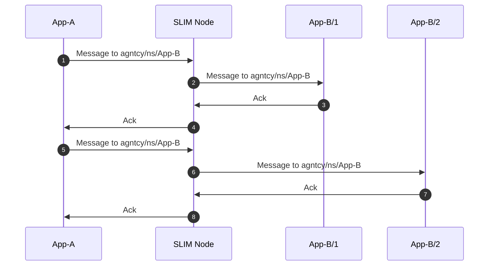
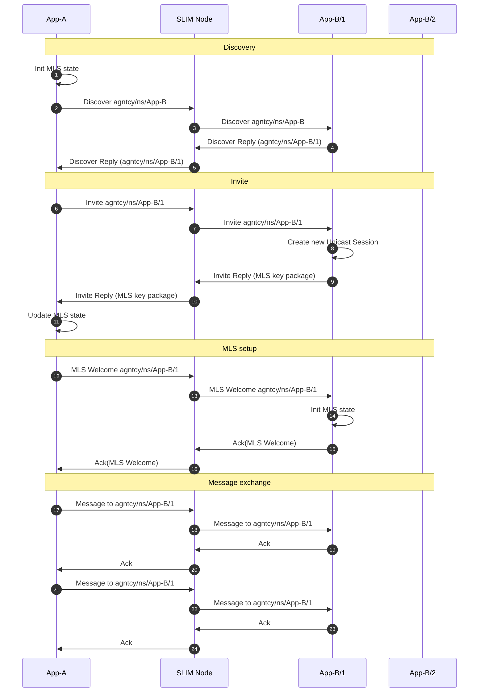
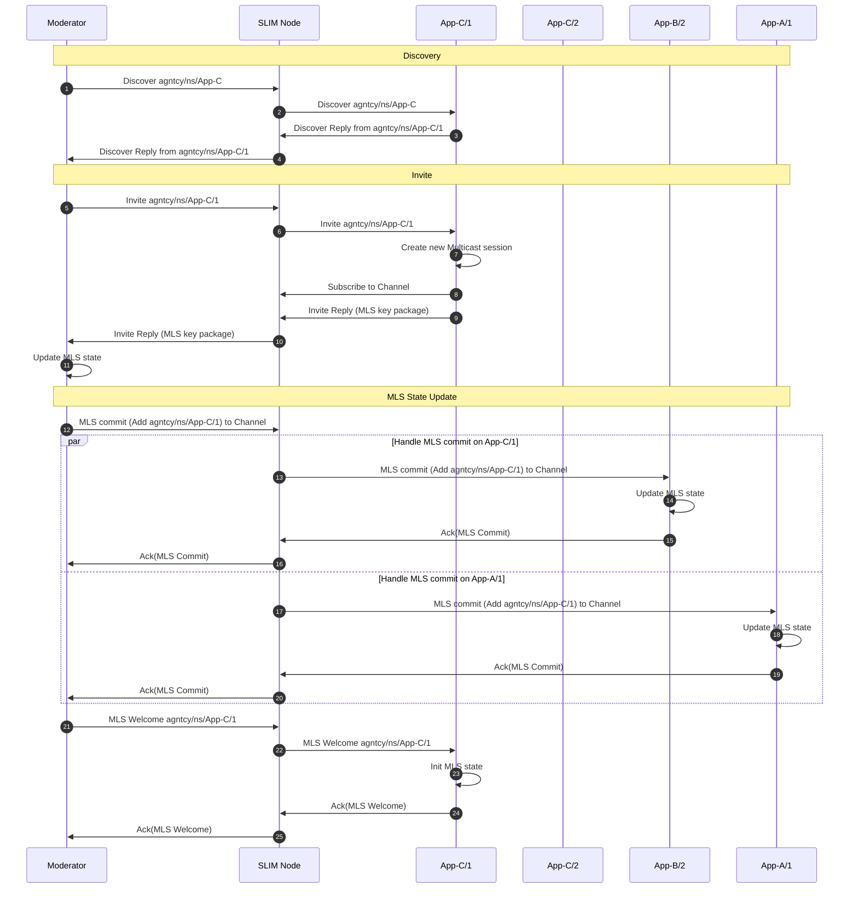
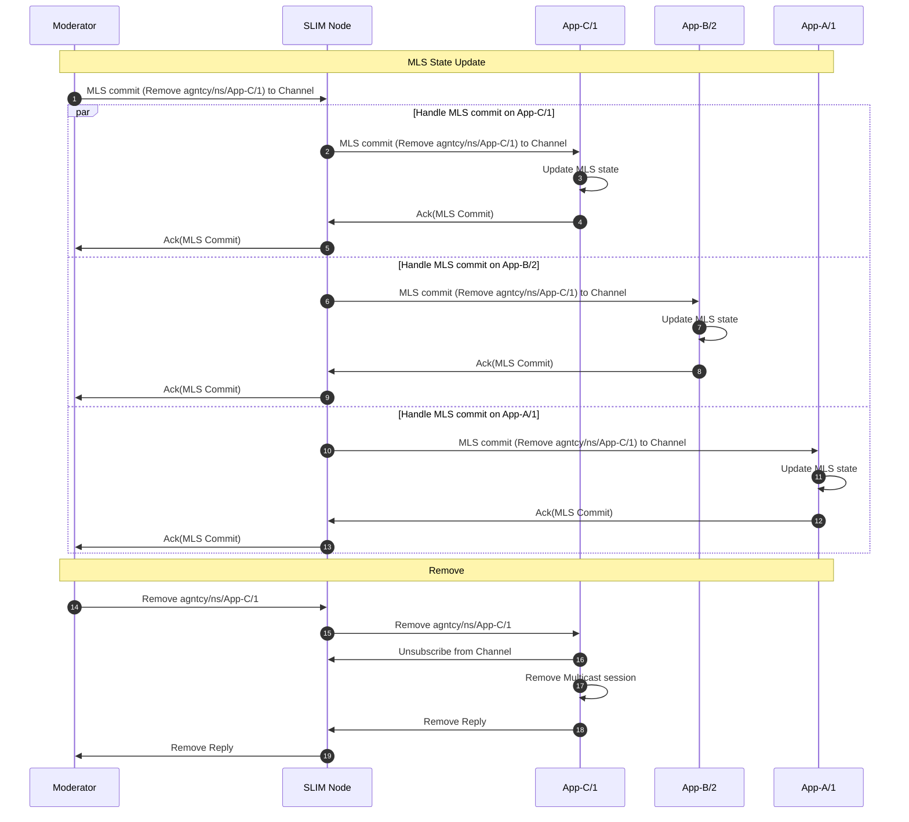

# SLIM Sessions


---
## TL;DR: SLIM Session Types Overview

| Session Type | Pattern         | Reliability | Security (MLS) | Use Case / Notes                  |
|--------------|----------------|-------------|----------------|-----------------------------------|
| Anycast      | 1:1, stateless | Optional    | Not supported  | Load balancing, stateless comms   |
| Unicast      | 1:1, stateful  | Optional    | Supported      | Stateful, secure, persistent      |
| Multicast    | N:N, group     | Optional    | Supported      | Group messaging, channel control  |

**Key Points:**
- **Anycast:** Each message goes to one instance; no persistent state; no MLS.
- **Unicast:** Messages go to a specific instance; supports MLS for security.
- **Multicast:** Group/channel messaging; moderator can add/remove participants;
    supports MLS for secure group comms.
---

This document describes the different session types available to applications 
running on SLIM. Each session type is designed for specific communication patterns 
and use cases, supporting a range of reliability and security settings.


## Anycast


The anycast session enables point-to-point (1:1) communication where each message
sent to a service is delivered to only one of its available instances. This
pattern provides natural load balancing and redundancy for stateless services.
Anycast is best suited for distributing requests across multiple instances
without maintaining session state.

Let's see an example of the communication pattern in the anycast session using the 
sequence diagram below. The anycast session sends each
message to a service (e.g., App-B) and the message is delivered to only one of its
available instances of that service (e.g., App-B/1 or App-B/2). The SLIM Node dynamically
routes each message to one of the running instances, so consecutive messages
may be delivered to different endpoints. 

If reliability is enabled, the sender expects an acknowledgment (Ack) for every
message sent. This ensures that the sender is notified of successful delivery,
even though the specific recipient instance may vary for each message.

The diagram below illustrates two consecutive messages from App-A to the
service agntcy/ns/App-B. The first message is delivered to App-B/1, the second
to App-B/2. Each delivery is followed by an Ack:



**Note:** Anycast sessions are stateless and do not allow persistent state to
be stored on the remote endpoint. As a result, Messaging Layer Security (MLS)
cannot be enabled for anycast sessions. If MLS is required for point-to-point
communication, use a unicast session instead.


### Create an Anycast Session

Using the SLIM Python bindings, you can create an Anycast session as follows:

```python
import datetime

# Assume local_app is an initialized application instance
session_info = await local_app.create_session(
    slim_bindings.PySessionConfiguration.Anycast(
        max_retries=5,  # Number of times to retry message delivery on failure
        timeout=datetime.timedelta(seconds=5),  # Timeout for each retry
    )
)
```

**Parameter explanations:**
- `max_retries`: Number of times to retry message delivery on failure. Default is 5.
- `timeout`: How long to wait for an acknowledgment at each retry. Default is 5 seconds.


## Unicast

The unicast session enables point-to-point communication with a specific instance
of an application. Unlike anycast, which may route each message to a different
instance, unicast begins with a discovery phase to identify one of the running
instances of the target application. After discovery, all subsequent messages in
the session are sent to the same instance, providing a stable communication
channel. This approach is useful when stateful interactions or session continuity are
required between the sender and a particular recipient. If reliability is
enabled, the sender expects an acknowledgment (Ack) for every message sent.

If Messaging Layer Security (MLS) is enabled, the unicast session setup the MLS 
state after the discovery. App-A sends an invite to App-B/1, which
responds with its MLS key package. App-A then sends an MLS Welcome message to
App-B/1, establishing a secure group with just these two participants. This is
similar to the MLS setup in multicast (see next session), but here the group contains 
only App-A and App-B/1.


The diagram below illustrates a unicast session from App-A to agntcy/ns/App-B.
App-A first discovers an available instance (App-B/1), then performs the MLS
setup, and finally sends multiple messages to that same instance, each followed
by an Ack. If MLS is not enabled, the MLS setup is skipped:




### Create a Unicast Session

Using the SLIM Python bindings, you can create a Unicast session as follows:

```python
import datetime

# Assume local_app is an initialized application instance
session_info = await local_app.create_session(
    slim_bindings.PySessionConfiguration.Unicast(
        max_retries=5,  # Number of times to retry message delivery on failure
        timeout=datetime.timedelta(seconds=5),  # Timeout for each retry
        mls_enabled=True,  # Enable Messaging Layer Security (MLS) for secure comms
    )
)
```

**Parameter explanations:**
- `max_retries`: Number of times to retry message delivery on failure. Default is 5.
- `timeout`: How long to wait for an acknowledgment at each retry. Default is 5 seconds.
- `mls_enabled`: Enables secure messaging using Messaging Layer Security (MLS). Set to 
`True` to enable encryption and authentication for the session.

## Multicast

The multicast session allows N:N communication where all applications can
exchange messages on a shared channel. The messages are delivered to all the
participants that are on the same channel.


Each channel is managed by a moderator who can add or remove participants from
the channel. A moderator can be part of the application logic itself or a
separate application used only to manage the channel. This can also be
controlled via the control plane.


Below are examples using the latest Python bindings, along with explanations of
what happens inside the session layer when a participant is added or removed
from the channel.

### Create a multicast session

To create a multicast session, you need to configure the session with a topic name,
set yourself as moderator if you want to manage participants, and specify other
options such as retries, timeout, and security settings. Here is an example:

```python
import datetime

# Assume local_app is an initialized application instance
session_info = await local_app.create_session(
    slim_bindings.PySessionConfiguration.Multicast(
        topic=("namespace", "app", "instance"),  # The multicast topic/channel (tuple or string)
        moderator=True,  # Set True if this app will invite/remove participants
        max_retries=10,  # Number of times to retry session creation on failure
        timeout=datetime.timedelta(seconds=1),  # Timeout for session creation
        mls_enabled=True,  # Enable Messaging Layer Security (MLS) for secure group messaging
    )
)
```

**Parameter explanations:**
- `topic`: The multicast channel or topic. This can be a string or a tuple
    (namespace, app, instance) identifying the group.
- `moderator`: If True, this app can invite or remove participants from the
    session.
- `max_retries`: On packet loss detection, how many times to retry to retrieve
    a message before notifying the application with an error. 
    If set to None, every packet loss will be ignored.
- `timeout`: How long to wait for the message to come back at every
    retransmission request.
- `mls_enabled`: Enables secure group messaging using Messaging Layer Security
    (MLS).


### Invite New Participant

A moderator can invite a new participant to the channel using the `invite` method
after creating the session.

#### Example: Inviting a participant (Python)

```python
await local_app.set_route(participant_name)  # Set up routing for the participant
await local_app.invite(session_info, participant_name)  # Invite the participant to the session
```

**Parameter explanations:**
- `session_info`: The session object returned by `create_session`.
- `participant_name`: The participant's identifier (tuple or string, e.g.,
  (namespace, app, instance)).


When a moderator wants to add a new participant (e.g., an instance of App-C) to a
multicast session, the following steps occur. All the steps are visualized in the
diagram below:


1. **Discovery Phase:**
    The moderator initiates a discovery request to find a running instance of the
    desired application (App-C). This request is sent to the SLIM Node, which
    forwards it in anycast to one of the App-C instances. In the example, the
    message is forwarded to App-C/1 that replies with its full identifier. The
    SLIM Node relays this reply back to the moderator.

2. **Invitation:**
    The moderator sends an invite message for the discovered instance (App-C/1)
    to the SLIM Node, which forwards it to App-C/1. Upon receiving the invite,
    App-C/1 creates a new multicast session, subscribes to the channel, and
    replies with its MLS (Messaging Layer Security) key package. This reply is
    routed back to the moderator.

3. **MLS State Update:**
    The moderator initiates an MLS commit to add App-C/1 to the secure group.
    The message is sent using the channel name and so the SLIM Node distributes
    this commit to all current participants (App-B/2 and App-A/1), who update
    their MLS state and acknowledge the commit. The moderator collects all
    acknowledgments. Once all acknowledgments are received, the moderator sends
    an MLS Welcome message to App-C/1. App-C/1 initializes its MLS state and
    acknowledges receipt. At the end of this process, all participants
    (including the new one) share a secure group state and can exchange
    encrypted messages on the multicast channel. If MLS is disabled, the MLS state update and welcome step are skipped.



### Remove Participant


A moderator can remove a participant from the channel using the `remove` method
after creating the session.

#### Example: Removing a participant (Python)

```python
await local_app.remove(session_info, participant_name)  # Remove the participant from the session
```


**Parameter explanations:**
- `session_info`: The session object returned by `create_session`.
- `participant_name`: The participant's identifier (tuple or string, e.g.,
  (namespace, app, instance)).


When a moderator wants to remove a participant (e.g., App-C/1) from a multicast
session, the following steps occur. All the steps are visualized in the diagram
below:


1. **MLS State Update:**
    The moderator creates an MLS commit to remove App-C/1 from the secure group.
    This commit is sent to the multicast channel and the SLIM Node distributes it
    to all current participants (App-C/1, App-B/2, and App-A/1). Each
    participant updates its MLS state and acknowledges the commit. The moderator
    collects all acknowledgments. In case the MLS is disabled, this step is not
    executed.

2. **Removal:**
    After the MLS state is updated, the moderator sends a remove message to
    App-C/1. Upon receiving the remove message, App-C/1 unsubscribes from the
    channel, deletes its multicast session, and replies with a confirmation. The
    SLIM Node relays this confirmation back to the moderator. At the end of this
    process, App-C/1 is no longer a member of the multicast group and cannot
    send or receive messages on the channel.

