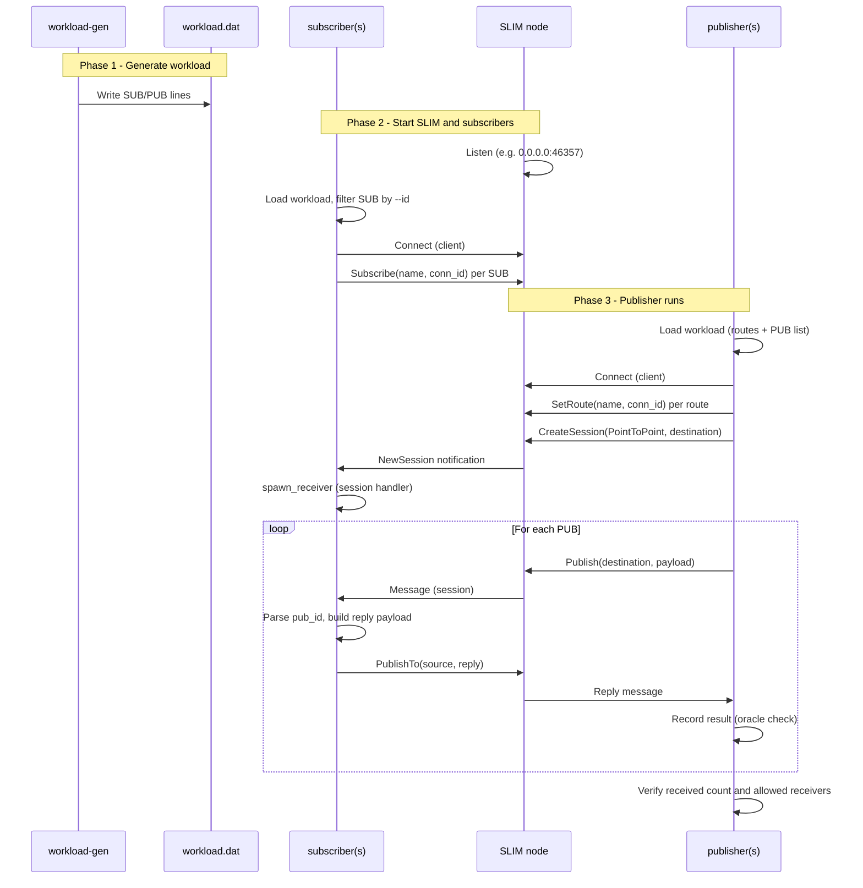

# Load test experiment: workload-gen, publisher, subscriber

## Use case description

This experiment uses three binaries from the `agntcy-slim-testing` crate to generate load on a SLIM data-plane instance:

1. **workload-gen** — Generates a **workload file** that describes a reproducible pattern of subscriptions and publications. It produces a `.dat` file with:
   - **SUB** lines: which subscriber (by id) subscribes to which name (org/namespace/type + app id).
   - **PUB** lines: which publication targets which names and which subscriber ids are valid receivers (used later for correctness checks).

   The workload is the single source of truth: both publisher and subscriber read it so that subscriptions and publications align (same names, matching subscriber ids).

2. **publisher** — Connects to a SLIM node as a **client** (using the same client config as the data-plane endpoint). It:
   - Loads the workload file.
   - Creates a local app, sets **routes** for all subscription names from the workload, and creates a **Point-to-Point session** toward the first route.
   - Sends one message per **PUB** entry (payload includes publication id and padding). It then waits for **replies** from subscribers (echo back) and verifies that each publication was received by an allowed receiver (oracle check).

3. **subscriber** — Connects to the same SLIM node as a **client**. It:
   - Loads the same workload file.
   - Registers **subscriptions** only for SUB lines whose subscriber id matches its `--id` (so one process per logical subscriber id).
   - Listens for **NewSession** notifications; for each new session it spawns a receiver that reads messages and **replies** via `publish_to` (echo with subscriber id in payload).
   - Runs until the process is stopped.

Together, **workload-gen** defines the scenario; **subscriber**(s) register interest; **publisher**(s) drive traffic through SLIM; the publisher validates that replies match the workload oracle. This exercises session establishment, routing, publish, and reply paths on a running SLIM instance.

---

## Sequence diagram



---

## Basic setup to run an experiment

### Prerequisites

- Built data-plane workspace (e.g. `cargo build -p agntcy-slim-testing` from `data-plane/`).
- Client and server configs that match your environment. Below assumes:
  - **Server**: `data-plane/config/base/server-config.yaml` (SLIM listening on `0.0.0.0:46357`).
  - **Client**: `data-plane/config/base/client-config.yaml` (clients connect to `http://localhost:46357`).

### Step 1: Generate the workload

From the repo root or `data-plane/testing/`:

```bash
cd data-plane
cargo run -p agntcy-slim-testing --bin workload-gen -- \
  --subscriptions 20 \
  --publications 50 \
  --instances 1 \
  --apps 1 \
  --output workload_debug.dat
```

- `--apps 1`: one logical subscriber (id `0`). Use a higher value if you run multiple subscriber processes with different `--id`.
- Output `workload_debug.dat` is written under the current directory (e.g. `data-plane/workload_debug.dat`).

### Step 2: Start the SLIM server

In a dedicated terminal:

```bash
cd data-plane
cargo run -p agntcy-slim -- --config config/base/server-config.yaml
```

Or, if you use the testing Taskfile from `data-plane/testing/`:

```bash
cd data-plane/testing
task run:slim
```

Leave this running.

### Step 3: Start the subscriber

In another terminal, same workload and client config:

```bash
cd data-plane
cargo run -p agntcy-slim-testing --bin subscriber -- \
  --config config/base/client-config.yaml \
  --id 0 \
  --workload workload_debug.dat
```

- `--id 0` must match the subscriber id used in the workload (with `--apps 1`, only id `0` appears in SUB lines).
- Leave it running so it can accept sessions and reply to messages.

### Step 4: Start the publisher

In a third terminal:

```bash
cd data-plane
cargo run -p agntcy-slim-testing --bin publisher -- \
  --config config/base/client-config.yaml \
  --id 1 \
  --workload workload_debug.dat \
  --msg-size 1024 \
  --frequency 0
```

- Uses the same `workload_debug.dat` and client config.
- Publisher will set routes, create a session, send all publications, wait for replies, and print whether the oracle check passed.

### Order summary

1. Generate workload once (Step 1).
2. Start SLIM (Step 2).
3. Start subscriber(s) (Step 3) — at least one with an id that appears in the workload’s SUB lines.
4. Start publisher (Step 4).

For multiple subscribers, generate a workload with `--apps N`, then run N subscriber processes with `--id 0`, `--id 1`, … and ensure the config points to the same SLIM endpoint. The publisher needs no change; the workload already defines which names and receiver ids are valid.

### Debug configurations (Cursor/VS Code)

If you use the provided launch configs (see `.vscode/launch.json` and `.vscode/tasks.json`):

- **Debug workload_gen** — builds and runs workload-gen with default args (writes e.g. `workload_debug.dat`).
- **Debug subscriber** — builds and runs subscriber with `--config config/base/client-config.yaml`, `--id 0` (or match workload’s `--apps`), `--workload workload_debug.dat`.
- **Debug publisher** — builds and runs publisher with the same config and workload.

Run SLIM and at least one subscriber first, then start the publisher debug session so the publisher can establish a session and receive replies.
