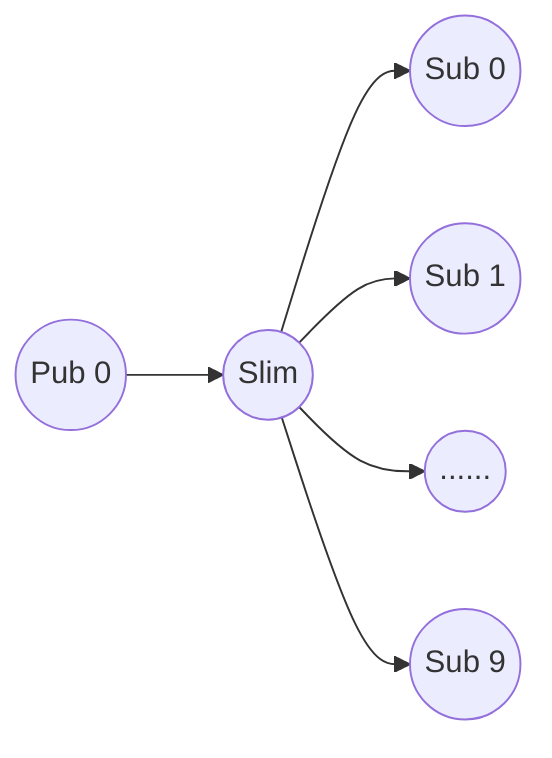

# SLIM Testing

SLIM testing involves applications designed to evaluate the performance and correctness of SLIM.

## Workload-based test
This test takes a workload file as input and executes a test by sending messages from one publisher to multiple subscribers.

### Workload-gen
```workload-gen``` iis an application that generates a workload file, which is then used as input for other applications. It can be run with the following command:
```
$ cargo run --release --bin workload-gen -- --help
Usage: workload-gen [OPTIONS] --subscriptions <SUBSCRIPTIONS> --publications <PUBLICATIONS>

Options:
  -s, --subscriptions <SUBSCRIPTIONS>  Number of subscriptions to produce
  -p, --publications <PUBLICATIONS>    Number of publications to produce
  -i, --instances <INSTANCES>          Maximum number of app instances for the same class [default: 1]
  -a, --apps <APPS>                    Number of subscriber apps [default: 1]
  -o, --output <OUTPUT>                Output file where to store the workload [default: autogenerated]
  -h, --help                           Print help
  -V, --version                        Print version
```

#### Workload file structure
The names used by SLIM are in the format:
```
organization/namespace/service/id
```

A subscription is represented as follows:
```
SUB 6 2 NM8Hjo3 880olhZ lFWEuqP 4021443650295720152
```
- ```SUB``` indicates that the line represents a subscription.
- ```6``` is the index of the subscription in the workload.
- ```2``` is the ID of the subscriber that will generate the subscription. This is randomly generated and is a value between 0 and APPS (which is provided as input). Ensure enough subscriber apps are spawned (see below) to cover all the IDs.
- The other four components (```NM8Hjo3, 880olhZ, lFWEuqP, 4021443650295720152```) represent the subscription name.

A publication is represented as follows:
```
PUB 3 p60YHNb tkWn1yi uEMNxKG 18446744073709551615 7 0 4 6 9 5 7 8
```
- ```PUB``` indicates that the line is a publication.
- ```3``` is the index of the publication in the workload.
- The next four fields (```p60YHNb tkWn1yi uEMNxKG 18446744073709551615```) indicate the destination name of the publication.
- ```7``` indicates how many subscribers can potentially receive a publication with this name.

### Subscriber
```subscriber``` is an application that takes a workload file as input, connects to a remote SLIM instance, sets up all the subscriptions available in the workload file,
and waits for incoming messages. It can be run as follows:
$ cargo run --release --bin subscriber -- --help
Usage: subscriber --workload <WORKLOAD> --config <CONFIGURATION> --id <ID>

Options:
  -w, --workload <WORKLOAD>     Workload input file
  -c, --config <CONFIGURATION>  Slim configuration file
  -i, --id <ID>                 Subscriber id
  -h, --help                    Print help
  -V, --version                 Print version
```

### Publisher
```publisher``` takes the workload file as input, connects to a remote SLIM instance, and generates all the publications specified in the workload file. Using the information in the workload file,
the publisher can verify if all publications were sent to the correct subscribers during the test and if replies were received back correctly. The publisher can be run as follows:
```
$ cargo run --release --bin publisher -- --help
Usage: publisher [OPTIONS] --workload <WORKLOAD> --config <CONFIGURATION> --id <ID>

Options:
  -w, --workload <WORKLOAD>     Workload input file
  -c, --config <CONFIGURATION>  Slim config file
  -i, --id <ID>                 Publisher id
  -m, --msg-size <SIZE>         Publication message size [default: 1500]
  -q, --quite                   Runs in quite mode without progress bars
  -s, --sleep <SLEEP>           time between publications in milliseconds [default: 0]
  -h, --help                    Print help
  -V, --version                 Print version
```

## How to run the test using the Taskfile
The Taskfile contains several commands that can be used to run a simple test with one SLIM instance, 10 subscribers, and 1 publisher. 
All options can be modified within the Taskfile. The topology of the test is as follows:


Follow these steps to run the test:

1. create a new workflow
```
task run:workload-gen
```
This will create the workload file 

2. run SLIM:
```
task run:slim
```

3. run the subscribers:
```
task run:subscribers
```

4. run the publisher:
```
task run:publisher
```

At the end of the test, if everything works correctly, the publisher will print the string "test succeeded"; otherwise, a list of errors will be shown.

To stop all the processes, run
```
task run:shutdown
```

## Channel Test
```channel``` is an application that tests streaming sessions with MLS encryption support. It can run in moderator mode (creates and manages the channel) or participant mode (joins an existing channel). It supports both MLS-enabled and MLS-disabled modes for testing purposes. It can be run as follow:
```
$ cargo run --release --bin channel -- --help
Usage: channel [OPTIONS] --config <CONFIGURATION> --name <ENDOPOINT>

Options:
  -c, --config <CONFIGURATION>     Slim config file
  -n, --name <ENDOPOINT>           Local endpoint name in the form org/ns/type/id
  -i, --is-moderator               Runs the endpoint in moderator mode
  -a, --is-attacker                Runs the endpoint in attacker mode
  -m, --mls-disabled               Runs the endpoint with MLS disabled
  -p, --participants <PARITICIPANTS>... List of participant types to add to the channel (moderator mode only)
  -o, --moderator-name <MODERATOR_NAME> Moderator name (participant mode only)
  -f, --frequency <FREQUENCY>      Time between publications in milliseconds [default: 1000]
      --max-packets <MAX_PACKETS>  Maximum number of packets to send (moderator only)
  -h, --help                       Print help
  -V, --version                    Print version
```


