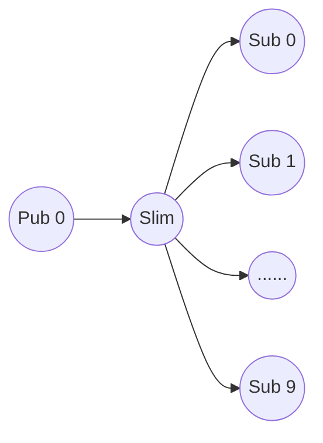

# SLIM Testing

SLIM testing includes applications to test the performance and correctness of SLIM.

## Applications
### Workload-gen
```workload-gen``` is an application that generates a workload file that is used as input for the other applications. It can be run with the following command:
```
$ cargo run --release --bin workload-gen -- --help
Usage: workload-gen [OPTIONS] --subscriptions <SUBSCRIPTIONS> --publications <PUBLICATIONS>

Options:
  -s, --subscriptions <SUBSCRIPTIONS>  Number of subscriptions to produce
  -p, --publications <PUBLICATIONS>    Number of publications to produce
  -i, --instances <INSTANCES>          Maximum number of agent instances for the same class [default: 1]
  -a, --agents <AGENTS>                Number of subscriber agents [default: 1]
  -o, --output <OUTPUT>                Output file where to store the workload [default: autogenerated]
  -h, --help                           Print help
  -V, --version                        Print version
```

#### Workload file structure
The names used by SLIM are in the form
```
organization/namespace/agent_class/agent_id
```
These four components are strings decided by the application. For performance reason SLIM internally encodes these strings in u64 values. The workload generator application ignores the strings and creates random names by generating four random u64.

A subscription is represented as follow
```
SUB 24 7 9025227877545173655 4093485893050047688 12129358409937561971 3376091243880048110
```
- ```SUB``` indicates that the line is a subscription
- ```24``` is the index of the subscription
- ```7``` is the ID of the subscriber that will generate the subscription. This is randomly generated and is a value between 0 and ```AGENTS``` that is provided as input. Be sure to spawn enough subscriber apps (see below) to cover all the IDs
- the last for numbers are random generated and are the subscription name in the form ```organization/namespace/agent_class/agent_id```

A publication is represented as follow
```
PUB 13 16626561741245539420 10461745917985659451 6613773069593221921 0 3 3 4 9
PUB 14 17926574898407524295 7737506283686582136 9887701346115217859 3014426321123145721 1 8
```
- ```PUB``` indicates that the line is a publication
- ```13``` or ```14``` are the indexes of the publication
- the following three values encode the fist part of the name of the publication, meaning ```organization/namespace/agent_class```
- the fourth value indicates the ```agent_id``` where to send the publication (unicast publication) or 0 if we want to send the publication in anycast. The workload generator creates randomly unicast or anycast publications.
- The first value after the publication name indicates how many publisher can potently receive a publication with this name. Pub ```13``` can be received by 3 subscribers, while pub ```14``` can be forwarded only to a single subscriber.
- The last values are the list of IDs of the subscribers that can receive the publication. This list is used by the publisher to verify that the test worked correctly.

### Subscriber
```subscriber``` is an application that takes as input a workload file, connects to a remote SLIM, setup all the subscriptions available in the workload file and waits for incoming message. For each message received it replays with a new message with the format specified below. It can be run as follow:
```
$ cargo run --release --bin subscriber -- --help
Usage: subscriber --workload <WORKLOAD> --config <CONFIGURATION> --id <ID>

Options:
  -w, --workload <WORKLOAD>     Workload input file
  -c, --config <CONFIGURATION>  Slim configuration file
  -i, --id <ID>                 Subscriber id
  -h, --help                    Print help
  -V, --version                 Print version
```

### Publisher
```publisher``` takes the workload file as input, connects to a remote SLIM and generates all the publications specified in the workload file. Using the information in the workload file the publisher is able to verify if during the test all the publications were sent to the right subscriber and if the reply was received back correctly. The publisher can be run as follow:
```
$ cargo run --release --bin publisher -- --help
Usage: publisher [OPTIONS] --workload <WORKLOAD> --config <CONFIGURATION> --id <ID>

Options:
  -w, --workload <WORKLOAD>     Workload input file
  -c, --config <CONFIGURATION>  Slim config file
  -i, --id <ID>                 Publisher id
  -m, --msg-size <SIZE>         Publication message size [default: 1500]
  -q, --quite                   Runs in quite mode without progress bars
  -s, --sleep <SLEEP>           time between publications in milliseconds [default: 0]
  -h, --help                    Print help
  -V, --version                 Print version
```

### Channel
```channel``` is an application that tests streaming sessions with MLS encryption support. It can run in moderator mode (creates and manages the channel) or participant mode (joins an existing channel). It supports both MLS-enabled and MLS-disabled modes for testing purposes. It can be run as follow:
```
$ cargo run --release --bin channel -- --help
Usage: channel [OPTIONS] --config <CONFIGURATION> --name <ENDOPOINT>

Options:
  -c, --config <CONFIGURATION>     Slim config file
  -n, --name <ENDOPOINT>           Local endpoint name in the form org/ns/type/id
  -i, --is-moderator               Runs the endpoint in moderator mode
  -a, --is-attacker                Runs the endpoint in attacker mode
  -m, --mls-disabled               Runs the endpoint with MLS disabled
  -p, --participants <PARITICIPANTS>... List of participant types to add to the channel (moderator mode only)
  -o, --moderator-name <MODERATOR_NAME> Moderator name (participant mode only)
  -f, --frequency <FREQUENCY>      Time between publications in milliseconds [default: 1000]
      --max-packets <MAX_PACKETS>  Maximum number of packets to send (moderator only)
  -h, --help                       Print help
  -V, --version                    Print version
```

#### Message format and test verification
The payload of a publication message has this format
```
 0                   1                   2                   3
 0 1 2 3 4 5 6 7 8 9 0 1 2 3 4 5 6 7 8 9 0 1 2 3 4 5 6 7 8 9 0 1
+-+-+-+-+-+-+-+-+-+-+-+-+-+-+-+-+-+-+-+-+-+-+-+-+-+-+-+-+-+-+-+-+
|    Pub_ID       |0|                  Payload                  |
+-+-+-+-+-+-+-+-+-+-+-+-+-+-+-+-+-+-+-+-+-+-+-+-++-+-+-+-+-+-++-+
|                           ...                                 |
```

The ```Pub_ID``` is taken from the workload file while the ```Payload``` is composed by a series of ```x``` and the size is decided from the publisher application command line.

The payload of the reply to this publication has the following format
```
 0                   1                   2                   3
 0 1 2 3 4 5 6 7 8 9 0 1 2 3 4 5 6 7 8 9 0 1 2 3 4 5 6 7 8 9 0 1
+-+-+-+-+-+-+-+-+-+-+-+-+-+-+-+-+-+-+-+-+-+-+-+-+-+-+-+-+-+-+-+-+
|    Pub_ID       |0|    Sub_ID     |0|       Payload           |
+-+-+-+-+-+-+-+-+-+-+-+-+-+-+-+-+-+-+-+-+-+-+-+-++-+-+-+-+-+-++-+
|                           ...                                 |
```
Where the ```Sub_ID``` is the identifier of the subscriber that received the publication message and replied to it. Using this field, and comparing it to the list of subscribers ids available in the workload file for each publication, the  publisher is able to verify if the message was forwarded in the right way. In this way the publisher app can verify if the test succeeded or not.


## Taskfile and test setup
The Taskfile contains few commands that can be used to run a simple test with one SLIM instance, 10 subscribers and 1 publisher. All the options can be modified inside the Taskfile. The topology of the test is the following one:


First of all a new workload file needs to be created with 
```
task run:workload-gen
```
This will create the workload file ```sub1000000_pub3000000_i10_s10.dat``` with 1M subscriptions generated by 10 subscribers (about 100K subscriptions from each one) and 3M publications. The parameters can be adjust in the Taskfile itself.

Once the workload is created run SLIM agent:
```
task run:slim
```
and the subscribers (in another terminal)
```
task run:subscribers
```
this second command will create 10 subscribers that will load the corresponding subscriptions from the workload file

At this point run the publisher
```
task run:publisher
```
At the end of the test, if everything works in the right way, the publisher will print the string ```test succeeded```, otherwise a list of errors will be shown.

To stop all the processes, run 
```
task run:shutdown
```