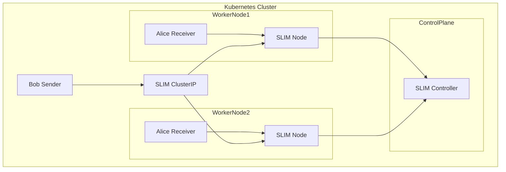

# DaemonSet Deployment Strategy

## Description

The DaemonSet deployment strategy provides a distributed approach to deploying SLIM across all nodes in a Kubernetes cluster. This strategy is specifically designed for scenarios requiring SLIM to run on every node, ensuring local access and eliminating network hops for improved performance and reliability.

In this deployment pattern, SLIM instances are distributed across the cluster with one pod per node using a DaemonSet. Sender clients connect through a Kubernetes ClusterIP Service that distributes requests across all available SLIM nodes for load balancing. Receiver clients are also deployed as a DaemonSet and connect to their co-located SLIM instance through a ClusterIP Service configured with `internalTrafficPolicy = Local`, ensuring they communicate only with the SLIM pod running on their local node.

**Target Audience:**

- Infrastructure teams requiring node-local SLIM instances.
- Performance-critical applications needing minimal latency.
- Edge computing and distributed system deployments.

**Use Cases:**

- Node-local SLIM deployments for reduced latency.
- Edge computing scenarios with distributed nodes.
- Applications requiring SLIM on every worker node.
- Infrastructure monitoring and logging use cases.

## Details

The DaemonSet deployment strategy ensures that a SLIM pod runs on every node in the cluster. This approach provides optimal performance by eliminating network overhead and ensuring local access to SLIM functionality from applications running on each node.

The DaemonSet deployment strategy deploys SLIM components with node-centric configuration:

- DaemonSet-based deployment ensuring one SLIM pod per node.
- Node-local access for improved performance.
- Enhanced configuration through dedicated values file.

This approach deploys SLIM as a DaemonSet, which guarantees that every node in the cluster runs a SLIM instance. The deployment is driven by the `daemonset-values.yaml` file, which contains specific configuration parameters optimized for node-local deployments.



**Key Features:**

- One SLIM instance per cluster node.
- Node-local access for minimal latency.
- Automatic scaling with cluster node additions.
- Enhanced SLIM configuration for distributed deployments.

## Usage

Follow these steps to deploy SLIM using the DaemonSet deployment strategy:

1. Set up the Kubernetes cluster

    ```bash
    task cluster:up
    ```

1. Deploy SLIM controller chart

    ```bash
    task controller:deploy
    ```

    See [SLIM Controller Helm chart values](controller-values.yaml) for more information.

1. Deploy SLIM nodes as DaemonSet

    ```bash
    task slim:deploy
    ```

    To deploy SLIM instances on each node:

    ```yaml
    slim:
      # Deploy as DaemonSet instead of StatefulSet
      daemonset: true
    ```

    See [SLIM Helm chart values](daemonset-values.yaml).

1. Verify the deployment

    ```bash
    kubectl get daemonsets -n slim
    kubectl get pods -n slim -o wide
    ```

1. Deploy sample receiver application as DaemonSet

    ```bash
    task test:receiver:deploy
    ```

1. Deploy sample sender application

    ```bash
    task test:sender:deploy
    ```

1. Check client logs

    ```bash
    kubectl logs daemonset/alice
    kubectl logs bob
    ```

    You should see 10 messages sent and received.

1. Clean up when done

```bash
task cluster:down
```

> **Note:** The DaemonSet strategy uses the `daemonset-values.yaml` file for Helm chart configuration. This values file contains specific settings for DaemonSet deployment, including node-selector configurations, resource limits optimized for node-local deployment, and SLIM-specific parameters tailored for distributed operations. Review and customize this file according to your node requirements and SLIM configuration needs.
