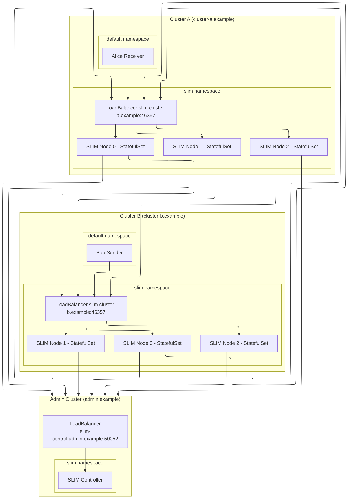

# Multi-Cluster Deployment Strategy

## Description

The multi-cluster deployment strategy demonstrates how SLIM nodes in different Kubernetes clusters can be connected to each other, enabling clients connecting to any cluster to reach each other seamlessly. This strategy is specifically designed for distributed environments where workloads span multiple clusters or cloud regions, with centralized control plane management.

**Target Audience:**

- Multi-cluster environments requiring cross-cluster communication.
- Distributed applications spanning multiple Kubernetes clusters.
- Organizations with geographically distributed infrastructure.
- Disaster recovery and high availability scenarios across clusters.

**Use Cases:**

- Cross-cluster service mesh communication.
- Multi-region application deployments.
- Disaster recovery with active-active clusters.
- Hybrid cloud deployments.
- Edge computing scenarios with central coordination.

## Details

SLIM nodes are deployed as StatefulSet on two separate workload clusters (`cluster-a` and `cluster-b`), each exposing an external LoadBalancer endpoint. The Controller is deployed on a dedicated administrative cluster (`admin.example`) and its endpoint is exposed via LoadBalancer for cross-cluster access from all workload clusters.

All three clusters (`admin.example`, `cluster-a.example`, and `cluster-b.example`) are federated using SPIRE federation, which enables secure cross-cluster identity and authentication. Routes are created by the centralized Controller upon new subscriptions, allowing SLIM nodes to connect to each other across cluster boundaries using mutual TLS (mTLS) with certificates generated by SPIRE federation. For more information, see the [Spire documentation](https://spiffe.io/docs/latest/spire-about/).

**Key Features:**

- Cross-cluster SLIM node connectivity.
- Centralized Controller on dedicated administrative cluster.
- SPIRE federation for secure cross-cluster authentication across all clusters.
- External endpoint configuration for inter-cluster communication.
- Automatic route management across all federated clusters. (Supported SLIM node configs: insecure and secure  MTLS with Spire)

The deployment uses LoadBalancer services to expose SLIM endpoints externally, enabling cross-cluster connectivity. Each SLIM node is configured with both local and external endpoints to support intra-cluster and inter-cluster communication patterns. The Controller, running on the admin cluster, manages routing and coordination across all workload clusters.



## Setup Steps in Detail

To deploy SLIM using the multi-cluster deployment strategy, follow these steps:

### 1. Set up the Kubernetes clusters

```bash
sudo task multi-cluster:up
```

>NOTE: `sudo` is only required to start Kind's `LoadBalancer` provider process on host.

<details>
<summary>More Details on Cluster Setup</summary>
  
This step creates three Kind clusters:

- `admin.example` - Administrative cluster hosting the Controller.
- `cluster-a.example` - First workload cluster for distributed workloads.
- `cluster-b.example` - Second workload cluster for distributed workloads.

Kind Cloud Provider is started on host for LoadBalancer support.

Each cluster gets its own kubeconfig context for management.

</details>

### 2. Deploy Spire (federated mode enabled) on all three clusters

```bash
task spire:deploy
```

<details>
<summary>More Details on Federated Spire</summary>
  
This step deploys SPIRE Server, Agent and Controller on all three clusters with federation capabilities enabled. Unlike single-cluster deployments, federated SPIRE allows cross-cluster identity verification and certificate exchange across all clusters.

Key federation configurations:
- Each cluster has its own trust domain (`admin.example`, `cluster-a.example`, `cluster-b.example`)
- SPIRE servers are configured to federate with each other in a full mesh
- Cross-cluster certificate bundles are automatically exchanged between all clusters
- JWT-SVIDs can be verified across all trust domains

The federation enables:

```yaml
spire:
  enabled: true
  trustedDomains:
  - spiffe://admin.example        # Administrative cluster
  - spiffe://cluster-a.example    # First workload cluster  
  - spiffe://cluster-b.example    # Second workload cluster
```

Check federation status on any cluster by running:

```bash
kubectl exec -n spire spire-server-0 -- /opt/spire/bin/spire-server federation show
```

List federated bundle endpoints by running:

```bash
kubectl exec -n spire spire-server-0 -- /opt/spire/bin/spire-server federation list
```

Find out more on [Spire on Kubernetes](https://spiffe.io/docs/latest/try/getting-started-k8s/) and [ClusterFederatedTrustDomain](https://github.com/spiffe/spire-controller-manager/blob/main/docs/clusterfederatedtrustdomain-crd.md) resource.

</details>

During deployment, LoadBalancer IP addresses are displayed for each cluster. Add these IPs to your `/etc/hosts` file:

```bash
...
Add to your /etc/hosts: 172.18.0.5    spire.admin.example
...
Add to your /etc/hosts: 172.18.0.6    spire.cluster-a.example
...
Add to your /etc/hosts: 172.18.0.7    spire.cluster-b.example

```

<details>
<summary>More Details</summary>
  
Since Kind clusters use LoadBalancer services, you need to add the assigned IP addresses to your local `/etc/hosts` file for proper DNS resolution. The wait-for-lb task will:

- Wait for LoadBalancer IP assignment
- Display the IP address for manual addition to `/etc/hosts`

Example `/etc/hosts` entries:

```bash
172.18.255.200   spire.admin.example
172.18.255.201   spire.cluster-a.example
172.18.255.202   spire.cluster-b.example
```
</details>

### 3. Create cluster federation resources on all three clusters

```
task spire:federation:deploy
```

<details>
<summary>More Details on Federation Resources</summary>
  
This step creates the necessary Kubernetes resources to establish SPIRE federation between all three clusters:

- **ClusterFederatedTrustDomain** resources for cross-cluster trust across all domains

The federation resources enable:

- Automatic certificate bundle exchange between all clusters
- Cross-cluster workload identity verification across all trust domains
- Federated JWT-SVID validation across the entire mesh

Example federation configuration (deployed on each cluster for every other cluster):

```yaml
apiVersion: spire.spiffe.io/v1alpha1
kind: ClusterFederatedTrustDomain
metadata:
  name: cluster-b-example
spec:
  trustDomain: cluster-b.example
  bundleEndpointURL: https://spire.cluster-b.example:8443
```

</details>

### 4. Deploy Controller chart on admin cluster

```bash
task slim:controller:deploy
```

<details>
<summary>More Details on Controller configuration</summary>
  
The Controller is deployed only on the dedicated `admin.example` cluster but configured to accept connections from both workload clusters. Key multi-cluster configurations:

```yaml
config:
  southbound:
    httpHost: 0.0.0.0
    httpPort: "50052"
    tls:
      useSpiffe: true
    spire:
      socketPath: "unix:///run/spire/agent-sockets/api.sock"

spire:
  enabled: true
  trustedDomains:
  - spiffe://cluster-a.example  # Trust cluster-a workloads
  - spiffe://cluster-b.example  # Trust cluster-b workloads

service:
  type: LoadBalancer  # External access for cross-cluster
```

The Controller handles:

- Route management across both workload clusters.
- Cross-cluster subscription routing.
- Federated identity verification for SLIM nodes from all clusters.

</details>

During deployment Controller's LoadBalancer IP addresses are displayed for each cluster. Add these IPs to your `/etc/hosts` file:

```bash
...
Add to your /etc/hosts: 172.18.0.8    slim-control.admin.example
```

See [Controller Helm chart values](controller-values.yaml) for more information.

### 5. Deploy SLIM chart on workload clusters (cluster-a & cluster-b)

```bash
task slim:deploy
```

<details>
<summary>More Details on Multi-Cluster SLIM Deployment</summary>

SLIM is deployed on both workload clusters with specific multi-cluster configurations. Key differences from single-cluster deployment is setting `group_name` local and external endpoints and trust domains:

**External Endpoint Configuration:**

```yaml
services:
  slim/0:
    node_id: ${env:SLIM_SVC_ID}
    group_name: "cluster-a.example"
    dataplane:
      servers:
        - endpoint: "0.0.0.0:{{ .Values.slim.service.data.port }}"
          metadata:
            local_endpoint: ${env:MY_POD_IP}
            external_endpoint: "slim.cluster-a.example:{{ .Values.slim.service.data.port }}"             
          tls:
            #insecure: true
            insecure_skip_verify: false   
            source:
              type: spire
              socket_path: unix:/tmp/spire-agent/public/api.sock              
            ca_source:
              type: spire
              socket_path: unix:/tmp/spire-agent/public/api.sock        
              trust_domains:
                - cluster-b.example  
```

Group name identifies SLIM nodes in the same cluster (nodes can directly connect to each other using their pod IP `local_endpoint`) which must be the same as the trust_domain. To enable MTLS secure connection `trust_domains` must be set for CA for nodes in other groups.


**Cross-Cluster Controller Connection (to Admin Cluster):**

```yaml
controller:
  clients:
    - endpoint: "https://slim-control.admin.example:50052"
      tls:
        #insecure: true
        #insecure_skip_verify: false
        source:
          type: spire
          socket_path: unix:/tmp/spire-agent/public/api.sock               
        ca_source:
          type: spire
          socket_path: unix:/tmp/spire-agent/public/api.sock
          trust_domains:
            - admin.example 
```

> Trust domain must be set for admin cluster to enable MTLS connection to Controller.

**Federated Trust Configuration:**

```yaml
spire:
  enabled: true
  trustedDomains:
  - spiffe://admin.example      # Trust the admin cluster
  - spiffe://cluster-b.example  # Trust the other workload cluster
```

</details>

See [SLIM Helm chart values for cluster-a](cluster-a-values.yaml) and [SLIM Helm chart values for cluster-b](cluster-b-values.yaml) for more information.

During deployment SLIM LoadBalancer IP addresses are displayed for each cluster. Add these IPs to your `/etc/hosts` file:

```bash
...
Add to your /etc/hosts: 172.18.0.9    slim.cluster-a.example
...
Add to your /etc/hosts: 172.18.0.10   slim.cluster-b.example
```

### 6. Verify cross-cluster connectivity

At this point you can check that all nodes are connected, in Controller logs by running:

```bash
kubectl config use-context kind-admin.example
kubectl logs -n slim deployment/slim-control | grep "Registering node with ID"
```

### 7. Deploy sample client applications for cross-cluster communication testing

The sample applications demonstrate cross-cluster communication with centralized control:

- **Alice (Receiver)** on cluster-a subscribes to messages and replies to received messages.
- **Bob (Sender)** on cluster-b creates a new MLS session publishes messages and waits for reply.
- Messages flow: Bob → SLIM(cluster-b) → SLIM(cluster-a) → Alice.
  
Each client uses SPIRE federation for authentication.
  
The centralized Controller automatically creates routes when Alice subscribes, enabling Bob's messages to reach Alice across clusters through the admin cluster coordination.
  
```bash
# Deploy receiver (Alice) on cluster-a
kubectl config use-context kind-cluster-a.example
task test:receiver:deploy

# Deploy sender (Bob) on cluster-b
kubectl config use-context kind-cluster-b.example
task test:sender:deploy
```

Checkout client logs:

```bash
kubectl config use-context kind-cluster-a.example
kubectl logs alice client

kubectl config use-context kind-cluster-b.example
kubectl logs bob client
```

You should see 10 messages being sent and received.

<details>
<summary>Troubleshooting tips</summary>
  
Checkout SLIM node logs on each cluster:

```bash
kubectl logs -n slim slim-0 slim
kubectl logs -n slim slim-1 slim
```

In case of connection problems check the following:

1. List registration entries on each cluster:

    ```bash
    kubectl exec -n spire spire-server-0 -- /opt/spire/bin/spire-server entry show
    ```

    There should be an entry for Controller on admin.example cluster, one entry for each SLIM node on worker clusters,
    one entry for Bob on cluster-b and one entry for Alice on cluster-a.

2. Check federation status on each cluster by running:

    ```bash
    # Check federation status on each cluster
    kubectl exec -n spire spire-server-0 -- /opt/spire/bin/spire-server federation list

    Found 2 federation relationships

    Trust domain              : admin.example
    Bundle endpoint URL       : https://spire.admin.example:8443
    Bundle endpoint profile   : https_spiffe
    Endpoint SPIFFE ID        : spiffe://admin.example/spire/server

    Trust domain              : cluster-a.example
    Bundle endpoint URL       : https://spire.cluster-a.example:8443
    Bundle endpoint profile   : https_spiffe
    Endpoint SPIFFE ID        : spiffe://cluster-a.example/spire/server
    ```

    There should be 2 relationships on each cluster.

    </details>

    ### 9. Clean up
    ```bash
    # Delete all clusters
    task multi-cluster:down
    ```

```bash
# Stop Kind LoadBalancer process
task sudo multi-cluster:lb:down
```

## Key Differences from Single-Cluster Deployment

### Configuration Differences

| Configuration Aspect | Single-Cluster | Multi-Cluster |
|---------------------|----------------|---------------|
| **Centralized Control Plane** | Controller deployed alongside SLIM nodes. | Controller deployed on dedicated admin cluster with cross-cluster access. |
| **External Endpoint Configuration** | Uses internal service names only. | Requires `external_endpoint` metadata for cross-cluster access. |
| **Trust Domain Configuration** | No `trustedDomains` needed. | Must specify `trustedDomains` for all federated clusters (admin + workload clusters). |
| **Service Types** | Can use `ClusterIP` services. | Requires `LoadBalancer` services for external access. |
| **Group Names** | Optional group identification. | Required `group_name` for cluster identification. |
| **Federation Complexity** | No federation required. | Full mesh federation between admin cluster and all workload clusters. |

### Federation Requirements

The multi-cluster deployment requires additional federation components:

- SPIRE federation configured between all three clusters (admin + workload clusters).
- Cross-cluster trust domain configuration for full mesh connectivity.
- External LoadBalancer services for inter-cluster communication.
- DNS resolution for external endpoints (via /etc/hosts or DNS server).
- Centralized Controller endpoint accessible from all workload clusters.

> **Note:** The multi-cluster strategy uses cluster-specific values files (`cluster-a-values.yaml`, `cluster-b-values.yaml`, and `controller-values.yaml`) that contain the federation and external endpoint configurations necessary for cross-cluster communication. All workload clusters are configured to connect to the centralized Controller on the admin cluster. Review and customize these files according to your specific cluster networking and security requirements.
