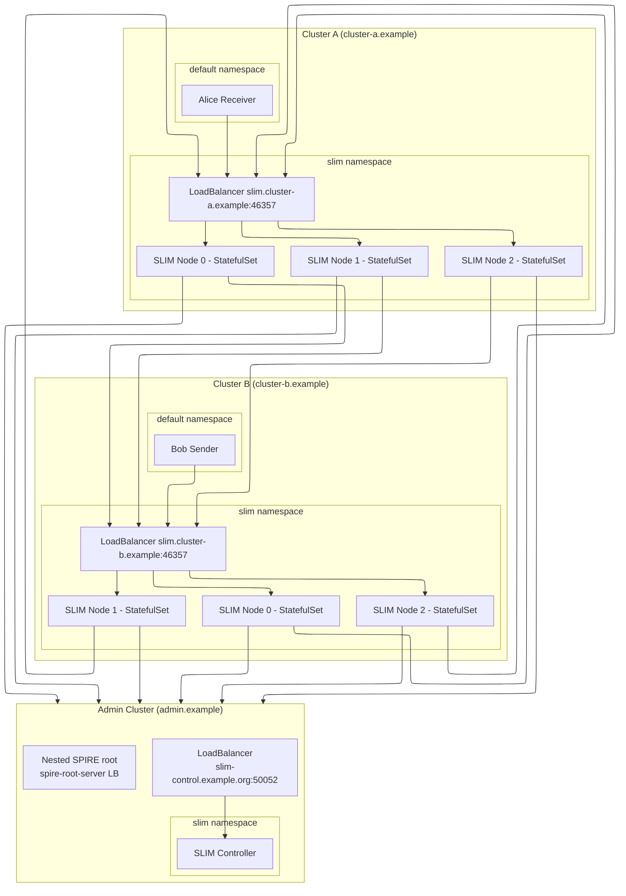

# Multi-Cluster Deployment Strategy

## Description

The multi-cluster deployment strategy demonstrates how SLIM nodes in different Kubernetes clusters can be connected to each other, enabling clients connecting to any cluster to reach each other seamlessly. This strategy is specifically designed for distributed environments where workloads span multiple clusters or cloud regions, with centralized control plane management.

**Target Audience:**

- Multi-cluster environments requiring cross-cluster communication.
- Distributed applications spanning multiple Kubernetes clusters.
- Organizations with geographically distributed infrastructure.
- Disaster recovery and high availability scenarios across clusters.

**Use Cases:**

- Cross-cluster service mesh communication.
- Multi-region application deployments.
- Disaster recovery with active-active clusters.
- Hybrid cloud deployments.
- Edge computing scenarios with central coordination.

## Details

SLIM nodes are deployed as StatefulSet on two separate workload clusters (`cluster-a` and `cluster-b`), each exposing an external LoadBalancer endpoint. The Controller is deployed on a dedicated administrative cluster (`admin.example`) and its endpoint is exposed via LoadBalancer for cross-cluster access from all workload clusters.

All three Kind clusters (`admin.example`, `cluster-a.example`, and `cluster-b.example`) share one **nested SPIRE** topology: a **root** SPIRE server on the admin cluster and **child** SPIRE servers on the workload clusters, all in the **same SPIFFE trust domain** (default `example.org`, overridable via `SPIFFE_TRUST_DOMAIN`). Child servers use the upstream root for signing ([nested SPIRE](https://spiffe.io/docs/latest/architecture/nested/readme/), [Helm nested guide](https://spiffe.io/docs/latest/spire-helm-charts-hardened-advanced/nested-spire/)). Routes are created by the centralized Controller upon new subscriptions, allowing SLIM nodes to connect across clusters using mTLS with identities issued from that shared trust domain.

**Key Features:**

- Cross-cluster SLIM node connectivity.
- Centralized Controller on dedicated administrative cluster.
- Nested SPIRE (not federation): single trust domain, root on admin, children on workload clusters.
- External endpoint configuration for inter-cluster communication.
- Automatic route management across all federated clusters. (Supported SLIM node configs: insecure and secure  MTLS with Spire)

The deployment uses LoadBalancer services to expose SLIM endpoints externally, enabling cross-cluster connectivity. Each SLIM node is configured with both local and external endpoints to support intra-cluster and inter-cluster communication patterns. The Controller, running on the admin cluster, manages routing and coordination across all workload clusters.


```mermaid
---
config:
  layout: elk
---
flowchart TB
 subgraph subGraph0["slim namespace"]
        CONTROLLER["SLIM Controller"]
  end
 subgraph subGraph1["Admin Cluster (admin.example)"]
        subGraph0
        LB_ADMIN["LoadBalancer<br>slim-control.example.org:50052"]
        SPIRE_ROOT["Nested SPIRE root<br>spire-root-server LB"]
  end
 subgraph subGraph2["slim namespace"]
        SLIM_A1["SLIM Node 0 - StatefulSet"]
        SLIM_A2["SLIM Node 1 - StatefulSet"]
        SLIM_A3["SLIM Node 2 - StatefulSet"]
        SVC_A["LoadBalancer slim.cluster-a.example:46357"]
  end
 subgraph subGraph3["default namespace"]
        ALICE["Alice Receiver"]
  end
 subgraph subGraph4["Cluster A (cluster-a.example)"]
        subGraph2
        subGraph3
  end
 subgraph subGraph5["slim namespace"]
        SLIM_B1["SLIM Node 0 - StatefulSet"]
        SLIM_B2["SLIM Node 1 - StatefulSet"]
        SLIM_B3["SLIM Node 2 - StatefulSet"]
        SVC_B["LoadBalancer slim.cluster-b.example:46357"]
  end
 subgraph subGraph6["default namespace"]
        BOB["Bob Sender"]
  end
 subgraph subGraph7["Cluster B (cluster-b.example)"]
        subGraph5
        subGraph6
  end
    LB_ADMIN ----> CONTROLLER
    SVC_A --> SLIM_A1 & SLIM_A2 & SLIM_A3
    ALICE --> SVC_A
    SVC_B --> SLIM_B1 & SLIM_B2 & SLIM_B3
    BOB --> SVC_B
    SLIM_A1 ---> subGraph1 & SVC_B
    SLIM_A2 ---> subGraph1 & SVC_B
    SLIM_A3 ---> subGraph1 & SVC_B
    SLIM_B1 ---> subGraph1 & SVC_A
    SLIM_B2 ---> subGraph1 & SVC_A
    SLIM_B3 ---> subGraph1 & SVC_A
```

Workload clusters run nested SPIRE children (`spire-internal-server`) that use the root at `spire.admin.example` (conceptually `SPIRE_ROOT`).

## Setup Steps in Detail

To deploy SLIM using the multi-cluster deployment strategy, follow these steps:

### 1. Set up the Kubernetes clusters

```bash
sudo task multi-cluster:up
```

>NOTE: `sudo` is only required to start Kind's `LoadBalancer` provider process on host.

<details>
<summary>More Details on Cluster Setup</summary>
  
This step creates three Kind clusters:

- `admin.example` - Administrative cluster hosting the Controller.
- `cluster-a.example` - First workload cluster for distributed workloads.
- `cluster-b.example` - Second workload cluster for distributed workloads.

Kind Cloud Provider is started on host for LoadBalancer support.

Each cluster gets its own kubeconfig context for management.

</details>

### 2. Deploy nested SPIRE on all three clusters

```bash
task spire:deploy
```

<details>
<summary>More Details on Nested SPIRE</summary>

This step installs the **spire-nested** Helm chart (`spiffe/spire-nested`, pinned in [Taskfile.yaml](Taskfile.yaml)) on each cluster:

- **Admin** (`kind-admin.example`): `tags.nestedRoot` via [spire-root-values.yaml](spire-root-values.yaml); exposes **`spire-root-server`** as a `LoadBalancer`. Ensure `/etc/hosts` maps `spire.<admin-cluster-name>` (default `spire.admin.example`) to that IP so workload clusters can reach the root.
- **cluster-a / cluster-b**: `tags.nestedChildFull` via [spire-child-values.yaml](spire-child-values.yaml); **`global.spire.upstreamSpireAddress`** is set to `spire.<admin-cluster-name>`; each child gets a distinct **`global.spire.clusterName`** (`cluster-a`, `cluster-b`). Workloads use the downstream agent; SPIRE Controller Manager **`className`** is set to **`spire-spire`** to match the SLIM chart `ClusterSPIFFEID`.
- **Trust bundle (no root→child `kubeConfigs`)**: The root enables **`root-spire-server.federation`** so the trust bundle is served over HTTPS on **`spire-root-server`’s LoadBalancer** (port **`SPIRE_FEDERATION_BUNDLE_PORT`**, default **8443**, same IP as gRPC). Child **`upstream-spire-agent`** uses **`trustBundleURL`** `https://spire.<admin>:<port>` (set in [Taskfile.yaml](Taskfile.yaml)), so children do not need ConfigMap **`spire-bundle-upstream`** pushed from the admin API server. Child pods must still **resolve** `spire.<admin>` and reach that host on both the gRPC port and the federation port.

SPIFFE trust domain defaults to **`example.org`** for every cluster (`SPIFFE_TRUST_DOMAIN` in the Taskfile). Kind cluster DNS names (`*.example`) are only hostnames for LoadBalancers, not per-cluster trust domains.

CRDs are installed with **`spire-crds`** on each cluster. Release and components share namespace **`spire`** by setting `global.spire.recommendations.enabled: false` in the values files.

Further reading: [Nested SPIRE architecture](https://spiffe.io/docs/latest/architecture/nested/readme/), [Nested SPIRE with Helm Charts Hardened](https://spiffe.io/docs/latest/spire-helm-charts-hardened-advanced/nested-spire/).

</details>

During deployment, LoadBalancer IP addresses are displayed for each cluster. Add these IPs to your `/etc/hosts` file:

```bash
...
Add to your /etc/hosts: 172.18.0.5    spire.admin.example
...
Add to your /etc/hosts: 172.18.0.6    spire.cluster-a.example
...
Add to your /etc/hosts: 172.18.0.7    spire.cluster-b.example

```

<details>
<summary>More Details</summary>
  
Since Kind clusters use LoadBalancer services, you need to add the assigned IP addresses to your local `/etc/hosts` file for proper DNS resolution. The wait-for-lb task will:

- Wait for LoadBalancer IP assignment
- Display the IP address for manual addition to `/etc/hosts`

Example `/etc/hosts` entries:

```bash
172.18.255.200   spire.admin.example
172.18.255.201   spire.cluster-a.example
172.18.255.202   spire.cluster-b.example
```
</details>

### 3. Deploy Controller chart on admin cluster

```bash
task slim:controller:deploy
```

<details>
<summary>More Details on Controller configuration</summary>
  
The Controller is deployed only on the dedicated `admin.example` cluster but configured to accept connections from both workload clusters. Key multi-cluster configurations:

```yaml
config:
  southbound:
    httpHost: 0.0.0.0
    httpPort: "50052"
    tls:
      useSpiffe: true
    spire:
      socketPath: "unix:/tmp/spire-agent/public/api.sock"

spire:
  enabled: true

service:
  type: LoadBalancer  # External access for cross-cluster
```

The Controller handles:

- Route management across both workload clusters.
- Cross-cluster subscription routing.
- Identity verification for SLIM nodes (nested SPIRE, shared trust domain).

</details>

During deployment Controller's LoadBalancer IP addresses are displayed for each cluster. Add these IPs to your `/etc/hosts` file:

```bash
...
Add to your /etc/hosts: 172.18.0.8    slim-control.admin.example
```

See [Controller Helm chart values](controller-values.yaml) for more information.

### 4. Deploy SLIM chart on workload clusters (cluster-a & cluster-b)

```bash
task slim:deploy
```

<details>
<summary>More Details on Multi-Cluster SLIM Deployment</summary>

SLIM is deployed on both workload clusters with specific multi-cluster configurations. Key differences from single-cluster deployment are `group_name`, local and external endpoints, and SPIRE **`trust_domains`** for the shared nested trust domain (e.g. `example.org`):

**External Endpoint Configuration:**

```yaml
services:
  slim/0:
    node_id: ${env:SLIM_SVC_ID}
    group_name: "cluster-a.example"
    dataplane:
      servers:
        - endpoint: "0.0.0.0:{{ .Values.slim.service.data.port }}"
          metadata:
            local_endpoint: ${env:MY_POD_IP}
            external_endpoint: "slim.cluster-a.example:{{ .Values.slim.service.data.port }}"             
          tls:
            #insecure: true
            insecure_skip_verify: false   
            source:
              type: spire
              socket_path: unix:/tmp/spire-agent/public/api.sock              
            ca_source:
              type: spire
              socket_path: unix:/tmp/spire-agent/public/api.sock        
              trust_domains:
                - example.org
```

`group_name` identifies SLIM nodes in the same cluster (nodes can reach each other using `local_endpoint`). It may match your Kind-style cluster label (e.g. `cluster-a.example`) and need not equal the SPIFFE trust domain name.

**Cross-Cluster Controller Connection (to Admin Cluster):**

```yaml
controller:
  clients:
    - endpoint: "https://slim-control.example.org:50052"
      tls:
        #insecure: true
        #insecure_skip_verify: false
        source:
          type: spire
          socket_path: unix:/tmp/spire-agent/public/api.sock               
        ca_source:
          type: spire
          socket_path: unix:/tmp/spire-agent/public/api.sock
          trust_domains:
            - example.org
```

**SPIRE chart (`ClusterSPIFFEID`):** enable `spire` on the SLIM chart; omit `trustedDomains` so `federatesWith` is not emitted (not used for nested single domain).

</details>

See [SLIM Helm chart values for cluster-a](cluster-a-values.yaml) and [SLIM Helm chart values for cluster-b](cluster-b-values.yaml) for more information.

During deployment SLIM LoadBalancer IP addresses are displayed for each cluster. Add these IPs to your `/etc/hosts` file:

```bash
...
Add to your /etc/hosts: 172.18.0.9    slim.cluster-a.example
...
Add to your /etc/hosts: 172.18.0.10   slim.cluster-b.example
```

### 5. Verify cross-cluster connectivity

At this point you can check that all nodes are connected, in Controller logs by running:

```bash
kubectl config use-context kind-admin.example
kubectl logs -n slim deployment/slim-control | grep "Registering node with ID"
```

### 6. Deploy sample client applications for cross-cluster communication testing

The sample applications demonstrate cross-cluster communication with centralized control:

- **Alice (Receiver)** on cluster-a subscribes to messages and replies to received messages.
- **Bob (Sender)** on cluster-b creates a new MLS session publishes messages and waits for reply.
- Messages flow: Bob → SLIM(cluster-b) → SLIM(cluster-a) → Alice.
  
Each client uses SPIRE-issued identities from the nested trust domain.
  
The centralized Controller automatically creates routes when Alice subscribes, enabling Bob's messages to reach Alice across clusters through the admin cluster coordination.
  
```bash
# Deploy receiver (Alice) on cluster-a
kubectl config use-context kind-cluster-a.example
task test:receiver:deploy

# Deploy sender (Bob) on cluster-b
kubectl config use-context kind-cluster-b.example
task test:sender:deploy
```

Checkout client logs:

```bash
kubectl config use-context kind-cluster-a.example
kubectl logs alice client

kubectl config use-context kind-cluster-b.example
kubectl logs bob client
```

You should see 10 messages being sent and received.

<details>
<summary>Troubleshooting tips</summary>
  
Checkout SLIM node logs on each cluster:

```bash
kubectl logs -n slim slim-0 slim
kubectl logs -n slim slim-1 slim
```

In case of connection problems check the following:

1. Confirm SPIRE pods are running on each cluster and that **`spire.admin.example`** (or your admin DNS name) resolves from workload nodes to the root LoadBalancer IP:

    ```bash
    kubectl get pods -n spire
    ```

2. Inspect registration entries / server health (pod and container names vary with **spire-nested**; adjust `-c` if needed):

    ```bash
    kubectl exec -n spire spire-internal-server-0 -c spire-server -- \
      /opt/spire/bin/spire-server entry show
    ```

    On the admin cluster, use the **root** StatefulSet name (often `spire-root-server-0`) instead of `spire-internal-server-0`.

3. If child clusters cannot bootstrap, verify upstream connectivity to the root gRPC endpoint (port **443** by default on `spire-root-server`) and `/etc/hosts` on the host.

</details>

### 7. Clean up

```bash
# Delete all clusters
task multi-cluster:down
```

```bash
# Stop Kind LoadBalancer process
sudo task multi-cluster:lb:down
```

## Key Differences from Single-Cluster Deployment

### Configuration Differences

| Configuration Aspect | Single-Cluster | Multi-Cluster |
|---------------------|----------------|---------------|
| **Centralized Control Plane** | Controller deployed alongside SLIM nodes. | Controller deployed on dedicated admin cluster with cross-cluster access. |
| **External Endpoint Configuration** | Uses internal service names only. | Requires `external_endpoint` metadata for cross-cluster access. |
| **Trust Domain Configuration** | Single-cluster SPIRE. | **One** SPIFFE trust domain (`SPIFFE_TRUST_DOMAIN`, default `example.org`) shared by root + children. |
| **Service Types** | Can use `ClusterIP` services. | Requires `LoadBalancer` services for external access. |
| **Group Names** | Optional group identification. | Required `group_name` for cluster identification. |
| **SPIRE topology** | Standalone SPIRE on one cluster. | **Nested SPIRE**: root on admin, children on workload clusters (`spire-nested` chart). |

### Nested SPIRE requirements

- **spire-nested** on admin (root) and on each workload cluster (child) with `global.spire.upstreamSpireAddress` pointing at the root SPIRE LB hostname.
- Matching **SPIFFE trust domain** and Helm values under [spire-root-values.yaml](spire-root-values.yaml) / [spire-child-values.yaml](spire-child-values.yaml).
- External LoadBalancer services and DNS (e.g. `/etc/hosts`) for `spire.*`, `slim.*`, and `slim-control.*` hostnames.
- Centralized Controller endpoint reachable from all workload clusters.

> **Note:** Values files ([cluster-a-values.yaml](cluster-a-values.yaml), [cluster-b-values.yaml](cluster-b-values.yaml), [controller-values.yaml](controller-values.yaml)) use the nested trust domain in `trust_domains` and omit `spire.trustedDomains` so workloads rely on one domain. Customize `SPIFFE_TRUST_DOMAIN` and hostnames for your environment.
