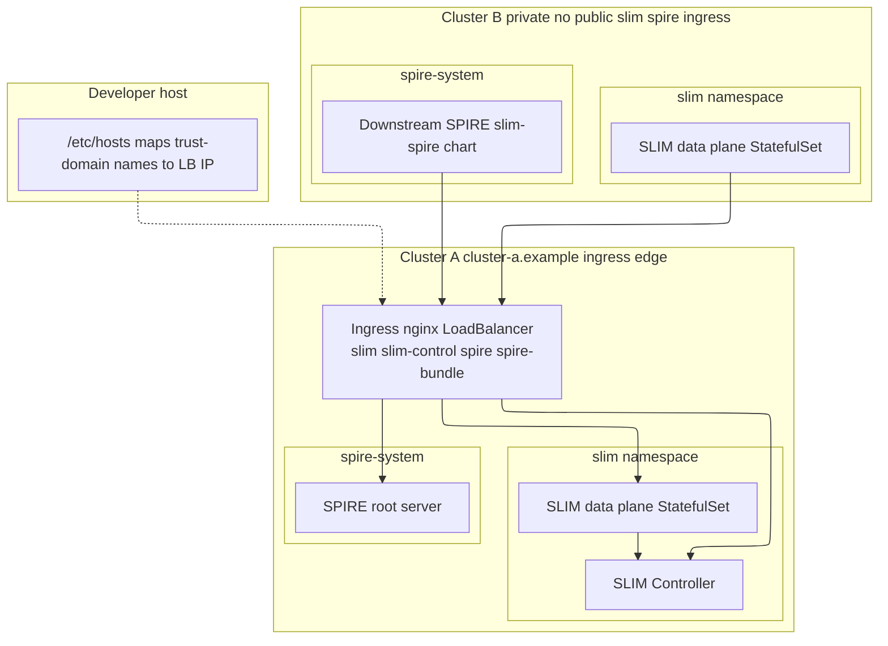

# Multi-Cluster Private (Kind) Deployment Strategy

## Description

This strategy (`multicluster_private`) runs two local Kind clusters with a deliberate split from the [three-cluster multi-cluster strategy](../multicluster/multi_cluster_strategy.md):

| | **Multi-cluster** (`multicluster/`) | **Multi-cluster private** (`multicluster_private/`) |
|---|--------------------------------------|------------------------------------------------------|
| **Exposure** | SPIRE and SLIM are typically reached via **LoadBalancer services** on each cluster (admin + workload clusters each expose endpoints). | **Cluster-a** exposes **SLIM and SPIRE only through ingress** (one LoadBalancer IP, multiple hostnames). **Cluster-b is a private workload cluster**: this layout does **not** publish SLIM or SPIRE on ingress or public LoadBalancers—cluster-b components reach cluster-a **outbound** (DNS to `spire.<cluster-a trust domain>`, `slim-control.…`, etc.). |

Cross-cluster identity still uses a **root SPIRE server on cluster-a** (behind ingress) and a **downstream SPIRE stack on cluster-b** that joins with a bootstrap join token. The SLIM controller runs **only on cluster-a**; cluster-b SLIM nodes and pods use the cluster-a ingress hostnames (resolved inside the cluster or on nodes) to talk to the controller and peers.

**Target audience**

- Developers who want a **public edge only on cluster-a** and a **private second cluster** with no mirrored ingress for SPIRE/SLIM.
- Lab setups where TLS terminates at ingress on cluster-a and you manage `/etc/hosts` (or equivalent DNS) on the host and optionally CoreDNS on cluster-b.

**Use cases**

- Two-cluster SLIM demos with a single northbound entry point.
- Exercising downstream SPIRE (`charts/slim-spire`) and join-token bootstrap without exposing cluster-b SPIRE/SLIM APIs to the same style of public hostnames as cluster-a.

## Details

- **Clusters:** `kind-<CLUSTER_A_TRUST_DOMAIN>` (default `cluster-a.example`) and `kind-<CLUSTER_B_TRUST_DOMAIN>` (default `cluster-b.example`). Override with Task variables `CLUSTER_A_TRUST_DOMAIN` / `CLUSTER_B_TRUST_DOMAIN`.
- **Cluster-a ingress:** [cloud-provider-kind](https://github.com/kubernetes-sigs/cloud-provider-kind) assigns a LoadBalancer IP to **ingress-nginx on cluster-a** only. Hostnames such as `slim.cluster-a.example`, `slim-control.cluster-a.example`, and `spire.cluster-a.example` route through that controller.
- **Cluster-b private:** The provided Taskfile does **not** install ingress for SLIM/SPIRE on cluster-b or advertise public hostnames for cluster-b services. Outbound connectivity from cluster-b to cluster-a is expected (SPIRE upstream agent, SLIM client traffic).
- **Manual `/etc/hosts`:** After `cluster-a:deploy-all`, add the cluster-a ingress LB IP on **your machine** for those hostnames. For **cluster-b pods**, configure **in-cluster DNS** (for example CoreDNS `hosts`) so `spire.<trust-domain>` resolves to the same ingress IP—the chart does not inject `hostAliases` for the upstream agent.

Tasks live in [`Taskfile.yaml`](Taskfile.yaml) under `deployments/multicluster_private/`. Run all `task` commands from that directory (or pass `-t` / `--taskfile`).

Cluster-a exposes SLIM and SPIRE through one ingress LoadBalancer; cluster-b runs workloads privately and reaches cluster-a by name while the developer host maps trust-domain names to the LB IP for local tooling.



## Aggregate tasks (`deploy-all`)

### `cluster-a:deploy-all`

Runs, in order:

1. **`spire:deploy:cluster-a`** — SPIFFE CRDs and root SPIRE (`spire-root`) in `spire-system` on cluster-a. Depends on **`ingress:deploy`** (which depends on **`cert-manager:deploy`**).
2. **`slim:controller:deploy`** — SLIM control plane Helm release on cluster-a (`slim` namespace).
3. **`slim:deploy:cluster-a`** — SLIM data plane on cluster-a with `cluster-a-values.yaml`.
4. A **shell step** that prints suggested `/etc/hosts` lines for `slim`, `slim-control`, `spire`, and `spire-bundle` under `CLUSTER_A_TRUST_DOMAIN` using the ingress controller’s LoadBalancer IP (if assigned).

**Required variables:** `SLIM_IMAGE_TAG`, `SLIM_CONTROLLER_IMAGE_TAG`.

### `cluster-b:deploy-all`

Runs, in order:

1. **`spire:deploy:cluster-b`** — SPIFFE CRDs on cluster-b, mints or uses a join token for the upstream agent SPIFFE ID, creates `spire-upstream-bootstrap-token`, then installs **`charts/slim-spire`** as `spire-downstream` with `spire-cluster-b-values.yaml`. This task **depends on `spire:deploy:cluster-a`** (root SPIRE must exist to mint a token unless you set `SPIRE_JOIN_TOKEN`).
2. **`slim:deploy:cluster-b`** — SLIM data plane on cluster-b with `cluster-b-values.yaml`.

**Required variable:** `SLIM_IMAGE_TAG`.

## Setup steps

Run from the repo root or `cd deployments/multicluster_private`.

### 1. Create Kind clusters and start the LoadBalancer provider

```bash
cd deployments/multicluster_private
task multi-cluster:up
```

`multi-cluster:up` runs **`multi-cluster:lb:up`** first (starts cloud-provider-kind in the background), then creates both Kind clusters.

If LoadBalancer IPs do not appear (ingress `EXTERNAL-IP` stays pending), start or restart the provider with sufficient host privileges:

```bash
sudo task multi-cluster:lb:up
```

Wait until `kubectl --context kind-<CLUSTER_A_TRUST_DOMAIN> get svc -n ingress-nginx` shows an external IP for `ingress-nginx-controller` **after** you install ingress in the next step (or re-check after `cluster-a:deploy-all`).

### 2. Deploy cluster-a stack (`cluster-a:deploy-all`)

```bash
export SLIM_IMAGE_TAG=...           # SLIM node image tag
export SLIM_CONTROLLER_IMAGE_TAG=... # SLIM controller image tag

task cluster-a:deploy-all
```

This covers cert-manager, ingress-nginx, root SPIRE, controller, SLIM on cluster-a, and prints **`/etc/hosts`** guidance.

<details>
<summary>What each sub-task does</summary>

- **cert-manager** — Installed by `ingress:deploy` dependency chain (`cert-manager:deploy` before `ingress:deploy`).
- **ingress-nginx** — On cluster-a with pinned chart version; required for ACME HTTP-01 and for exposing SPIRE/SLIM hostnames.
- **spire:deploy:cluster-a** — `spire-crds` + `spire-root` using `spire-cluster-a-values.yaml`.
- **slim:controller:deploy** — `slim-control` release with `controller-values.yaml`.
- **slim:deploy:cluster-a** — `slim` release with `cluster-a-values.yaml`.

</details>

### 3. Add cluster-a ingress IP to `/etc/hosts` (manual)

Use the line printed at the end of `cluster-a:deploy-all`, or discover the IP:

```bash
kubectl --context kind-cluster-a.example get svc -n ingress-nginx ingress-nginx-controller \
  -o jsonpath='{.status.loadBalancer.ingress[0].ip}{"\n"}'
```

Append one line (replace `<LB_IP>` and trust domain if you overrode defaults):

```text
<LB_IP>  slim.cluster-a.example slim-control.cluster-a.example spire.cluster-a.example spire-bundle.cluster-a.example
```

Your shell, browser, and `kubectl` port-forwards or TLS clients on the host need these names to hit cluster-a ingress.

**Cluster-b pods** must still resolve `spire.<CLUSTER_A_TRUST_DOMAIN>` (and bundle hostname if used) toward that same ingress IP—typically via a **CoreDNS** `hosts` plugin or another cluster DNS mechanism; that is outside this Taskfile’s automation.

### 4. Deploy cluster-b stack (`cluster-b:deploy-all`)

```bash
export SLIM_IMAGE_TAG=...   # same tag as on cluster-a unless you intentionally differ

task cluster-b:deploy-all
```

<details>
<summary>What each sub-task does</summary>

- **spire:deploy:cluster-b** — CRDs, join-token Secret, Helm install of downstream SPIRE + upstream agent from `../../charts/slim-spire` with `spire-cluster-b-values.yaml`.
- **slim:deploy:cluster-b** — `slim` release with `cluster-b-values.yaml` on cluster-b.

</details>

Optional: pre-set `SPIRE_JOIN_TOKEN` if you do not want the task to `kubectl exec` into cluster-a’s `spire-server` to mint a token.

### 5. Deploy example receiver and sender

```bash
task test.receiver:deploy
task test.sender:deploy
```

These use the included `client_apps` Taskfile to prepare bindings and apply `receiver-pod.yaml` / `sender-pod.yaml` (default namespace). They expect both cluster names in `KIND_CLUSTER_NAMES`.

### 6. Deploy A2A echo agent (optional)

After SLIM is running on both clusters, you can deploy the **slima2a** echo server (cluster-a) and client (cluster-b) that mirror [slim-a2a-python `examples/echo_agent`](https://github.com/agntcy/slim-a2a-python/tree/main/examples/echo_agent). Manifests live under [`deployments/client_apps/a2a/`](../client_apps/a2a/); tasks are `echo-agent:server:deploy` and `echo-agent:client:deploy` in [`Taskfile.yaml`](Taskfile.yaml). For commands, log lines, and overrides, see **[Examples → Echo agent](#echo-agent-deploy-and-watch-logs)** below.

## Examples

### Minimal bring-up (copy-paste)

Replace image tags with the ones you build or pull. Trust domains default to `cluster-a.example` / `cluster-b.example`.

```bash
cd deployments/multicluster_private
export SLIM_IMAGE_TAG=<your-slim-node-tag>
export SLIM_CONTROLLER_IMAGE_TAG=<your-slim-controller-tag>

task multi-cluster:up
task cluster-a:deploy-all
# Add printed /etc/hosts lines for cluster-a ingress LB IP, then:
task cluster-b:deploy-all
```

### Echo agent: deploy and watch logs

Assume steps 1–4 (or the minimal bring-up above) already succeeded.

```bash
cd deployments/multicluster_private
task echo-agent:server:deploy
task echo-agent:client:deploy
```

Follow logs (adjust context names if you set `CLUSTER_A_TRUST_DOMAIN` / `CLUSTER_B_TRUST_DOMAIN`):

```bash
kubectl --context kind-cluster-a.example logs -n default deploy/echo-agent-server -f --tail=50
kubectl --context kind-cluster-b.example logs -n default deploy/echo-agent-client -f --tail=50
```

On the server you should see **`echo_agent_server ready`** then **`received client message`** / **`sending echo reply`** each time the client runs. On the client, stderr shows the prompt and echoed text.

### Echo agent: common overrides

| Variable | Where | Purpose |
|----------|--------|---------|
| `NAMESPACE` | task | `task echo-agent:server:deploy NAMESPACE=slim` applies manifests into another namespace. |
| `TEMPLATE` | task | Point at a forked YAML: `TEMPLATE=/path/to/echo-agent-server.yaml`. |
| `SLIMA2A_VERSION` | Pod env (edit manifest or `kubectl set env`) | Pin PyPI `slima2a` version (default in YAML is `0.4.0`). |
| `ECHO_CLIENT_TEXT` | client Deployment env | Message body the client sends (default in YAML). |

### Bindings example pods (receiver / sender)

```bash
cd deployments/multicluster_private
task test.receiver:deploy
task test.sender:deploy
```

`KIND_CLUSTER_NAMES` defaults to both trust domains so the `client_apps` image is loaded into each Kind cluster before `kubectl apply`.

## Teardown

```bash
task multi-cluster:down
task multi-cluster:lb:down   # optional: stop cloud-provider-kind
```

## Related documentation

- [Multi-cluster (three-cluster) strategy](../multicluster/multi_cluster_strategy.md) — admin + two workload clusters with SPIRE federation on all three.
- [`charts/slim-spire`](../../charts/slim-spire) — downstream SPIRE chart used on cluster-b.
