# Statefulset Deployment Strategy

## Description

The statefulset deployment strategy provides a more robust approach to deploying SLIM in a Kubernetes cluster, specifically designed for scenarios requiring high availability and ordered deployment patterns.

**Target Audience:**
- Production environments requiring high availability
- Applications needing ordered scaling and updates
- Deployments requiring predictable pod management

**Use Cases:**
- Production SLIM deployments with high availability
- Applications with complex initialization sequences
- Deployments needing predictable pod naming and ordering
- Environments requiring reliable service continuity

## Details

This approach deploys SLIM nodes as a Statefulset which guarantees ordered deployment and scaling, supporting high availability scenarios. All nodes are connected to one single Controller using MTLS. Clients are connecting to a `ClusterIP` Service which load balances connections between SLIM nodes. Since SLIM keeps the connection open, all communication will go to the same server. 

Forwarding routes between the nodes are managed automatically by Controller on-demand upon new subscriptions. SLIM nodes are connected directly via their pod IP.

All connections between SLIM nodes and SLIM nodes and Controller are set up using MTLS.
Clients are also deployed on the cluster connecting with MTLS, but in addition messages are encrypted using MLS authenticating with JWT tokens.

`Spire` is not part of SLIM, we use it to resolve automatic certificate and token generation, rotation between pods.

The deployment is driven by the `statefulset-values.yaml` file, which contains specific configuration parameters optimized for stateful workloads.

**Key Features:**

- Ordered deployment and scaling for high availability
- Predictable pod management
- Enhanced SLIM configuration options



## Usage

Follow these steps to deploy SLIM using the statefulset deployment strategy:

### 1. Set up the Kubernetes cluster
```bash
task templates:cluster:up
```

### 2. Deploy Spire
```bash
task templates:spire:deploy
```

<details>
  <summary>More Details on Spire</summary>
  
  This step will deploy a Spire Server, Agent and Controller on the cluster.  
  Spire Controller automatically creates SVIDs, certificates, JWT tokens and registers the created *SPIFFEID* for each running pod driven by `ClusterSPIFFEID` custom resource. 

  Here's an example of the default `ClusterSPIFFEID` which applies to all pods unless a custom one is defined: 

  ```yaml
    apiVersion: spire.spiffe.io/v1alpha1
    kind: ClusterSPIFFEID
    name: spire-spire-default
    spec:
        className: spire-spire
        fallback: true
        hint: default
        namespaceSelector:
            matchExpressions:
            - key: kubernetes.io/metadata.name
            operator: NotIn
            values:
            - spire
            - spire-server
            - spire-system
        spiffeIDTemplate: spiffe://{{ .TrustDomain }}/ns/{{ .PodMeta.Namespace }}/sa/{{
            .PodSpec.ServiceAccountName }}
  ```

  Spire Agent exposes a local API endpoint on each node, used by applications to fetch certificates and certificate bundles. Applications may support Spire natively (Controller) or they run [Spiffe helper](https://github.com/spiffe/spiffe-helper) as a side-car, which takes care or fetching and rotating certificates and tokens. (SLIM nodes and clients)
  

  Useful command for troubleshooting connection problems to list created entries:

  ```bash
  kubctl exec -n spire spire-server-0 -- /opt/spire/bin/spire-server entry
  ```

  Find out more on [Spire on K8s](https://spiffe.io/docs/latest/try/getting-started-k8s/) and [ClusterSPIFFEID](https://github.com/spiffe/spire-controller-manager/blob/main/docs/clusterspiffeid-crd.md) resource.

</details>

### 3. Deploy SLIM controller
```bash
task templates:slim:controller:deploy
```

<details>
  <summary>More Details on Controller configuration</summary>
  
  This step will deploy SLIM Controller Southbound API configured with MTLS.
  Controller support MTLS by Spire natively, just need to be enabled and `socketPath` has to be set:

  ```yaml
    config:
        northbound:
            httpHost: 0.0.0.0
            httpPort: "{{ .Values.service.north.port }}"

        southbound:
            httpHost: 0.0.0.0
            httpPort: "{{ .Values.service.south.port }}"    
            tls:
                useSpiffe: true
            spire:
                socketPath: "unix:///run/spire/agent-sockets/api.sock"
  ```

  See [SLIM Controller Helm chart values](../controller-values.yaml)

</details>


### 4. Deploy SLIM nodes
```bash
task slim:deploy
```

<details>
  <summary>More Details on SLIM node configuration</summary>
  
  This step will deploy 3 replicas of SLIM servers and a `ClusterIP` service. 
  In each SLIM pod there's a `spire-helper` container running fetching generated X509 certificates, keys and certificate bundles to the configured path. SLIM nodes must be configured to use MTLS using the same path.

  ```yaml
    services:
      slim/0:
        node_id: ${env:SLIM_SVC_ID}
        dataplane:
          servers:
            - endpoint: "0.0.0.0:{{ .Values.slim.service.data.port }}"
              tls:
                #insecure: true
                insecure_skip_verify: false
                cert_file: "/svids/tls.crt"
                key_file: "/svids/tls.key"
                ca_file: "/svids/svid_bundle.pem"                

          clients: []
        controller:
          clients:
            - endpoint: "https://slim-control:50052"
              tls:
                #insecure: true
                insecure_skip_verify: false
                cert_file: "/svids/tls.crt"
                key_file: "/svids/tls.key"
                ca_file: "/svids/svid_bundle.pem"
  ```

  > `node_id` should be a unique ID within the cluster, since this is used by Controller to identify SLIM server.

  See [SLIM Helm chart values](statefulset-values.yaml)

</details>

### 4. Verify nodes are connected

At this point you can check that all nodes are connected, in Controller logs:

```
kubectl logs -n slim deployment/slim-control | grep "Registering node with ID"
```

### 5. Deploy sample client applications for testing

  The sample applications demonstrate in-cluster communication with centralized control:
  
  - **Alice (Receiver)** subscribes to messages and replies to received messages.
  - **Bob (Sender)** creates a new MLS session publishes messages and waits for reply.
  
Each client uses SPIRE Federation for authentication, running spiffe-helper as a side-car.
  
The centralized Controller automatically creates routes when Alice subscribes, enabling Bob's messages to reach Alice across clusters through the admin cluster coordination. 
  
```
# Deploy receiver (Alice)
task apps:spire:receiver:deploy
task apps:spire:sender:deploy
```

Checkout client logs:

```
kubectl logs alice client
kubectl logs bob client
```

You should see 10 messages sent and received.

<details>
  <summary>Troubleshooting tips</summary>

    Checkout SLIM node logs on each cluster:

    ```
    kubectl logs -n slim slim-0 slim
    kubectl logs -n slim slim-1 slim
    ```

    In case of connection problems check:

    1. List registration entries on each cluster:

    ```
    kubectl exec -n spire spire-server-0 -- /opt/spire/bin/spire-server entry show
    ```

    There should be an entry for Controller, one entry for each SLIM node.

    2. Check `spiffe-helper` side-car logs in SLIM nodes and client apps:

    ```
    kubectl logs -n slim slim-0 spiffe-helper
    kubectl logs -n slim slim-1 spiffe-helper
    kubectl logs alice spiffe-helper
    kubectl logs bob spiffe-helper
    ```

</details>

### 6. Clean up when done
```bash
task slim:delete
task templates:cluster:down
```

**Note:** The statefulset strategy uses the `statefulset-values.yaml` file for Helm chart configuration. This values file contains specific settings for StatefulSet deployment, including SLIM-specific parameters and enhanced resource definitions. Review and customize this file according to your SLIM requirements.