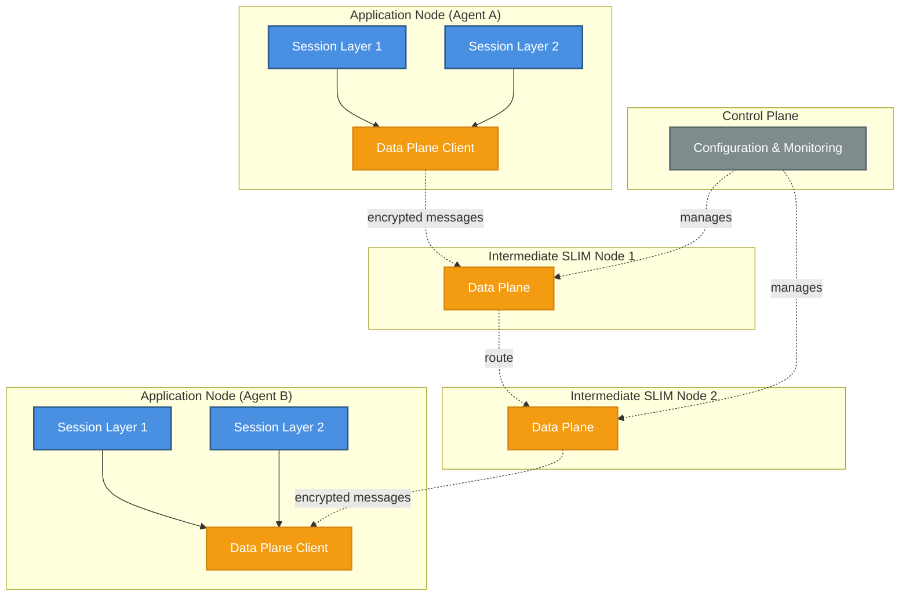

# Architecture

SLIM separates message delivery from infrastructure management across three network layers, with an independent control plane that configures the network without participating in message routing.

## Network Stack

The three layers that carry messages between applications:

```
Applications (Python / Go / .NET / JS bindings)
    ↓
Session Layer (Rust) — MLS encryption, reliable delivery, group communication
    ↓
Data Plane (Rust) — hierarchical name-based message routing, TLS/mTLS/auth
```

- **Applications and Bindings**: Your agents and services communicate through language-native bindings (Python, Go, .NET, JavaScript). The bindings expose a simple API for sending and receiving messages, establishing sessions, and managing groups without needing to deal directly with the underlying protocols.

- **Session Layer**: Sits inside each application node. Provides end-to-end encryption using the [MLS protocol](https://www.rfc-editor.org/rfc/rfc9420.html), handles session setup and teardown, manages group membership, and ensures reliable message delivery. The session layer is invisible to intermediate routing nodes — only the communicating endpoints hold the session keys.

- **Data Plane**: The routing and forwarding engine. SLIM nodes run the data plane and forward messages based on hierarchical names. Routing nodes do not participate in application sessions and never see plaintext message content, keeping the infrastructure lightweight and the architecture zero-trust.

## Control Plane

The Control Plane sits alongside the network stack as a separate management component — it is not a layer that messages pass through. The SLIM Controller configures data plane nodes, manages route tables, and handles node registration. Operators interact with it via the `slimctl` CLI and its northbound gRPC API; data plane nodes receive configuration updates via the southbound gRPC interface.

The data plane operates independently and can run without any control plane deployed. The control plane becomes valuable at scale — particularly for multi-cluster deployments where routing topology needs to be managed centrally.

## Component Topology

The diagram below shows how components are distributed across application and routing nodes in a typical SLIM deployment:



## Component Distribution

### Pure Data Plane Nodes

SLIM routing nodes run only the data plane. Because they never participate in application sessions, they require no session layer code. This makes routing nodes lightweight, fast, and straightforward to deploy at scale — whether in a single data center or across multiple regions.

### Application Nodes with Bindings

Application nodes use the language bindings, which bundle both the data plane client and the session layer. This gives applications the full stack: name-based routing, end-to-end encryption, reliable delivery, and group communication through a simple API.

### Control Plane Separation

The control plane manages the routing infrastructure independently from message traffic. Operators use `slimctl` to configure routes, monitor nodes, and manage deployments without touching the data plane nodes directly.

## Key Design Principles

**Zero-trust encryption**: MLS end-to-end encryption is applied at the session layer inside each application node. Intermediate routing nodes see only ciphertext and routing headers — they cannot read message content even if compromised.

**Hierarchical naming**: All endpoints are identified by a routable name (`org/namespace/service/clientId`). The naming scheme enables anycast discovery and unicast delivery without requiring a separate service registry.

**Separation of concerns**: Data plane, session layer, and control plane are independently deployable and scalable. You can run a global routing network without deploying any control plane, and add centralized management when needed.

## Architecture Sub-topics

- [Naming](./naming.md) — Client and channel naming conventions, anycast vs. unicast
- [Sessions](./session.md) — Point-to-point and group session types
- [Groups](./group.md) — Group creation, management, and membership
- [Authentication](./authentication.md) — Identity management with JWT, shared secrets, and SPIRE
