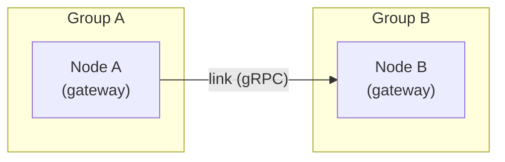
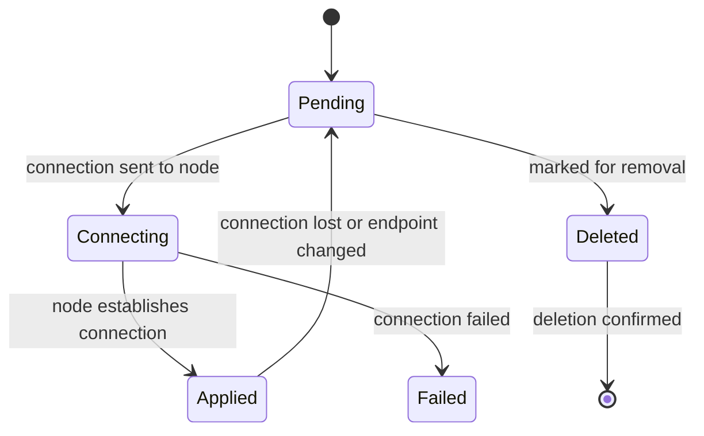

# Routing

SLIM uses a group-based routing model managed by the SLIM Controller. The Controller maintains the desired connectivity between groups of SLIM nodes and propagates routing information to the data plane using a declarative reconciliation loop. This page explains the three core concepts — **groups**, **links**, and **segments** — and how they combine to form flexible network topologies.

## Groups

A **group** is a set of SLIM data plane nodes that share a common identity — typically all nodes within a single deployment or Kubernetes cluster. Each node belongs to exactly one group, declared in its configuration:

```yaml
services:
  slim/0:
    group_name: "cluster-a.example"
```

**Intra-group connectivity** is handled automatically by the data plane: nodes in the same group discover each other via peer discovery and route messages between themselves without Controller involvement.

**Inter-group connectivity** is managed by the Controller. When nodes from different groups register, the Controller creates links between them and installs route subscriptions so messages can flow across group boundaries.

Within each group, one node is selected at random as the **gateway** — the node that holds the inter-group link and forwards traffic to and from other groups. If the gateway node crashes or deregisters, the Controller performs **gateway failover**: it reassigns the inter-group link to a sibling node in the same group, maintaining connectivity without operator intervention.

## Links

A **link** is a directed gRPC connection between two nodes in different groups. The source node initiates the connection to the destination node's `external_endpoint`. Links are created and managed entirely by the Controller — application code and data plane nodes do not create links directly.



### Link Lifecycle

Links pass through the following states:



Once a link reaches `Applied`, the Controller installs route subscriptions over it so messages for remote names are forwarded through the link automatically.

### Inspecting Links

```bash
# List all inter-group links
slimctl controller link list

# List routes (subscriptions installed over links)
slimctl controller route list

# List nodes and their group assignment
slimctl controller node list
```

## Topology

The **topology** configuration in the Controller defines which groups are allowed to form inter-group links. It is expressed as an adjacency list: each entry declares a group name and the groups it connects to. All links are bidirectional — if group A lists group B as a neighbour, the link between them is established in both directions.

The wildcard `"*"` matches all registered groups and is resolved at runtime when new nodes register.

### Full Mesh (Default)

If no topology is configured, the Controller defaults to full mesh: every group is linked to every other group.

```yaml
topology: {}
```

Use full mesh when all deployments need to communicate with each other and there is no need to restrict routing.

### Star Topology

A hub group connects to all others; spoke groups can only reach each other by routing through the hub.

```yaml
topology:
  links:
    - name: cloud
      neighbors: ["*"]
```

Use a star topology when you have a central service (e.g. a cloud-hosted coordination layer) that all edge deployments connect to, but edge deployments should not connect directly to each other.

### Explicit Pairs

Only specific group pairs are allowed to form links:

```yaml
topology:
  links:
    - name: cloud
      neighbors: [customer-a, customer-b]
    - name: customer-a
      neighbors: [cloud]
    - name: customer-b
      neighbors: [cloud]
```

### Chain Topology

Groups form a linear chain; multi-hop routing via the Shortest Path Tree algorithm handles transit automatically:

```yaml
topology:
  links:
    - name: group-a
      neighbors: [group-b]
    - name: group-b
      neighbors: [group-a, group-c]
    - name: group-c
      neighbors: [group-b, group-d]
    - name: group-d
      neighbors: [group-c]
```

## Segments

**Segments** partition the network into independent routing domains. Nodes in one segment are completely invisible to nodes in other segments — routes are only expanded within a segment's topology graph, and no links are created between groups that do not share an edge in any segment.

Segments are used to enforce **multi-tenant isolation**: different customers or deployments can share the same SLIM infrastructure while being unable to route messages to each other.

When segments are defined, the top-level `topology.links` configuration is ignored — segments fully control both link creation and route expansion.

### Named Segments

Explicit segments for multi-tenant isolation:

```yaml
topology:
  segments:
    - name: customer-1
      links:
        - name: cloud
          neighbors: [cluster-a]
    - name: customer-2
      links:
        - name: cloud
          neighbors: [cluster-b, cluster-c]
```

In this example, `cluster-a` can route to `cloud` (and vice versa), but `cluster-a` cannot reach `cluster-b` or `cluster-c` at all — they are in separate routing domains.

### Template Segments with `$group`

The special token `$group` causes a segment definition to be **instantiated once per registered group**. This enables dynamic per-tenant isolation without manually listing every group:

```yaml
topology:
  segments:
    - name: segment-$group
      links:
        - name: cloud
          neighbors: [$group]
```

When a node from `customer-a` registers, the Controller instantiates a segment named `segment-customer-a` with links `cloud <-> customer-a`. When a node from `customer-b` registers, another segment `segment-customer-b` is instantiated with `cloud <-> customer-b`. Because each customer group exists in its own segment, `customer-a` and `customer-b` cannot route to each other even though they both connect to `cloud`.

### Inspecting Segments

```bash
# List all segments and their group membership
slimctl controller segment list
```

The output shows each segment's name, the groups it contains, and the edges (links) in its adjacency graph.

## Shortest Path Tree Routing

When a SLIM application subscribes to a name, the Controller installs route subscriptions on data plane nodes using a **Shortest Path Tree (SPT)** algorithm. The SPT computes a loop-free forwarding tree rooted at the first group that announced the name:

- **Upward routes**: installed on non-root group gateways, pointing toward the root — used to deliver messages from any group to the first announcer
- **Downward routes**: installed when additional groups announce the same name, pointing away from the root toward the new announcers — used to fan out messages to all subscribers

This ensures that multi-hop routing (e.g. spoke-a → hub → spoke-b in a star topology) works correctly without creating forwarding loops, even across non-directly-connected groups.

## Choosing a Topology

| Topology | When to use |
|----------|-------------|
| Full mesh | All groups communicate freely; simple deployments |
| Star (hub + `"*"`) | Hub-and-spoke; edge deployments connect via a central service |
| Explicit pairs | Controlled access; specific groups should reach specific others |
| Chain | Linear pipelines; multi-hop routing handled automatically |
| Segments | Multi-tenant isolation; customers must not route to each other |
| `$group` template | Dynamic per-tenant segments; groups register without pre-configuration |

## Related

- [SLIM Controller Overview](../components/controller/index.md) — The component that manages groups, links, and segments
- [Controller Configuration Reference](../components/controller/config.md) — Full topology configuration options
- [Naming](./naming.md) — How client and channel names work in SLIM
- [Groups](./sessions/group.md) — Group sessions for multi-agent communication (distinct from routing groups)
