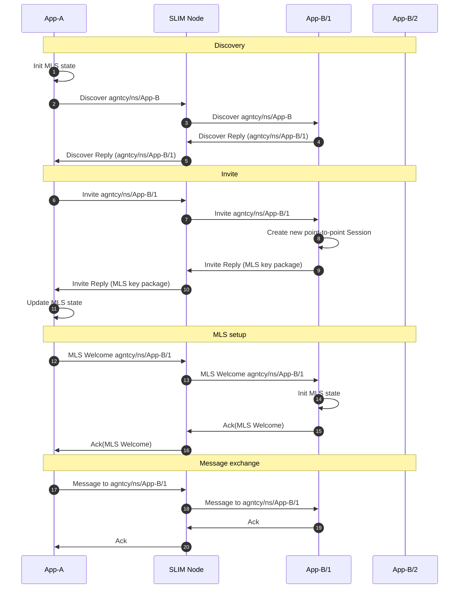
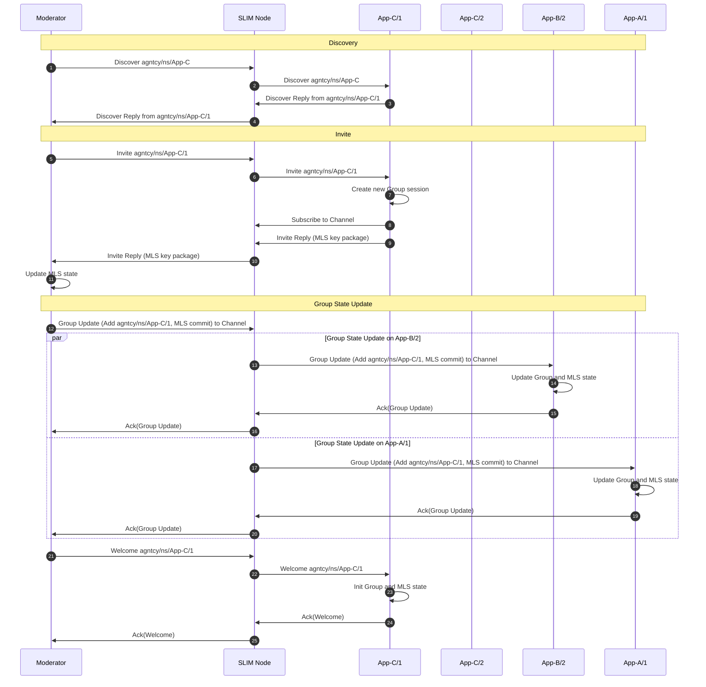
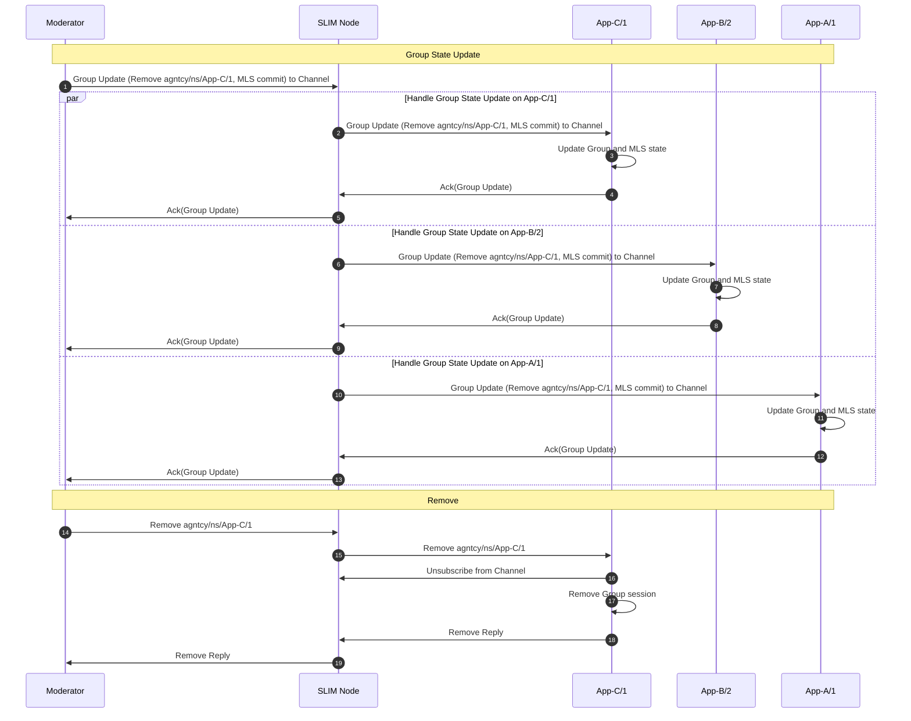

# Sessions

The SLIM session layer sits above the data plane and provides a simple interface that abstracts secure messaging and message distribution from the application. It handles session setup and teardown, end-to-end encryption, reliable delivery, and group membership — so application code only needs to deal with sending and receiving messages.

## What the Session Layer Does

The session layer is responsible for four concerns:

- **Security**: All messages can be encrypted end-to-end using the [MLS protocol](https://www.rfc-editor.org/rfc/rfc9420.html). Encryption is applied before a message leaves the application node, so intermediate SLIM routing nodes only see ciphertext.
- **Reliable delivery**: Sessions can be configured with acknowledgement and retry logic. Each message must be acknowledged by the recipient; unacknowledged messages are retried up to a configurable limit.
- **Session establishment**: The session layer handles the protocol exchange required to bind two or more endpoints together before messages flow, including discovery, key exchange, and MLS group setup.
- **Channel management**: For group sessions, the session layer manages membership — tracking who is in the group, coordinating additions and removals, and distributing updated key material.

## Session Types

SLIM provides two session types that map to the two fundamental communication patterns in a distributed system.

### Point-to-Point Session

A point-to-point session connects one application instance to exactly one remote instance. The session performs a **discovery phase** first: the initiator sends a request to the remote service's anycast name, and the SLIM network delivers it to one available instance. That instance replies with its full unique name, and the session is then bound to that specific endpoint for its lifetime.

This binding behaviour means a point-to-point session is stable across messages — the same remote instance handles the entire conversation. It is the right choice for request-response interactions, task delegation to a specific agent, and any pattern that requires conversation state to be held at one endpoint.

The diagram below shows the full establishment sequence when MLS is enabled. When MLS is disabled, the MLS setup phase is skipped and message exchange begins immediately after discovery.

### Group Session

A group session enables many-to-many communication over a named channel. Every message published to the channel is delivered to all current participants. A designated **moderator** (the session creator) controls membership: only the moderator can invite new participants or remove existing ones.

Unlike a point-to-point session, a group session has no discovery phase — the channel name is known in advance and all participants join the same address. When MLS is enabled, each membership change triggers a key rotation so that former members lose access to future traffic and new members cannot read past messages.

The diagrams below show the message exchanges when a moderator adds or removes a participant.

#### Adding a Participant

#### Removing a Participant

When the moderator closes the session, a close message is broadcast to the channel. All remaining participants acknowledge and tear down their local sessions, ensuring the group shuts down cleanly even if participants are not explicitly removed first.

## Session Properties

### Establishment Guarantee

Session creation is asynchronous. The initiating application receives a completion handle that becomes ready only once all underlying protocol exchanges — discovery, invite, and MLS setup — have finished and the remote endpoint is fully connected. Code that waits on this handle is guaranteed to be working with a fully established session.

### Reliability

Sessions can be configured with per-message acknowledgement and retry. When a retry limit is configured, each message must be acknowledged within a timeout window; if not, it is retried up to the limit before a delivery failure is reported. When no retry limit is set, the session operates in best-effort mode with no delivery guarantees beyond the underlying transport.

### End-to-End Encryption

MLS encryption is optional and independent of transport-layer TLS. Enabling it means messages are encrypted by the session layer inside the application before being handed to the data plane, and decrypted only at the destination application. Intermediate SLIM routing nodes cannot access plaintext regardless of their TLS configuration.

## Choosing a Session Type

| | Point-to-Point | Group |
|---|---|---|
| **Participants** | Two (one initiator, one responder) | Many |
| **Discovery** | Automatic (anycast) | None (channel name known in advance) |
| **Endpoint binding** | Bound to one specific instance | Shared channel, all members receive |
| **Membership changes** | Not applicable | Moderator-controlled, atomically consistent |
| **Typical use** | Request/response, task delegation | Broadcast, multi-agent collaboration |

## Related

- [Groups](./group.md) — The group communication model, moderation, and use cases
- [Creating a Session](../components/sdk/tutorial-session.md) — SDK tutorial with code examples for both session types
- [Naming](./naming.md) — How channel and client names work
