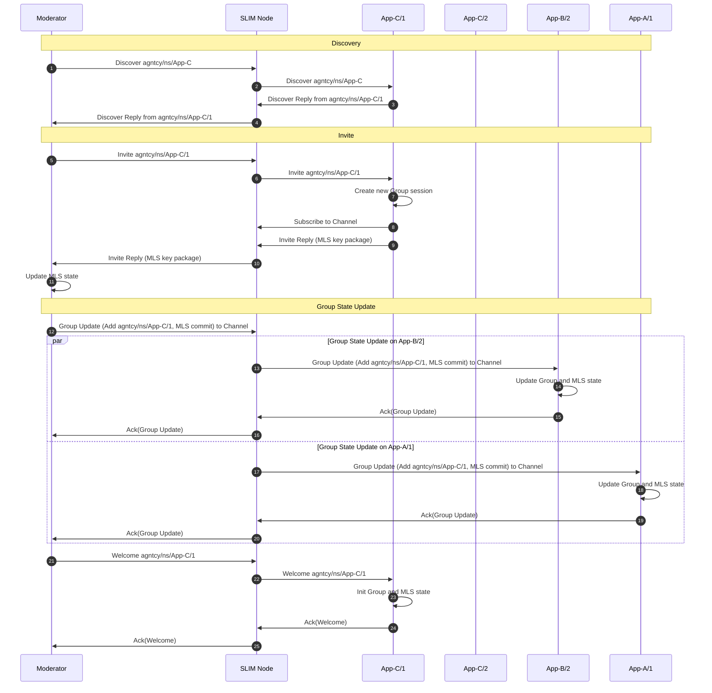
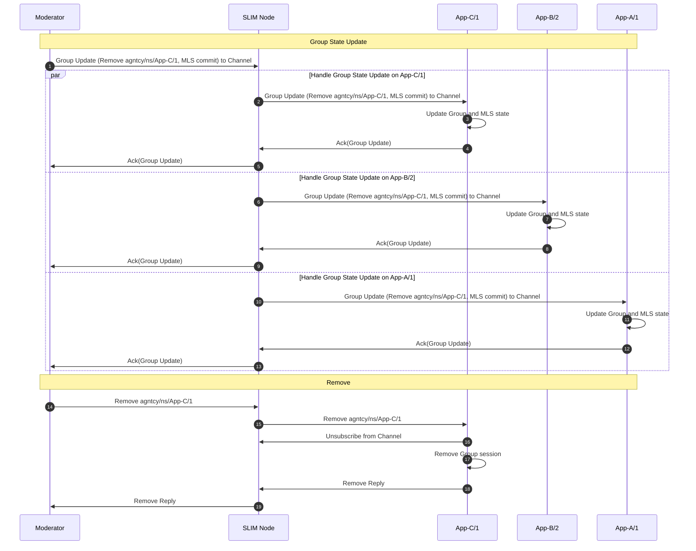

# Groups

A SLIM group is a set of application instances that communicate over a shared channel. Any message published to the channel is delivered to every current member of the group. Groups are the foundation for multi-agent collaboration, broadcast patterns, and pub/sub communication in SLIM.

## What is a Group?

A group is bound to a named channel — a SLIM name where the client component is the well-known group identifier `0xffffffff`:

```text
organization/namespace/service/0xffffffff
```

Multiple application instances subscribe to the same channel name, and the SLIM data plane delivers each message sent to that name to all subscribers. The session layer sitting above the data plane adds group state management, membership tracking, and optionally end-to-end encryption to this channel.

A group therefore consists of two things:

- A **channel** in the data plane — the named address all members subscribe to
- A **group session** in the session layer — the shared state that tracks membership, handles key material (when MLS is enabled), and enforces ordered delivery

## The Moderator Model

Every SLIM group has a **moderator** — the application instance that created the group session. The moderator is the only participant that can invite new members and remove existing ones. This gives groups a clear trust boundary: membership changes are gated by the moderator, not by the network.

The moderator role can be held by:

- **An application instance** — a specific agent that manages membership as part of its logic (e.g. a coordinator agent that controls which peers join a task group)
- **The Channel Manager** — a dedicated service that connects to a SLIM node and takes the moderator role, so operators can manage group membership using `slimctl channel-manager` commands without touching application code

Both models produce the same outcome on the data plane. The choice is about where membership logic lives.

## How Membership Changes Work

When a participant is added to or removed from a group, all current members must update their shared state atomically. This is what makes group membership in SLIM strongly consistent rather than eventual.

### Adding a Participant



### Removing a Participant



When the moderator closes the session or is itself removed, a close message is broadcast to the channel. All remaining participants tear down their local sessions on receipt.

## End-to-End Encryption with MLS

Groups optionally use the [MLS protocol](https://www.rfc-editor.org/rfc/rfc9420.html) for end-to-end encryption. When MLS is enabled:

- Each participant holds a secret key that is part of the shared group key material
- Messages are encrypted before leaving the application and can only be decrypted by current group members
- Intermediate SLIM routing nodes see only ciphertext — they cannot read message content
- Adding or removing a member triggers a key rotation, so former members lose access to future messages and new members cannot read past messages (forward and post-compromise security)

When MLS is disabled, the group still has consistent membership state and reliable delivery, but messages are not end-to-end encrypted beyond whatever transport-layer TLS is in use.

## Use Cases

**Multi-agent task groups** — A coordinator agent creates a group and invites specialist agents to collaborate on a task. The coordinator holds the moderator role and controls which agents participate at each stage.

**Broadcast and fan-out** — A single publisher sends messages to a group channel and they are delivered to all subscribers simultaneously. Useful for distributing events, configuration updates, or model outputs to a fleet of agents.

**Operator-managed communication channels** — The SLIM Controller acts as moderator, so infrastructure teams can provision groups and manage membership via `slimctl` without any changes to application code.

**Secure multi-party computation** — With MLS enabled, a group of agents can exchange sensitive data with cryptographic guarantees that no intermediate node and no former or future member can access the messages.

## Related

- [Sessions](./index.md) — Session types, properties, and the SDK API for creating group sessions
- [Naming](../naming.md) — Channel naming conventions
- [Group Communication Tutorial](../../components/sdk/tutorial-group.md) — End-to-end walkthrough using the Controller to manage group membership
- [Creating a Session](../../components/sdk/tutorial-session.md) — SDK tutorial showing group session creation in Python and Go
