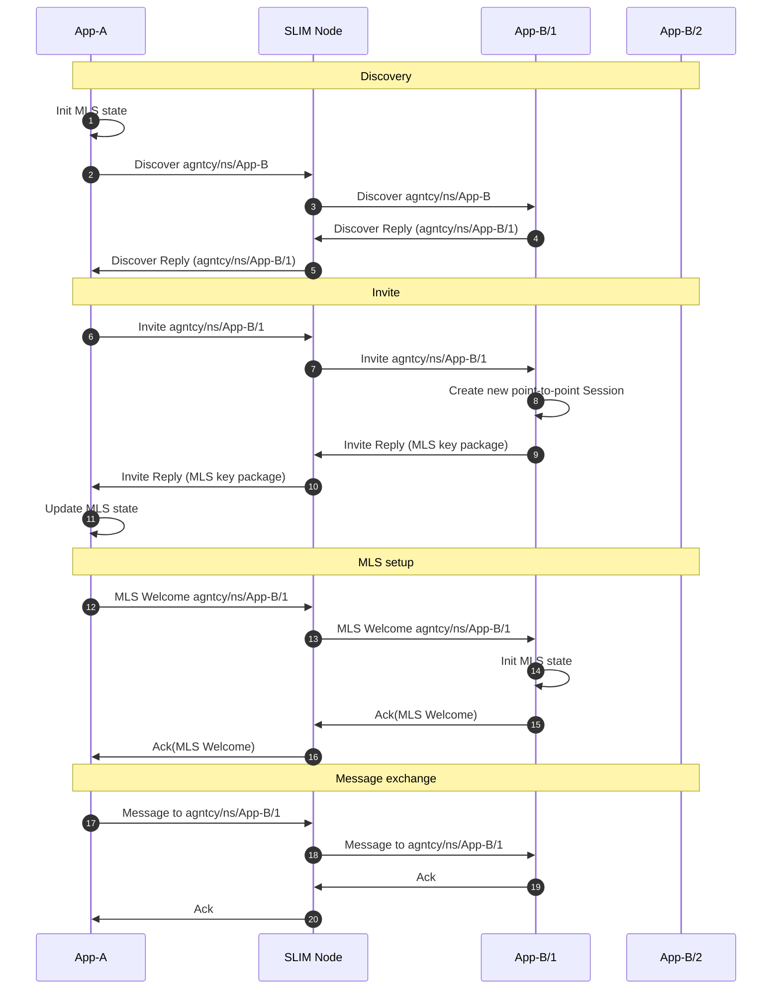

# Point-to-Point Session

A point-to-point session connects one application instance to exactly one remote instance. The session performs a **discovery phase** first: the initiator sends a request to the remote service's anycast name, and the SLIM network delivers it to one available instance. That instance replies with its full unique name, and the session is then bound to that specific endpoint for its lifetime.

This binding behaviour means a point-to-point session is stable across messages — the same remote instance handles the entire conversation. It is the right choice for request-response interactions, task delegation to a specific agent, and any pattern that requires conversation state to be held at one endpoint.

## Establishment Sequence

The diagram below shows the full establishment sequence when MLS is enabled. When MLS is disabled, the MLS setup phase is skipped and message exchange begins immediately after discovery.

## Phases

**Discovery** — The initiator addresses the remote service by its three-component anycast name (`org/namespace/service`). The SLIM network delivers the discover request to one available instance, which replies with its full four-component unique name. From this point the session is bound to that specific instance.

**Invite** — The initiator sends an invite to the discovered instance's unique name. The responder creates a local session and, if MLS is enabled, returns its MLS key package.

**MLS setup** — The initiator uses the key package to generate a Welcome message, completing the MLS handshake. Both sides now share key material and the session is fully established.

**Message exchange** — Messages flow between the two bound endpoints with per-message acknowledgement (when reliability is configured).

## Related

- [Sessions](./index.md) — Session types overview, properties, and choosing between P2P and Group
- [Creating a Session](../../components/sdk/tutorials/tutorial-session.md) — SDK tutorial with P2P code examples in Python and Go
- [Naming](../naming.md) — Anycast vs. unicast addressing
