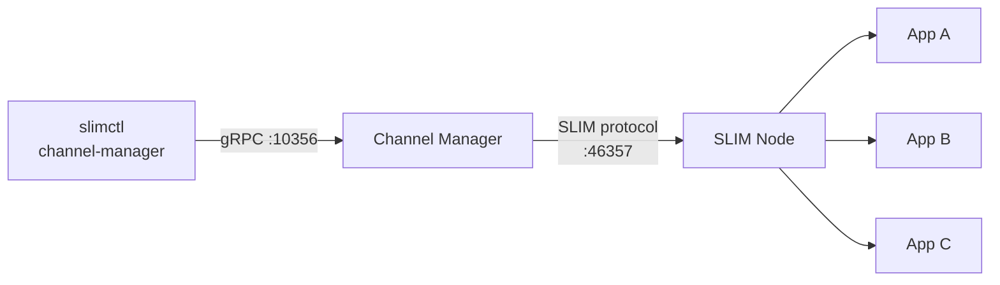

# SLIM Channel Manager

The SLIM Channel Manager is a standalone service that acts as the **moderator** for SLIM group channels. It connects to a SLIM data plane node as a regular application, creates and manages group sessions, and exposes a gRPC API so operators can control channel membership without modifying application code.

## What the Channel Manager Does

Every SLIM group channel requires a moderator — the participant that controls membership. The Channel Manager takes that role on behalf of the operator:

- Connects to a SLIM node and registers itself as a named SLIM application
- Creates group sessions (channels) and invites participants to them
- Maintains the moderator role for the lifetime of each channel
- Exposes a gRPC management API on a configurable local port
- Accepts commands from `slimctl channel-manager` to add and remove participants at runtime
- Optionally creates pre-configured channels and invites participants on startup

Because the Channel Manager is an independent service, application code never needs to implement moderation logic. Teams can provision groups and adjust membership using `slimctl` commands as part of normal operations.

## Architecture



The Channel Manager sits between the operator tooling (`slimctl`) and the SLIM data plane:

1. **Southbound** — connects to the SLIM data plane node as a SLIM application (gRPC or WebSocket transport, same as any other app)
2. **Northbound** — exposes a gRPC API (`ChannelManagerService`) that `slimctl channel-manager` and the standalone `cmctl` tool use to send management commands

The Channel Manager holds the moderator role for every channel it creates. When a participant is added or removed, it performs the full SLIM group state update and key rotation sequence on behalf of the operator.

## Key Features

**Startup channel provisioning** — channels and their initial participants can be declared in the configuration file. The Channel Manager creates them and completes all invitation handshakes automatically when it starts.

**Runtime management** — after startup, channels and participants can be added or removed at any time using `slimctl channel-manager` commands or the `cmctl` standalone tool, without restarting the service.

**MLS encryption** — channels are created with MLS end-to-end encryption enabled by default. Each membership change triggers a key rotation, so former members cannot read future messages and new members cannot read past messages. MLS can be disabled per-channel if not required.

**Authentication** — the Channel Manager authenticates to the SLIM node using the same options as any SLIM application: shared secret (development), JWT, or SPIRE (production).

## Managing Channels with slimctl

Once the Channel Manager is running, use `slimctl channel-manager` (alias `cm`) to manage channels and participants. The default API endpoint is `127.0.0.1:10356`.

```bash
# Create a channel (MLS enabled by default)
slimctl channel-manager create-channel agntcy/ns/team-chat

# Add participants
slimctl channel-manager add-participant agntcy/ns/team-chat agntcy/ns/agent-1
slimctl channel-manager add-participant agntcy/ns/team-chat agntcy/ns/agent-2

# List channels and participants
slimctl channel-manager list-channels
slimctl channel-manager list-participants agntcy/ns/team-chat

# Remove a participant
slimctl channel-manager delete-participant agntcy/ns/team-chat agntcy/ns/agent-2

# Delete a channel
slimctl channel-manager delete-channel agntcy/ns/team-chat
```

Connect to a non-default endpoint with `--endpoint`:

```bash
slimctl channel-manager --endpoint http://192.168.1.100:10356 list-channels
```

## Related

- [Groups](../../architecture/sessions/group.md) — The group communication model and the moderator role
- [Installation Guide](./install.md) — Build and run the Channel Manager
- [Configuration Reference](./config.md) — All configuration options
- [Creating a Session](../sdk/tutorials/tutorial-session.md) — Create a group session and invite participants via the Channel Manager
- [Receiving a Session](../sdk/tutorials/tutorial-receive.md) — Listen for session invitations and receive messages
