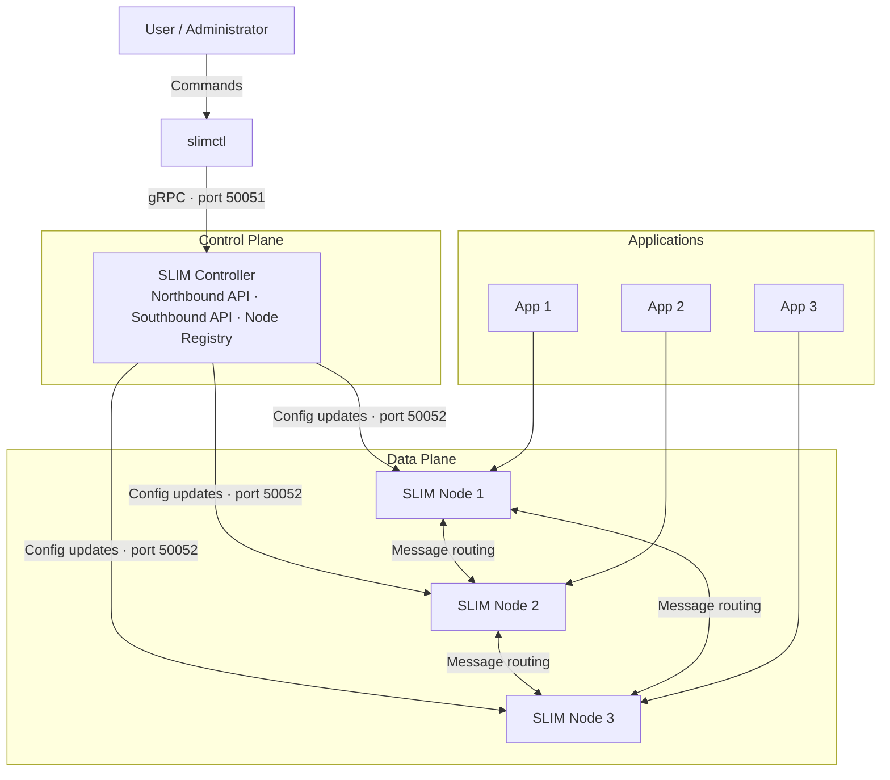

# SLIM Controller

The SLIM Controller is the management component of a SLIM deployment. It maintains a registry of Data Plane nodes, distributes routing and connection configuration to them, and exposes a management API for operators and tooling.

## Responsibilities

- **Node registry** — tracks which Data Plane nodes are active and their current state
- **Route distribution** — pushes route and connection configuration to registered nodes via the southbound API
- **Northbound API** — exposes a gRPC management interface used by `slimctl` and other management tooling to inspect and configure the network
- **Southbound API** — accepts registrations from Data Plane nodes and delivers configuration updates to them

## Architecture

The Controller exposes two independent gRPC interfaces:

- **Northbound (port 50051)** — used by operators and tools such as `slimctl`. Supports creating and listing routes, connections, links, groups, and network segments.
- **Southbound (port 50052)** — used by Data Plane nodes. Nodes connect at startup to register themselves; the Controller then pushes configuration changes down the same persistent connection.



## Connecting Nodes to the Controller

To enable a Data Plane node to register with the Controller, configure its `controller.clients` with the Controller's southbound address:

```yaml
services:
  slim/1:
    dataplane:
      servers: []
      clients: []
    controller:
      servers: []
      clients:
        - endpoint: "http://<controller-address>:50052"
          tls:
            insecure: true
```

Once registered, the Controller can push route and connection configuration to the node without further operator intervention.

## In This Section

- [Installation Guide](./install.md) — Build or download the SLIM Controller binary and run it
- [Configuration Reference](./config.md) — Full YAML configuration reference

## Related

- [SLIM Data Plane](../data-plane/index.md) — The routing engine managed by the Controller
- [Architecture](../../architecture/index.md) — How the Controller fits into the overall SLIM architecture
- [SLIM CLI](../cli/index.md) — Install and configure `slimctl`
- [Command Reference](../cli/reference/index.md) — Full `slimctl` command reference
