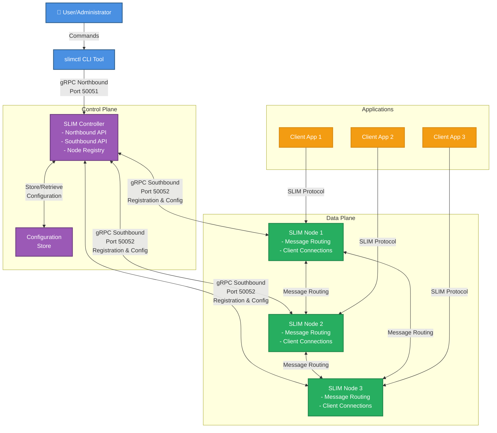
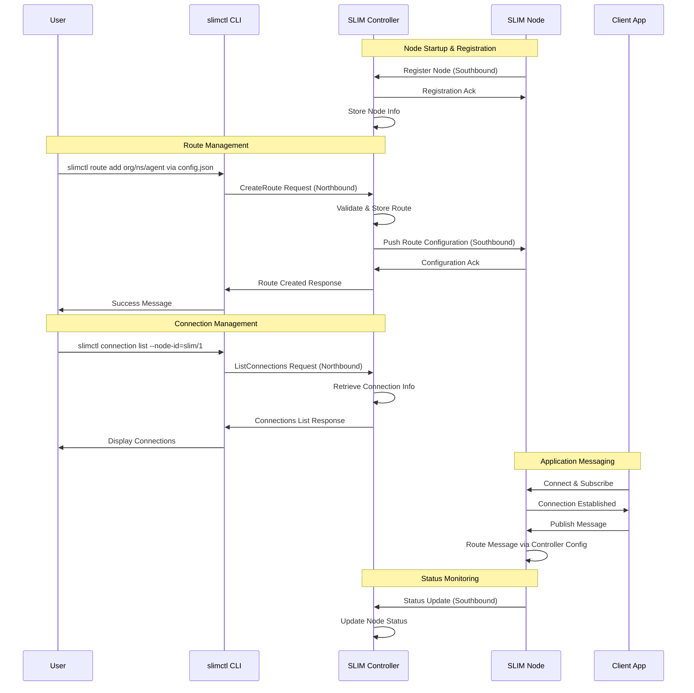

# SLIM Controller

The [SLIM](../../../index.md) Controller is a central management component that
orchestrates and manages SLIM nodes in a distributed messaging system. It
provides a unified interface for configuring routes, managing node registration,
and coordinating communication between nodes.

The Controller serves as the central coordination point for SLIM infrastructure,
offering both northbound and southbound interfaces. The northbound interface
allows external systems and administrators to configure and manage the SLIM
network. The southbound interface enables SLIM nodes to register and receive
configuration updates.

## Key Features

- **Centralized Node Management**: Register and manage multiple SLIM nodes from a single control point.
- **Route Configuration**: Set up message routing between nodes through the Controller.
- **Bidirectional Communication**: Supports both northbound and southbound gRPC interfaces.
- **Connection Orchestration**: Manages connections and subscriptions between SLIM nodes.

## Architecture

The Controller implements northbound and southbound gRPC interfaces.

The northbound interface provides management capabilities for external systems
and administrators, such as [slimctl](../cli/install.md). It includes:

- **Route Management**: Create, list, and manage message routes between nodes.
- **Connection Management**: Set up and monitor connections between SLIM nodes.
- **Node Discovery**: List registered nodes and their status.

The southbound interface allows SLIM nodes to register with the Controller and
receive configuration updates. It includes:

- **Node Registration**: Nodes can register themselves with the Controller.
- **Node De-registration**: Nodes can unregister when shutting down.
- **Configuration Distribution**: The Controller can push configuration updates to registered nodes.
- **Bidirectional Communication**: Supports real-time communication between the Controller and nodes.

### Control Plane Architecture



### Control Flow Sequence



## Managing Nodes

Nodes can register themselves with the Controller upon startup. Once registered, the Controller can communicate with nodes using the same connection.

To enable self-registration, configure the nodes with the Controller address:

```yaml
services:
  slim/1:
    dataplane:
      servers: []
      clients: []
    controller:
      servers: []
      clients:
        - endpoint: "http://<controller-address>:50052"
          tls:
            insecure: true
```

Routes between SLIM nodes are automatically created by the Controller upon receiving new subscriptions from clients. Nodes can also be managed manually through slimctl.

## Related

- [Installation Guide](./install.md) — Install the SLIM Controller
- [Configuration Reference](./config.md) — Full YAML configuration reference
- [SLIM CLI](../cli/install.md) — Install and configure `slimctl`
- [Command Reference](../cli/reference/index.md) — Full `slimctl` command reference
