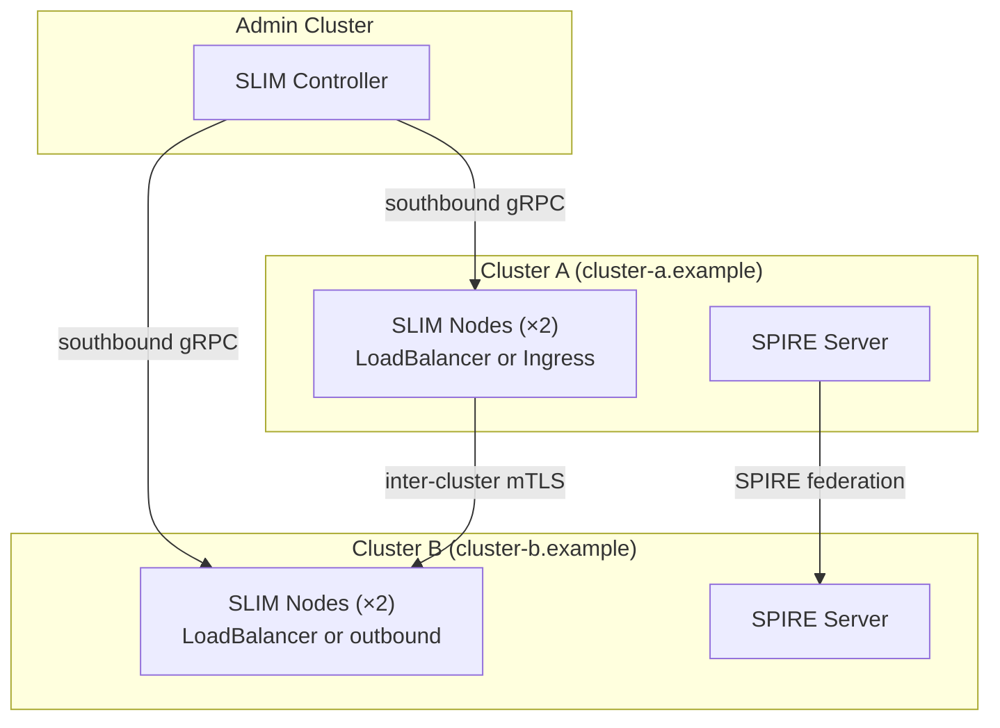

# Deployment: Kubernetes Multi-Cluster

This page describes deploying SLIM across multiple Kubernetes clusters so that agents on different clusters can communicate transparently. Cross-cluster routing requires SPIRE for identity federation and either LoadBalancer services or an Ingress for inter-cluster connectivity.

Two patterns are covered:

- **Open multi-cluster** — all clusters have public LoadBalancer endpoints; full SPIRE federation between all trust domains
- **Private multi-cluster** — one cluster is the public-facing entry point (nginx Ingress); other clusters connect outbound only with no public endpoints

## Architecture



Each cluster runs its own SPIRE server with a unique trust domain. SPIRE federation allows each cluster to verify SVIDs issued by other clusters, enabling cross-cluster mTLS without manually distributing certificates.

## Key Configuration Concepts

### `domain_name`

Every SLIM node is assigned a `domain_name` that identifies which cluster it belongs to. The Controller uses this to group nodes and propagate routes between clusters.

```yaml
services:
  slim/0:
    domain_name: "cluster-a.example"
```

### `local_endpoint` and `external_endpoint`

Each SLIM node advertises two endpoint addresses:

- `local_endpoint` — the pod IP, used for intra-cluster routing (set from the `MY_POD_IP` env var injected by Kubernetes)
- `external_endpoint` — the public address (LoadBalancer hostname or Ingress hostname) used by nodes in other clusters to connect

```yaml
dataplane:
  servers:
    - endpoint: "0.0.0.0:46357"
      metadata:
        local_endpoint: ${env:MY_POD_IP}
        external_endpoint: "slim.cluster-a.example:46357"
```

### `trust_domains`

The `ca_source` block lists the trust domains whose SPIRE-issued certificates are accepted. Add each peer cluster's trust domain to enable cross-cluster mTLS verification.

```yaml
tls:
  ca_source:
    type: spire
    socket_path: unix:/tmp/spire-agent/public/api.sock
    trust_domains:
      - cluster-b.example
```

---

## Open Multi-Cluster

All clusters expose SLIM via LoadBalancer services. Every cluster can initiate connections to every other cluster.

### Prerequisites

- 3 Kubernetes clusters: admin, cluster-a, cluster-b
- LoadBalancer support (cloud provider or `cloud-provider-kind` for local testing)
- `kubectl` contexts configured for all clusters

### Step 1: Deploy SPIRE on Each Cluster

Deploy the `slim-spire` Helm chart on each workload cluster, specifying a unique trust domain per cluster:

```bash
# Cluster A
helm upgrade --install slim-spire \
  oci://ghcr.io/agntcy/slim/helm/slim-spire \
  --namespace spire-system --create-namespace \
  --set global.spire.trustDomain=cluster-a.example

# Cluster B
helm upgrade --install slim-spire \
  oci://ghcr.io/agntcy/slim/helm/slim-spire \
  --namespace spire-system --create-namespace \
  --set global.spire.trustDomain=cluster-b.example
```

### Step 2: Configure SPIRE Federation

Exchange SPIFFE trust bundles between clusters so each SPIRE server can verify SVIDs from the other trust domains. The exact steps depend on your SPIRE deployment; refer to the [SPIRE federation documentation](https://spiffe.io/docs/latest/spire-about/spire-concepts/).

### Step 3: Deploy the Controller (Admin Cluster)

```bash
helm upgrade --install slim-control \
  oci://ghcr.io/agntcy/slim/helm/slim-control-plane \
  --namespace slim --create-namespace \
  --set service.type=LoadBalancer
```

Note the Controller's external address — SLIM nodes on both workload clusters will connect to it.

### Step 4: Deploy SLIM Nodes

**`cluster-a-values.yaml`:**

```yaml
slim:
  replicaCount: 2

  config:
    services:
      slim/0:
        node_id: ${env:SLIM_SVC_ID}
        domain_name: "cluster-a.example"
        dataplane:
          servers:
            - endpoint: "0.0.0.0:46357"
              metadata:
                local_endpoint: ${env:MY_POD_IP}
                external_endpoint: "slim.cluster-a.example:46357"
                client_config:
                  tls:
                    insecure_skip_verify: true
                    source:
                      type: spire
                      socket_path: unix:/tmp/spire-agent/public/api.sock
              tls:
                insecure_skip_verify: false
                source:
                  type: spire
                  socket_path: unix:/tmp/spire-agent/public/api.sock
                ca_source:
                  type: spire
                  socket_path: unix:/tmp/spire-agent/public/api.sock
                  trust_domains:
                    - cluster-b.example
          clients: []
        controller:
          clients:
            - endpoint: "https://slim-control.admin.example:50052"
              tls:
                source:
                  type: spire
                  socket_path: unix:/tmp/spire-agent/public/api.sock
                ca_source:
                  type: spire
                  socket_path: unix:/tmp/spire-agent/public/api.sock
                  trust_domains:
                    - admin.example

  service:
    type: LoadBalancer
    data:
      - port: 46357

spire:
  enabled: true
  trustedDomains:
    - spiffe://admin.example
    - spiffe://cluster-b.example
```

Deploy on each cluster with the corresponding values file:

```bash
helm upgrade --install slim oci://ghcr.io/agntcy/slim/helm/slim \
  --namespace slim --create-namespace \
  --values cluster-a-values.yaml

helm upgrade --install slim oci://ghcr.io/agntcy/slim/helm/slim \
  --namespace slim --create-namespace \
  --values cluster-b-values.yaml
```

---

## Private Multi-Cluster

Cluster A is the public-facing cluster with a SLIM endpoint exposed via nginx Ingress. Cluster B is private — it connects outbound to cluster A and exposes no public endpoints.

This pattern is suited for environments where one cluster acts as the hub and other clusters are internal-only.

### Architecture

```
Internet / other clusters
        ↓
  [nginx Ingress on cluster-a]  ←── cert-manager TLS
        ↓
  SLIM Node (cluster-a, port 46368 → Ingress)
        ↑
  SLIM Node (cluster-b) ─── outbound connection to slim.cluster-a.example:443
```

### Cluster A: Public Cluster (with Ingress)

Cluster A exposes SLIM on two ports: one internal (`:46357`, for pods in cluster-a) and one external (`:46368`, routed through the nginx Ingress to external clients).

**`cluster-a-values.yaml` highlights:**

```yaml
slim:
  config:
    services:
      slim/0:
        domain_name: "cluster-a.example"
        dataplane:
          servers:
            # Internal port — in-cluster traffic
            - endpoint: "0.0.0.0:46357"
              metadata:
                local_endpoint: ${env:MY_POD_IP}
              tls:
                insecure: true

            # External port — exposed through Ingress
            - endpoint: "0.0.0.0:46368"
              metadata:
                external_endpoint: "slim.cluster-a.example:443"
                client_config:
                  tls:
                    insecure: false
                    insecure_skip_verify: true
                    include_system_ca_certs_pool: true
              tls:
                insecure: true

  service:
    data:
      - port: 46357
        name: dp-internal
      - port: 46368
        name: dp-external    # used by Ingress

  ingresses:
    - enabled: true
      portName: dp-external
      className: "nginx"
      annotations:
        cert-manager.io/cluster-issuer: selfsigned-issuer
        nginx.ingress.kubernetes.io/ssl-redirect: "true"
        nginx.ingress.kubernetes.io/backend-protocol: "GRPC"
        nginx.ingress.kubernetes.io/proxy-read-timeout: "3600"
        nginx.ingress.kubernetes.io/proxy-send-timeout: "3600"
        nginx.ingress.kubernetes.io/proxy-stream-timeout: "3600"
        nginx.ingress.kubernetes.io/server-snippet: |
          grpc_socket_keepalive on;
          keepalive_timeout 3600s;
          grpc_read_timeout 3600s;
          grpc_send_timeout 3600s;
      hosts:
        - host: slim.cluster-a.example
          paths:
            - path: /
              pathType: Prefix
              port: "46368"
      tls:
        - secretName: slim-dataplane-tls
          hosts:
            - slim.cluster-a.example
```

### Cluster B: Private Cluster (outbound only)

Cluster B has no public endpoints. It connects outbound to cluster A's Ingress address and to the Controller on cluster A.

**`cluster-b-values.yaml` highlights:**

```yaml
slim:
  config:
    services:
      slim/0:
        domain_name: "cluster-b.example"
        dataplane:
          servers:
            - endpoint: "0.0.0.0:46357"
              metadata:
                local_endpoint: ${env:MY_POD_IP}
              tls:
                insecure: true
          clients: []
        controller:
          clients:
            - endpoint: "https://slim-control.cluster-a.example:443"
              keepalive:
                tcp_keepalive: 20s
                http2_keepalive: 20s
                timeout: 10s
                keep_alive_while_idle: true
              tls:
                insecure: false
                insecure_skip_verify: true
                include_system_ca_certs_pool: true
              auth:
                type: spire
                jwt_audiences:
                  - "slim"
                socket_path: /tmp/spire-agent/public/spire-agent.sock

  service:
    data:
      - port: 46357

  ingress:
    enabled: false   # no public endpoints on cluster B

spire:
  enabled: true
```

### SPIRE for Private Multi-Cluster

In this pattern cluster B uses a **downstream SPIRE** that joins the root SPIRE on cluster A via a join token. This avoids needing to exchange trust bundles manually.

```bash
# Generate a join token on cluster A's SPIRE server
kubectl exec -n spire-system <spire-server-pod> -- \
  /opt/spire/bin/spire-server token generate -spiffeID spiffe://cluster-a.example/downstream

# Deploy downstream SPIRE on cluster B with the join token
helm upgrade --install slim-spire \
  oci://ghcr.io/agntcy/slim/helm/slim-spire \
  --namespace spire-system --create-namespace \
  --set upstream-spire-agent.joinToken=<token-from-above> \
  --set global.spire.upstreamSpireAddress=spire.cluster-a.example
```

---

## Next Steps

- [Authentication](../architecture/authentication.md) — SPIRE, JWT, and mTLS configuration in depth
- [Controller Configuration Reference](../components/controller/config.md) — Controller config for multi-cluster setups
- [Kubernetes: DaemonSet](./daemonset.md) — Node-affine deployment within a cluster
