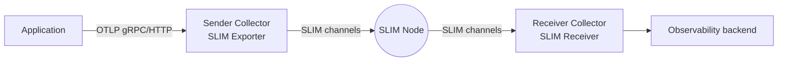

# OpenTelemetry over SLIM

The [slim-otel](https://github.com/agntcy/slim-otel) project provides a custom distribution of the OpenTelemetry Collector with a **SLIM exporter** and **SLIM receiver**. These components let you route traces, metrics, and logs between collectors over SLIM channels — giving you end-to-end encryption and cross-organization routing without adding a dedicated observability transport layer.

## Why route telemetry over SLIM?

Standard OpenTelemetry pipelines use OTLP over HTTP or gRPC. When collectors are distributed across organizations, cloud providers, or air-gapped networks, that requires opening firewall ports and adding TLS termination at every hop. SLIM replaces the transport while keeping the rest of the collector pipeline unchanged:

| | OTLP/HTTP default | SLIM |
|---|---|---|
| **Transport** | HTTP/2 + TLS | SLIM sessions |
| **Encryption** | TLS (channel only) | MLS (end-to-end) |
| **Cross-org routing** | Requires public ingress | Native SLIM routing |
| **Discovery** | DNS / service registry | Built into SLIM naming |

## How it works

### SLIM Exporter

The exporter runs inside a standard OpenTelemetry Collector pipeline. On startup it:

1. Connects to a SLIM node
2. Registers three apps — one per signal type (traces, metrics, logs) — under configured SLIM names
3. Creates SLIM group channels and invites the configured receiver participants
4. Serializes incoming OTLP data as protobuf and publishes it to the appropriate channel

### SLIM Receiver

The receiver listens for incoming SLIM sessions from any exporter. It auto-detects the signal type from the payload and forwards it into the downstream pipeline. Multiple concurrent sessions from different exporters are supported.



## Getting started

Full build instructions, configuration reference, and a step-by-step tutorial (including example YAML for both sender and receiver collectors) are in the [slim-otel repository](https://github.com/agntcy/slim-otel).

The quick path:

```bash
git clone https://github.com/agntcy/slim-otel.git
cd slim-otel
task collector:build    # produces ./slim-otelcol/slim-otelcol
```

Then configure your collector with the `slim` exporter or receiver alongside your existing OTLP components. See the [builder-config.yaml](https://github.com/agntcy/slim-otel/blob/main/builder-config.yaml) for how to embed the SLIM components into your own custom collector distribution.

## Related

- [slim-otel repository](https://github.com/agntcy/slim-otel) — source, configuration reference, full tutorial
- [Sessions](../architecture/sessions/index.md) — SLIM group sessions used by the exporter channels
- [Authentication](../architecture/authentication.md) — shared secret and SPIFFE options
