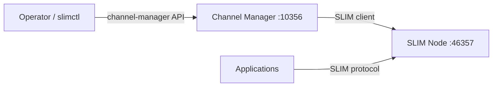

# Channel Manager

The channel manager is a service that creates and manages SLIM group sessions
(channels) and participant invitations. It connects to a SLIM node as a client
and exposes a gRPC management API for operators and automation.

Use the channel manager when you want to delegate group lifecycle to
infrastructure rather than implementing moderator logic in application code.
See the [Group Communication Tutorial](./slim-group-tutorial.md) for a full
walkthrough.

## Overview

The channel manager:

- Connects to a SLIM data-plane node
- Creates channels and invites participants based on configuration or API calls
- Exposes a gRPC API on port 10356 (default) for dynamic management via
  `slimctl channel-manager` or `cmctl`

The channel manager is separate from the [control plane](./slim-controller.md).
The control plane manages **topology** (inter-group links and route
reconciliation). The channel manager manages **group sessions** (channels and
participants within a deployment).

## Configuration

Create a YAML configuration file (see
[example-channel-manager-config.yaml](https://github.com/agntcy/slim/blob/main/crates/channel-manager/example-channel-manager-config.yaml)):

```yaml
channel-manager:
  slim-connection:
    endpoint: "http://127.0.0.1:46357"
    tls:
      insecure: true

  api-server:
    endpoint: "127.0.0.1:10356"
    tls:
      insecure: true

  local-name: "agntcy/ns/channel-manager"

  auth:
    type: shared_secret
    secret: "a-very-long-shared-secret-abcdef1234567890"

  channels:
    - name: "agntcy/ns/my-channel"
      participants:
        - "agntcy/ns/client-1"
        - "agntcy/ns/client-2"
      mls-enabled: true
```

| Field | Description |
|-------|-------------|
| `slim-connection` | Client config for connecting to the SLIM node (same options as data-plane `ClientConfig`) |
| `api-server` | gRPC server for channel manager commands |
| `local-name` | SLIM identity of the channel manager |
| `auth` | Authentication for the channel manager (`shared_secret` or `spire`) |
| `channels` | Channels to create on startup (optional) |

## Running

Build from source:

```bash
cargo build -p agntcy-slim-channel-manager --bin channel-manager
# Binary: target/debug/channel-manager
```

Run with a configuration file:

```bash
./target/debug/channel-manager --config-file config.yaml
```

There is no published Docker image for the channel manager today; run the binary
from a local build or your own container image.

## Management commands

Use `slimctl channel-manager` (alias `cm`) or the standalone `cmctl` binary:

```bash
slimctl --server 127.0.0.1:10356 channel-manager create-channel org/ns/channel
slimctl --server 127.0.0.1:10356 channel-manager add-participant org/ns/channel org/ns/app
slimctl --server 127.0.0.1:10356 channel-manager list-channels
slimctl --server 127.0.0.1:10356 channel-manager list-participants org/ns/channel
slimctl --server 127.0.0.1:10356 channel-manager delete-participant org/ns/channel org/ns/app
slimctl --server 127.0.0.1:10356 channel-manager delete-channel org/ns/channel
```

See the [Controller Reference](./slim-controller-reference.md#channel-manager-group-channel-management)
for all options and flags.

## Relationship to other components



Applications connect to the SLIM node and wait for session invitations. The
channel manager creates sessions and invites participants on their behalf.
