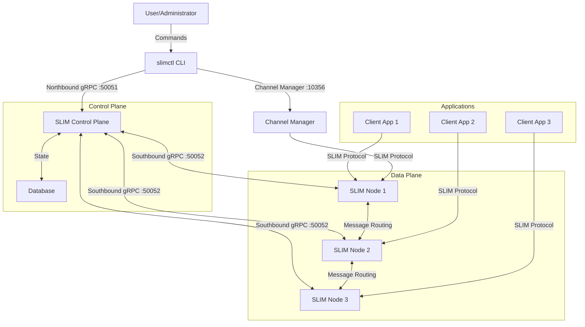
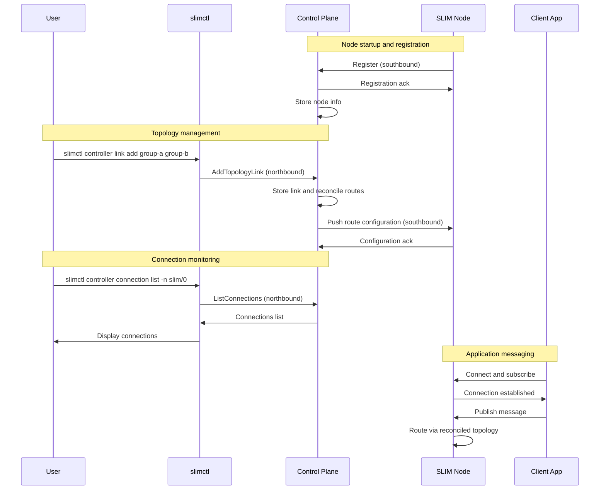

# SLIM Controller

The [SLIM](../index.md) control plane is a central management component that
orchestrates SLIM nodes in a distributed messaging system. It provides a unified
interface for topology management, node registration, and route reconciliation.

The control plane serves as the central coordination point for SLIM infrastructure,
offering both northbound and southbound gRPC interfaces. The northbound interface
allows external systems and administrators (via [slimctl](#slimctl)) to inspect
and configure the network. The southbound interface enables SLIM nodes to register
and receive configuration updates.

For group session lifecycle (channels and participants), see the separate
[Channel Manager](./slim-channel-manager.md) component.

## Controller configuration

The control plane is configured through a YAML file. See
[Control Plane Configuration](./slim-control-plane-config.md) for the full reference.

Minimal example:

```yaml
northbound:
  endpoint: "0.0.0.0:50051"
  tls:
    insecure: true

southbound:
  endpoint: "0.0.0.0:50052"
  tls:
    insecure: true

tracing:
  log_level: info

database:
  type: sqlite
  path: /db/controlplane.db

reconciler:
  max_requeues: 15
  base_retry_delay: 200ms
  reconcile_period: 30s
```

## slimctl

`slimctl` is a unified command-line interface for managing SLIM instances, the
control plane, channel manager, and local development workflows.

- **Local development** — run standalone SLIM instances with production configs
- **Topology management** — manage links, segments, and inspect reconciled routes
- **Connection monitoring** — view active connections on SLIM nodes
- **Direct node access** — query a node's control API without the control plane
- **Channel management** — create group channels and manage participants
- **Benchmarking** — measure pub/sub and channel throughput

See the full [Controller Reference](./slim-controller-reference.md) for all commands.

### Command groups

```bash
slimctl --help
```

| Command | Description |
|---------|-------------|
| `version` | Print version information |
| `config` | Manage slimctl client configuration |
| `node` | Interact with a SLIM node control API directly |
| `controller` | Interact with the control plane northbound API |
| `channel-manager` | Manage group channels and participants |
| `slim` | Run a local SLIM instance |
| `bench` | Run messaging benchmarks |

### Installing slimctl

=== "Pre-built binaries"

    Download from the [GitHub releases page](https://github.com/agntcy/slim/releases):

    1. Download the binary for your OS and architecture
    2. Extract the archive
    3. Move `slimctl` to a directory in your `PATH`

=== "Homebrew (macOS)"

    ```bash
    brew tap agntcy/slim https://github.com/agntcy/slim.git
    brew install slimctl
    ```

=== "Building from source"

    **Prerequisites**: [Rust](https://rustup.rs/), [Task](https://taskfile.dev/)

    ```bash
    # From repository root
    task slimctl:build

    # Binary location: .dist/bin/slimctl
    ```

### Configuring slimctl

`slimctl` supports configuration through a file, environment variables, or
command-line flags. Config file locations:

- `$HOME/.slimctl/config.yaml`
- `./config.yaml` (current directory)
- `--config` / `SLIMCTL_CONFIG`

Example `~/.slimctl/config.yaml` for control plane commands:

```yaml
endpoint: "127.0.0.1:50051"
request_timeout: 15s
connect_timeout: 15s
tls:
  insecure: true
```

The default endpoint depends on the subcommand:

| Subcommand | Default |
|------------|---------|
| `slimctl controller` | `127.0.0.1:50051` |
| `slimctl node` | `127.0.0.1:46358` |
| `slimctl channel-manager` | `127.0.0.1:10356` |

Override per invocation with the global `--server` flag:

```bash
slimctl --server 127.0.0.1:46358 node route list
slimctl --server 127.0.0.1:50051 controller node list
```

### Managing SLIM nodes directly

SLIM nodes can expose a control API on port 46358. Use `slimctl node` to query
this endpoint directly, bypassing the central control plane:

```yaml
services:
  slim/0:
    dataplane:
      servers: []
      clients: []
    controller:
      servers:
        - endpoint: "0.0.0.0:46358"
          tls:
            insecure: true
      clients: []
```

```bash
slimctl --server 127.0.0.1:46358 node connection list
slimctl --server 127.0.0.1:46358 node route list
```

## Key features

- **Centralized node management** — register and monitor multiple SLIM nodes
- **Declarative topology** — define inter-group links and segments; routes are reconciled automatically
- **Bidirectional gRPC** — northbound management API and southbound node API
- **Connection orchestration** — manages inter-group links and route distribution

## Architecture

The control plane implements northbound and southbound gRPC interfaces.

The **northbound** interface (port 50051) provides management capabilities:

- **Node discovery** — list registered nodes, groups, and their status
- **Route inspection** — list reconciled routes across the fleet
- **Topology management** — create and remove links and segments (API-managed mode)
- **Connection monitoring** — view active connections per node

The **southbound** interface (port 50052) handles node lifecycle:

- **Node registration** — nodes register on startup
- **Configuration distribution** — push route and link configuration to nodes
- **Status updates** — receive connection and health updates from nodes

### Control plane architecture



### Control flow sequence



## Usage

### Prerequisites

- [Rust](https://rustup.rs/) for building from source
- [Task](https://taskfile.dev/) (recommended for Taskfile commands)

### Building the control plane

```bash
# From repository root
task control-plane:build
```

Binary: `target/debug/slim-control-plane` (or `.dist/bin/control-plane` after staging).

### Starting the control plane

```bash
task run BIN=slim-control-plane BIN_ARGS="--config config/control-plane/config.yaml"
```

Or with Docker (use the latest release tag from [GitHub releases](https://github.com/agntcy/slim/releases)):

```bash
docker run -v ./config.yaml:/config.yaml \
  -p 50051:50051 -p 50052:50052 \
  ghcr.io/agntcy/slim/control-plane:latest \
  --config /config.yaml
```

### Managing nodes

Nodes register with the control plane on startup when configured with a
southbound client:

```yaml
services:
  slim/0:
    group_name: my-group
    dataplane:
      servers:
        - endpoint: "0.0.0.0:46357"
          tls:
            insecure: true
      clients: []
    controller:
      servers: []
      clients:
        - endpoint: "http://<controller-address>:50052"
          tls:
            insecure: true
```

Routes between groups are **reconciled** from topology configuration (links and
segments in the control plane config, or via `slimctl controller link` in
API-managed mode). Client subscriptions on a node trigger route expansion within
the reconciled topology.

For imperative group channel management, use the
[Channel Manager](./slim-channel-manager.md).

For the complete `slimctl` command reference, see
[Controller Reference](./slim-controller-reference.md).
