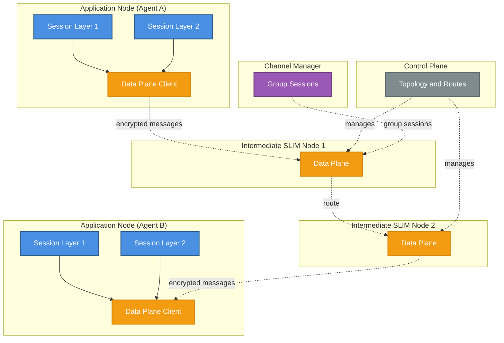

# Overview

Secure Low-Latency Interactive Messaging (SLIM) is a secure, scalable, and developer-friendly messaging framework that
provides the transport layer for agent communication protocols like A2A. While
A2A defines *what* agents say (message formats, task semantics, coordination
patterns), SLIM defines *how* these messages are securely delivered across
distributed networks.

At its core, SLIM combines:

- **gRPC's performance and reliability** — Built on HTTP/2 for efficient,
  multiplexed transport
- **Messaging capabilities** — Native support for channels and group
  communication
- **End-to-end encryption** — Using Message Layer Security (MLS) protocol
- **Native RPC support** — SRPC (SLIM RPC) for request-response patterns
  alongside messaging
- **Distributed architecture** — Separate control and data planes for
  scalability and management
- **Protocol flexibility** — Transport layer for A2A, MCP, and custom agent
  protocols

SLIM enables AI agents to communicate securely whether they're running in a data
center, in a browser, on mobile devices, or across organizational boundaries —
all while maintaining low latencies and strong security guarantees.

## SLIM Components

SLIM is composed of three operational components that work together to provide
secure, scalable messaging infrastructure:

- [SLIM Messaging Layer](./slim-data-plane.md): The data plane component
  that handles message routing, delivery, and secure communication between
  applications. It consists of the session layer (end-to-end encryption via MLS
  and reliable delivery) and the data plane (efficient message distribution).

- [SLIM Controller](./slim-controller.md): The control plane component that
  manages node registration, topology (links and segments), and route
  reconciliation across a fleet of SLIM nodes.

- [Channel Manager](./slim-channel-manager.md): A service that creates and
  manages group sessions (channels) and participant invitations, delegating
  group lifecycle from application code to infrastructure.

### Architecture Overview

The following diagram illustrates how SLIM components are distributed across
applications and intermediate routing nodes:

### Component Distribution

SLIM's architecture enables efficient distribution of components:

### Pure Data Plane

The `slim` binary and Docker images are distributed as pure
data-plane artifacts. Since SLIM routing nodes only forward messages and don't
participate in application sessions, they don't need the session layer. This
keeps the infrastructure lightweight, fast, and simple to deploy.

### Language Bindings

Libraries (Python, Go, etc.) include both the data plane
client and the session layer on top. Applications use these bindings to get
the full stack: secure, reliable, encrypted communication with automatic session
management.

### Separation of Concerns

You can run a global network of SLIM routing nodes
without any application logic, while your agents use the rich, full-featured
language bindings for their communication needs. The control plane manages
inter-group topology and route reconciliation; the channel manager handles
group session lifecycle independently.

To get started with SLIM, see the [Getting Started with
SLIM](../slim/slim-howto.md) guide.
